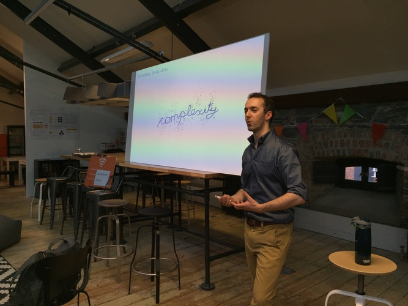
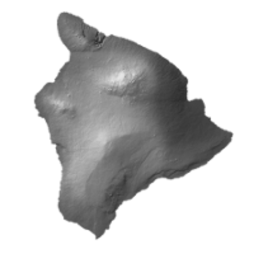
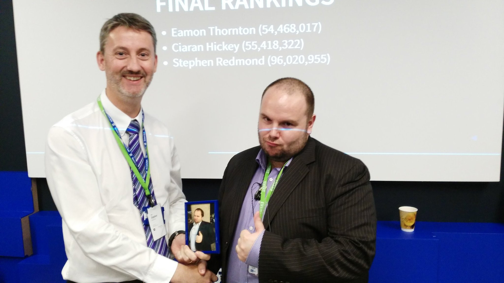

```{r knit_opts, include = FALSE}
rm(list = ls())

knitr::opts_chunk$set(tidy  = FALSE
                     ,cache = FALSE
                     ,warning = FALSE
                     ,message = FALSE
                     ,fig.width  = 11
                     ,fig.height =  8)


options(width = 80)


import::from(magrittr  ,"%>%")
import::from(readr     ,read_lines, read_csv)
import::from(ggplot2   ,ggplot, aes, geom_tile, scale_fill_gradient2)


set.seed(42)

```

```{r load_data, echo=FALSE}
island_data_tbl  <- read_csv("data/island_data.csv")
```

# Background

## Dublin R - May 2016



Pat O'Reilly - AllState

"Anyone can fit an elephant"


---

Regularisation

\

L1, L2, ElasticNet


---



Island with gold reserves $\rightarrow$ Predict deposits


---


---

Never a good thing

---


---

"That would be really cool!"

\

"You should definitely do that"


---

"So how are you thinking of generating the data..."


# The El Dorado Competition

## Basic Idea

```{r plot_elevation_data, message=FALSE, echo=FALSE, fig.height=7, fig.width=10}
height_mean <- 400

ggplot(island_data_tbl) +
    geom_tile(aes(x = Easting, y = Northing, fill = elevation)) +
    scale_fill_gradient2(low = 'blue', mid = 'green', high = 'brown', midpoint = height_mean)
```

---

Mine gold, make profit

\

Bid price, extraction costs, profit margins


## Design Goals

\

Emphasise use of prediction, accuracy less important

\

Something for everyone

---

Vickrey auction: Highest bidder wins, pays second highest price

\

Easy to understand, code, fast to run

---

Harder to 'game'

---

Starting capital

\

50 parcels of land, sequential auctions


---

\[
\text{Score} = \text{Start} - \text{Bids Paid} - \text{Extraction Costs} + \text{Sales}
\]


# Logistics


## Generating Data

\

Online datasets pointless

\

How do I generate data?

---


---

Make it up!

---

Hard to reverse engineer

\

No 'true' model

---

2D Gaussian Processes

\

$$
150 \times 150 = 22,500 \; \text{land parcels}
$$


---

Tested with simple models


## Submissions

\

5,000 parcels in training set

\

Team submits bids for each parcel


## Sample Submission

```{r show_sample_bids, echo=FALSE}
read_lines('data/sample_bid_short.csv') %>%
    cat(sep = '\n')
```

---

Simple Shiny app

\

CSV upload with time stamp

---


---

Manual submissions - emails

---

12 submissions

---


# Results

## Results Night

\

Facebook, mid-September 2016

\

7-8 teams

\

Most teams single person

---

Speakers described approach (5-10 mins)

\

Clustering, Cersei Lannister, Qlik

\

Mini-competitions

---

Hospital


## Final Scores

\


* 3rd Place (54,468,017)
* 2nd Place (55,418,322)
* 1st Place (96,020,955)

---

### Winning Approach

\

Unsophisticated model

\

Use variables to predict unknown variables to then predict gold

\

Focus on most profitable parcels

\

Overspend on auctions

---





# Wrapping Up

## What I Learned

\

I am bad at web code

\

It was a lot of fun

\

Definitely want to do it again

---

On that note ...


## El Dorado 2

\

_I am Henry the VIIIth I am_


---

### (Rough) Schedule

\

Tonight: Expressions of Interest

\

http://eepurl.com/dMFjPc

\

December: Competition Launch

\

Jan/Feb: Competition Close and Results Night


## Any Questions?

\

mickcooney@gmail.com

