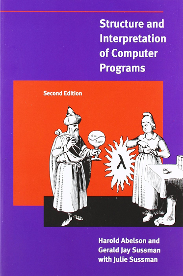

```{r knit_opts, include = FALSE}
rm(list = ls())

knitr::opts_chunk$set(tidy  = FALSE
                     ,cache = FALSE
                     ,message =  TRUE
                     ,warning =  TRUE
                     ,fig.height =  8
                     ,fig.width  = 11)

library(conflicted)
library(tidyverse)
library(scales)
library(cowplot)

conflict_prefer('filter',  'dplyr')
conflict_prefer('select',  'dplyr')


options(width = 80L
       ,warn  = 1
       ,mc.cores = parallel::detectCores()
        )

theme_set(theme_cowplot())

set.seed(42)
```


# Introduction


## Background

\


---

\

Data analysis

\

Statistical modelling

\

Finance / Insurance

---

BUT

---

Amateur programmer

---

The Structure and Interpretation of Computer Programs




## Why Haskell?

---

Purely functional

---

`ghc`

\

1993

---


---

Dominic Steinitz (idontgetoutmuch)

\

Barclays quant team

---

London Haskell

\

Particle filtering

\

`abs x`

---

Haskell Dublin Meetup

---

Lambdas are kinda cool

---

Monads sound interesting

---

PROBLEM...

---

Beth Orton / Chemical Brothers...

---

Where Do I Begin?

\


# Bayesian Methods


## Bayesian Inference Engine

\

Prior Knowledge

$+$

Data

\

$=$

\

Posterior Knowledge

---

Parameters, $\theta$

\

Data, $D$

---

Prior $\, \to \, p(\theta)$

\

Likelihood $\, \to \, p(D | \theta)$

\

Posterior $\, \to \, p(\theta | D)$

---

$$
p(\theta \, | \, D) = \int p(\theta) \, p(D \, | \, \theta)
$$

---


Simples!!!


# Particle Filters

## Visualisation

\

<iframe width="560" height="315" src="https://www.youtube.com/embed/5nswUcByXLo" frameborder="0" allow="accelerometer; autoplay; encrypted-media; gyroscope; picture-in-picture" allowfullscreen></iframe>

---

Update probabilities from data

---

Inherently Bayesian


## Kalman Filter

\

\begin{eqnarray*}
x_k &=& F_k x_{k-1} + B_k u_k + w_k \\
z_k &=& H_k x_k + v_k
\end{eqnarray*}

---


\

(not so simples...)


# First Example

```{r draw_normal_numbers, echo=FALSE}
x_data <- rnorm(10, mean = 0.5, sd = 1.5)
```


## Proposition

\

Normal distribution $\mathcal{N}(\mu, \sigma)$

\

Know $\sigma = 1.5$

\

Sequentially draw numbers

\

Guess the mean, $\mu$

---

First 3 numbers:

```{r display_three_numbers, echo=FALSE}
cat(paste0(x_data[1:3], collapse = '\n'))
```

---

### Prior Knowledge

\

$$
\mu \in (-3, 3)
$$

---

```{r plot_normal_prior, echo=FALSE}
x_vals <- seq(-3.5, 3.5, by = 0.01)
y_vals <- dnorm(x_vals, mean = 0, sd = 1)

ggplot() +
  geom_line(aes(x = x_vals, y = y_vals)) +
  expand_limits(x = c(-3, 3)) +
  xlab("x") +
  ylab("Density") +
  ggtitle("Normal Prior")
```

---

```{r plot_uniform_prior, echo=FALSE}
x_vals <- seq(-3.5, 3.5, by = 0.01)
y_vals <- dunif(x_vals, min = -3, max = 3)

ggplot() +
  geom_line(aes(x = x_vals, y = y_vals)) +
  expand_limits(x = c(-3, 3)) +
  xlab("x") +
  ylab("Density") +
  ggtitle("Uniform Prior")
```

---

$$
p(\theta \, | \, D) = \int p(\theta) \, p(D \, | \, \theta)
$$

---

Particle filter to integrate


# Haskell

## Normal Likelihood

\

$$
p(x \, | \, \mu, \sigma) = \frac{1}{\sqrt{2 \pi \sigma^2}} \exp\left(-\frac{(x - \mu)^2}{2 \sigma^2} \right)
$$

---

```{haskell likelihood, eval=FALSE}
likelihood :: Double -> Double -> Double
likelihood x nu = n / d
  where
    n = exp (-(x - nu)^2 / (2 * sigma^2))
    d = sqrt (2 * pi * sigma^2)
```

---

```{haskell posteriorize, eval=FALSE}
posteriorize ::  Histogram BinD Double ->
                 Double ->
                 Histogram BinD Double
posteriorize h x = H.bmap bayes h
  where
    bayes :: Double -> Double -> Double
    bayes theta p = p * likelihood x theta
```


# Conclusions


