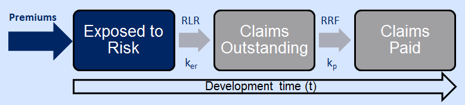
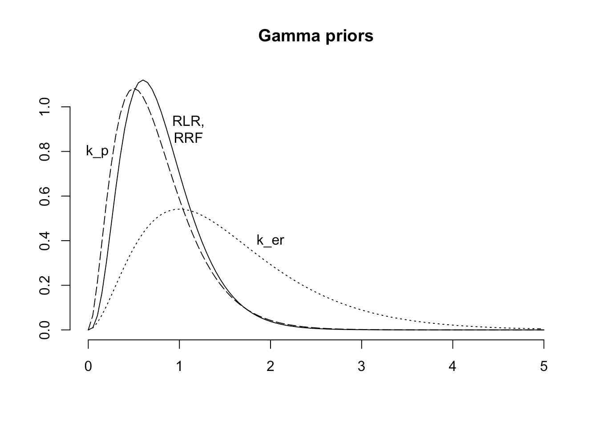
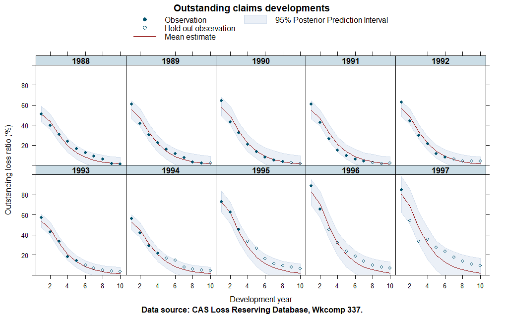
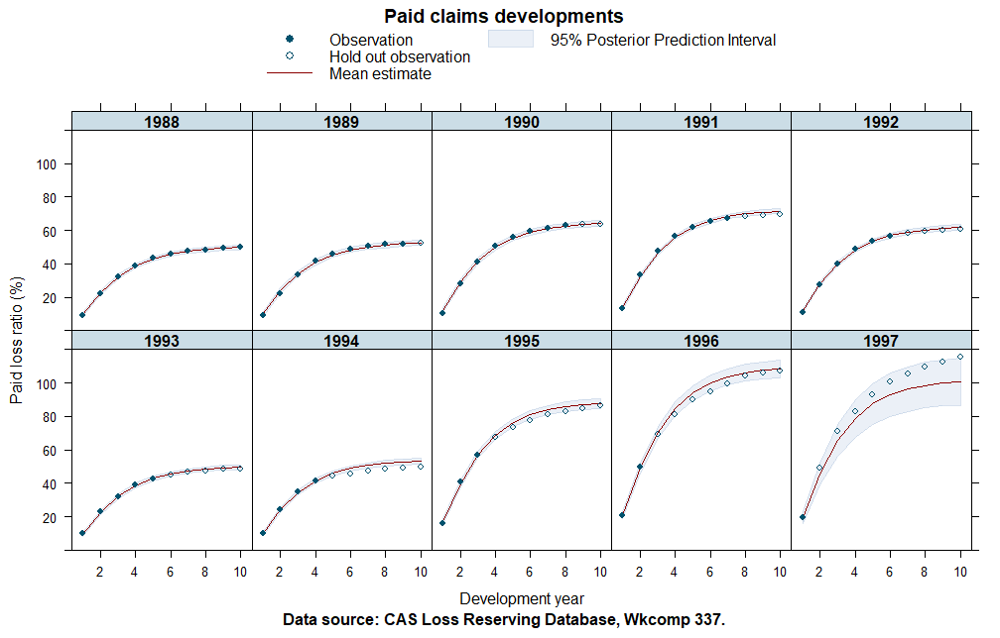

```{r knit_opts, include = FALSE}
knitr::opts_chunk$set(tidy  = FALSE
                     ,cache = FALSE
                     ,message = FALSE
                     ,warning = FALSE)

library(tidyverse)
library(deSolve)
library(scales)
library(rstan)
library(ggthemes)
#library(bayesplot)
```

# Extending the Growth Curve Approach

## Exponential Growth Function

- Exponential growth for rate of payment $k_{p}$ defined as:
$$GF_{t} =  1-e^{-k_{p} \cdot t}$$  
<style>
.nobullet li {
  list-style-type: none;
}
</style>


<div class = "nobullet">
- 
```{r, echo=FALSE, fig.height=5, fig.align="center"}
t_seq <- seq(0, 10, by = 0.01)
exp_func <- function(t, beta) 1-exp(-beta*t)

exp_tbl <- tibble(
    label = 'Exponential'
   ,t = t_seq
   ,value = exp_func(t_seq, 1)
)

ggplot(exp_tbl) +
    geom_line(aes(x = t, y = value), colour="darkred") +
    xlab(expression("Development Time")) +
    ylab(expression("Implied % Developed")) +
    scale_y_continuous(labels = scales::percent) +
    ggtitle("Exponential Growth Curve")  +
    theme_economist() + 
    scale_color_economist()
```
</div>

## Exponential Growth as an ODE system

- Define $EX_{t}$ as exposure % at development time t

- Assume $EX_{0} = 1$ and $EX_{t} + GF_{t} = 1$
\

- Growth function is a solution to ODEs:

<div class = "nobullet">
- 
$$dEX_{t}/dt = -k_{p} \cdot EX_{t}$$
$$dGF_{t}/dt = k_{p} \cdot EX_{t}$$
</div>
\
<div class = "nobullet">
- 
<span class="emphasized">$$EX_{t} = e^{-k_{p} \cdot t}$$ 
$$GF_{t} = 1-e^{-k_{p} \cdot t}$$</span>
</div>

## Exponential Growth Model as an ODE system

- Assume $EX_{0} = \text{Premiums} = P$

- Define $PD_{t}$ as cumulative paid claims at time t

- Allow a multiple of exposure, $ULR$, to become paid
\

<div class = "nobullet">
- 
$$dEX_{t}/dt = -k_{p} \cdot EX_{t}$$
$$dPD_{t}/dt = k_{p} \cdot ULR \cdot EX_{t}$$
\

<div class = "nobullet">
- 
<span class="emphasized">$$EX_{t} = P \cdot (1-GF_{t})$$ 
$$PD_{t} = P \cdot ULR \cdot GF_{t}$$</span>
</div>

---

```{r, echo=FALSE, fig.align='center', fig.height=4.5}
premiums = 10000
exp_ode <- function(t, y, parms) {
                  dy1 <- -parms[1]  * y[1] 
                  dy2 <- parms[1] * parms[2] * y[1] 
                  list(c(dy1, dy2))
                 }

yini <- c(y1 = premiums, y2 = 0)
t <- seq(from = 0, to = 10, by = 0.01)
out <- ode(times = t, 
          y = yini, 
          func = exp_ode, 
          parms=c(1, 0.8))

ggplot(out %>% as.data.frame() %>% as.tibble()) +
  geom_line(aes(x = t, y = y1), colour="gray50") +
  geom_line(aes(x = t, y = y2), colour="darkred") +
  xlab(expression("Development Time")) +
  ylab(expression("Exposure / Paid")) +
  ggtitle("Exponential ODE Solutions")  +
  theme_economist() + 
  scale_color_economist()

```

## Compartmental Model Representation
- Systems of ODEs can be written schematically as **compartmental models**:  

<div class = "nobullet">
-
{width=650px}
</div>

- Readily extensible framework for modelling the claims process

# Compartmental Reserving Models

## Base Model Schematic

- Introduce additional compartment for reported claims
    - Define $k_{er}$ as rate claims occur and are reported   
\

- Split $ULR$ into multiplicative components: 
  - Reported Loss Ratio ($RLR$) 
  - Reserve Robustness Factor ($RRF$)

<div class = "nobullet">
-

</div>


## Base Model ODEs


<div class = "nobullet">
- 
$$
\begin{gathered}
\begin{align}
\tfrac{dEX_{t}}{dt} &= -k_{er} \cdot EX_{t} \\
\tfrac{dOS_{t}}{dt} &= k_{er} \cdot RLR \cdot EX_{t} - k_{p}  \cdot OS_{t} \\ 
\tfrac{dPD_{t}}{dt} &= k_{p} \cdot RRF \cdot OS_{t}
\end{align}
\end{gathered}
$$ 
\
- 
```{r, echo=FALSE, fig.align='center', fig.height=4.5}
premiums = 10000
base_ode <- function(t, y, parms) {
                  dy1 <- -parms[1]  * y[1] 
                  dy2 <- parms[1] * parms[2] * y[1] - parms[3] * y[2]
                  dy3 <- parms[3] * parms[4] * y[2]
                  list(c(dy1, dy2, dy3))
                 }

yini <- c(y1 = premiums, y2 = 0, y3 = 0)
t <- seq(from = 0, to = 10, by = 0.01)
out <- ode(times = t, 
          y = yini, 
          func = base_ode, 
          parms=c(2, 1.05, 1, 0.75))

out = out %>%
      as.data.frame() %>% 
      as.tibble() %>% 
      mutate(inc = y2 + y3)

ggplot(out) +
  geom_line(aes(x = t, y = y1), colour="gray50") +
  geom_line(aes(x = t, y = y2), colour="black") +
  geom_line(aes(x = t, y = y3), colour="darkred") +
  geom_line(aes(x = t, y = inc), colour="darkgreen", linetype = 2) +
  xlab(expression("Development Time")) +
  ylab(expression("Exposure / Outstanding / Paid")) +
  ggtitle("Base Model Solutions") +
  theme_economist() + 
  scale_color_economist()

```
</div>

## Extending the Model

- Constant rates of reporting and payment rarely hold
  - Delays in reporting post-incident
  - Payment delays for larger claims  
\

- Allow $k_{er}$ and $k_{p}$ to depend on development time, $t$
    - Many potential functions  

\

<div class = "nobullet">
- 
<span class="emphasized">$$k_{er}(t) = \beta_{er} \cdot t$$
$$k_{p}(t) = \beta_{1,p} / (\beta_{2,p} + t)$$</span>
</div>  

## Extended Model ODEs

<div class = "nobullet">
- 
$$
\begin{gathered}
\begin{align}
\tfrac{dEX_{t}}{dt} &= -\beta_{er} \cdot t \cdot EX_{t} \\
\tfrac{dOS_{t}}{dt} &= \beta_{er} \cdot t \cdot RLR \cdot EX_{t} - \tfrac{\beta_{1,p}} {(\beta_{2,p} + t)} \cdot OS_{t} \\ 
\tfrac{dPD_{t}}{dt} &= \tfrac{\beta_{1,p}} {(\beta_{2,p} + t)} \cdot RRF \cdot OS_{t}
\end{align}
\end{gathered}
$$ 
\

<div class = "nobullet">
- 
```{r, echo=FALSE, fig.align='center', fig.height=4.5}
premiums = 10000
ext_ode <- function(t, y, parms) {
                  dy1 <- -parms[1] *t * y[1] 
                  dy2 <- parms[1] * t * parms[2] * y[1] - parms[3] / (parms[4] + t) * y[2]
                  dy3 <-  parms[3] / (parms[4] + t) * parms[5] * y[2]
                  list(c(dy1, dy2, dy3))
                 }

yini <- c(y1 = premiums, y2 = 0, y3 = 0)
t <- seq(from = 0, to = 10, by = 0.01)
out2 <- ode(times = t, 
          y = yini, 
          func = ext_ode, 
          parms=c(6, 1.05, 8, 8, 0.75))

out2 = out2 %>%
       as.data.frame() %>% 
       as.tibble() %>% 
       left_join(out, by = "time") %>%
       mutate(inc.x = y2.x + y3.x,
              inc.y = y2.y + y3.y)

ggplot(out2) +
  #geom_line(aes(x = t, y = y1.x), colour="gray50") +
  
  geom_line(aes(x = t, y = y2.x), colour="black") +
  geom_line(aes(x = t, y = y2.y), colour="black", alpha = 0.3) +
  
  geom_line(aes(x = t, y = y3.x), colour="darkred") +
  geom_line(aes(x = t, y = y3.y), colour="darkred", alpha = 0.3) +
  
  geom_line(aes(x = t, y = inc.x), colour="darkgreen", linetype = 2) +
  geom_line(aes(x = t, y = inc.y), colour="darkgreen", linetype = 2, alpha = 0.3) +
  
  xlab(expression("Development Time")) +
  ylab(expression("Outstanding / Paid / Incurred")) +
  coord_cartesian(ylim=c(0, 10e3)) +
  ggtitle("Extended Model vs. Base Model Solutions")  +
  theme_economist() + 
  scale_color_economist() 
```
</div>

# Hierarchical Compartmental Reserving Model

## Model Specification

<div class = "nobullet">
- 
\[
\begin{aligned}
 \begin{bmatrix}
           OS_{ij}, PD_{ij} 
          \end{bmatrix}^{T} = \
y_{ij} &\thicksim \mathcal{N}(\mu_{ij},\ \sigma^{2}_{[\delta]}) \\ 
\mu_{ij} &= P_{i} \cdot f(\delta_{ij}, t_{j}, k_{er}, RLR_{[i]}, k_{p}, RRF_{[i]}) \\
\\
f(\delta_{ij},t_{j},\dots) &
= (1 - \delta_{ij}) \cdot \hat {\mbox{OS}}(t_{j}, k_{er}, RLR_{[i]}, k_{p}) \ + \\
  & \ \ \ \ \ \ \delta_{ij} \cdot \hat {\mbox{PD}}( t_{j}, k_{er}, RLR_{[i]}, k_{p}, RRF_{[i]}) \\
\\
\delta_{ij} &=
\begin{cases}
  0 & \text{if } y_{ij} = OS_{ij} \\
  1 & \text{if } y_{ij} = PD_{ij}
\end{cases} \\ 
\\
\begin{pmatrix} RLR_{[i]} \\ RRF_{[i]}\end{pmatrix}  &\thicksim 
\mathcal{N} \left(  
\begin{pmatrix} 
        \mu_{RLR} \\ 
        \mu_{RRF}
\end{pmatrix},
\begin{pmatrix}
      \sigma_{_{RLR}}^2 & 0\\ 
      0 & \sigma_{_{RRF}}^2 
\end{pmatrix}
 \right)
  \end{aligned}
  \]   
</div>

## Priors

- Prior assumptions driven by domain knowledge:  
  - Profitability
  - Case reserving strength
  - Reporting / Payment speed
  
<div class = "nobullet">
-   
{width=600px}

</div>

## 'brms' Code

```{r, eval = FALSE}
fml <-
  loss_train ~ premiums * (
     (1 - delta) * (RLR*ker/(ker - kp) * (exp(-kp*dev) - exp(-ker*dev))) + 
      delta * (RLR*RRF/(ker - kp) * (ker *(1 - exp(-kp*dev)) - kp*(1 - exp(-ker*dev)))) 
   ) 

b1 <- brm(bf(fml,
             ker ~ 1, kp ~ 1,
             RLR ~ 1 + (1 | accident_year),
             RRF ~ 1 + (1 | accident_year),
             sigma ~ 0 + deltaf,
             nl = TRUE),
          data = lossData0[cal <= max(accident_year)], 
          family = brmsfamily("gaussian", link_sigma = "log"),
          prior = c(prior(gamma(4, 5), nlpar = "RLR", lb=0),
                    prior(gamma(4, 5), nlpar = "RRF", lb=0),
                    prior(gamma(3, 2), nlpar = "ker", lb=0),
                    prior(gamma(3, 4), nlpar = "kp", lb=0)),
          control = list(adapt_delta = 0.999, max_treedepth=15),
          seed = 1234, iter = 1000)
```

## Posterior Predictive Checks: Outstanding
{width=1000px}


## Posterior Predictive Checks: Paid
{width=1000px}

## Exercise Questions

- Is a Normal observation model appropriate?
\

- How sensitive is the model to alternative priors?
\

- Are $RLR_{i}$ and $RRF_{i}$ likely to be independent?
\

- How might we increase model flexibility?

## Questions?

  
