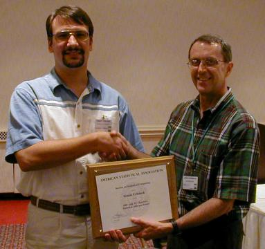
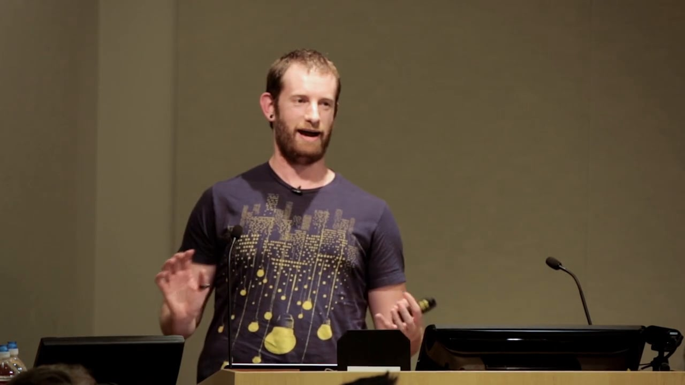
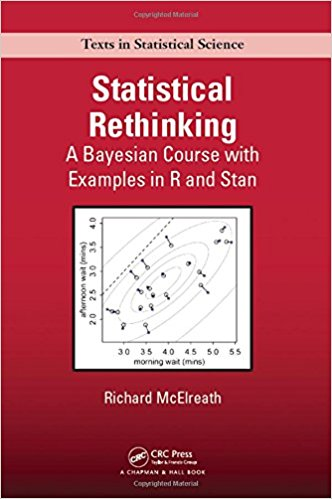
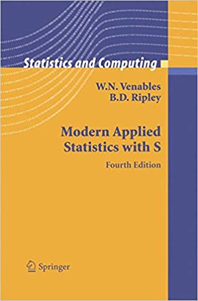

```{r knit_opts, include=FALSE}
rm(list = ls())

knitr::opts_chunk$set(tidy  = FALSE
                     ,cache = FALSE
                     ,fig.width  = 11
                     ,fig.height =  8)

library(tidyverse)
library(scales)
library(nycflights13)
library(rsample)

options(width = 80L
       ,warn  = 1 
        )
```


# Who Am I?

---

Physics

Quant Finance

Statistics

Computer Programming

---


Nerd

---

## What Do I Do?

\

Data problems

\

Education

\

Consulting


# Why R?

## History

\

S language

\

Bell labs

\

S-PLUS

---
 
## S Language



---

## Aim


"to turn ideas into software, quickly and faithfully"


---

## What about R?


Ross Ihaka, Robert Gentleman


---

University of Auckland

\

GNU Licence

\

Lexical scoping (Scheme)

---

Statisticians

$+$

Lexical scoping

$=$

Weird


## Example

```{r oldr_faithful_code, echo=TRUE, eval=FALSE}
xx <- faithful$eruptions

fit <- density(xx)

plot(fit)
```

---

```{r oldr_faithful_code_output, echo=FALSE}
xx <- faithful$eruptions

fit <- density(xx)

plot(fit)
```

---

```{r oldr_faithful_sample_code, echo=TRUE, eval=FALSE}
xx <- faithful$eruptions

fit1 <- density(xx)

fit2 <- replicate(10000, {
    x <- sample(xx, replace=TRUE);
    density(x, from=min(fit1$x), to=max(fit1$x))$y
})

fit3 <- apply(fit2, 1, quantile,c(0.025,0.975))

plot(fit1, ylim=range(fit3))

polygon(c(fit1$x, rev(fit1$x)), c(fit3[1,], rev(fit3[2,])), col='grey', border=F)

lines(fit1)
```

---

```{r oldr_faithful_sample_code_output, echo=FALSE}
xx <- faithful$eruptions

fit1 <- density(xx)

fit2 <- replicate(10000, {
    x <- sample(xx, replace=TRUE);
    density(x, from=min(fit1$x), to=max(fit1$x))$y
})

fit3 <- apply(fit2, 1, quantile,c(0.025,0.975))

plot(fit1, ylim=range(fit3))

polygon(c(fit1$x, rev(fit1$x)), c(fit3[1,], rev(fit3[2,])), col='grey', border=F)

lines(fit1)
```


# Modern R

## Hadley Wickham




## tidyverse and the 'pipe'

\

`%>%`

\

unix pipes, `|`

---

```{r nycflights_data, echo=FALSE}
flights %>% head()
```

---

```{r nycflights_summary, echo=TRUE, eval=FALSE}
flights %>%
    group_by(year, month, day) %>%
    select(arr_delay, dep_delay) %>%
    summarise(
        arr = mean(arr_delay, na.rm = TRUE),
        dep = mean(dep_delay, na.rm = TRUE)
    ) %>%
    filter(arr > 30 | dep > 30)
```

---

```{r nycflights_summary_output, echo=FALSE}
flights %>%
    group_by(year, month, day) %>%
    select(arr_delay, dep_delay) %>%
    summarise(
        arr = mean(arr_delay, na.rm = TRUE),
        dep = mean(dep_delay, na.rm = TRUE)
    ) %>%
    filter(arr > 30 | dep > 30)
```


## Old Faithful Again

```{r ggplot_old_faithful, echo=TRUE, eval=FALSE}
ggplot(faithful) +
    geom_density(aes(x = eruptions)) +
    expand_limits(x = c(0.5, 6.5))
```

---

```{r ggplot_old_faithful_output, echo=FALSE, warning=FALSE}
ggplot(faithful) +
    geom_density(aes(x = eruptions)) +
    expand_limits(x = c(0.5, 6.5))
```

---

```{r tidyverse_resampling, echo=TRUE, eval=FALSE}
pull_data <- function(x) x %>% as_data_frame %>% .$eruptions

faithful %>%
    bootstraps(200) %>%
    mutate(test = map(splits, pull_data)) %>%
    select(id, test) %>%
    unnest() %>%
    ggplot(.) +
        geom_density(aes(x = test, group = id), alpha = 0.01) +
        expand_limits(x = c(0.5, 6.5))
```

---


```{r tidyverse_resampling_output, echo=FALSE}
pull_data <- function(x) x %>% as_data_frame %>% .$eruptions

faithful %>%
    bootstraps(200) %>%
    mutate(test = map(splits, pull_data)) %>%
    select(id, test) %>%
    unnest() %>%
    ggplot(.) +
        geom_density(aes(x = test, group = id), alpha = 0.01) +
        expand_limits(x = c(0.5, 6.5))
```

# Getting Started

## Books


---


---




---




# Thank You

## Get in Touch

\


mcooney@agrippadataconsulting.com

GitHub: <http://www.github.com/kaybenleroll>


