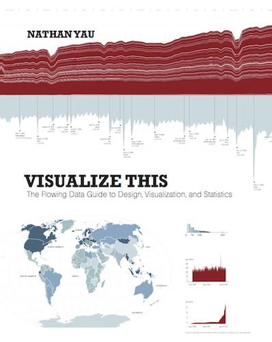

```{r knit_opts, include = FALSE}
library(conflicted)
library(tidyverse)
library(rlang)
library(cowplot)
library(CASdatasets)
library(rsample)
library(scales)
library(sf)
library(tmap)
library(kableExtra)
library(gganimate)
library(gifski)
library(av)
library(transformr)
library(tidytext)
library(ggwordcloud)


source("lib_utils.R")

conflict_lst <- resolve_conflicts(
  c("xml2", "magrittr", "rlang", "dplyr", "readr", "purrr", "ggplot2")
  )


knitr::opts_chunk$set(
  tidy       = FALSE,
  cache      = FALSE,
  warning    = FALSE,
  message    = FALSE,
  fig.height =     8,
  fig.width  =    11
  )

options(
  width = 80L,
  warn  = 1,
  mc.cores = parallel::detectCores()
  )

set.seed(42)

theme_set(theme_cowplot())

data(freMTPL2freq)
data(freMTPL2sev)
```


```{r prepare_datasets, echo=FALSE}
freq_tbl <- freMTPL2freq %>% as_tibble()
sev_tbl  <- freMTPL2sev  %>% as_tibble()

combined_tbl <- freq_tbl %>%
  nest_join(sev_tbl, by = "IDpol", name = "claim_data")
```


# Purpose

---

Tell A Story

---

Total Exposure of MTPL Data by Region

\


```{r tell_story_data, echo=FALSE}
story_data_tbl <- freq_tbl %>%
  mutate(Region = fct_lump_prop(Region, prop = 0.1)) %>%
  count(Region, wt = Exposure, name = "Total Exposure")
```

```{r tell_story_table, echo=FALSE}
story_data_tbl %>%
  knitr::kable()
```

---

Total Exposure of MTPL Data by Region

\


```{r tell_story_table_formatted, echo=FALSE}
story_data_tbl %>%
  mutate(`Total Exposure` = label_comma(accuracy = 0.01)(`Total Exposure`)) %>%
  knitr::kable(align = "lr")
```

---

```{r tell_story_plot, echo=FALSE}
ggplot(story_data_tbl) +
  geom_col(
    aes(x = Region, y = `Total Exposure`)
    ) +
  scale_y_continuous(labels = label_comma()) +
  labs(
    x = "Region",
    y = "Total Exposure",
    title = "Total Exposure of MTPL Data by Region"
    ) +
  theme(axis.text.x = element_text(angle = 20, vjust = 0.5, size = 12))
```


## Chart Types

---

Line plots

\

Scatter plots

---

Histograms

\

Error lines


# French Motor Third-Party Liability

---

CASdatasets

\

http://cas.uqam.ca/

\

https://github.com/dutangc/CASdatasets


---

Policy

```{r show_mtpl_data_freq, echo=FALSE}
freq_tbl %>% head(5) %>% knitr::kable() %>% kable_styling(font_size = 14)
```

\


Claims

```{r show_mtpl_data_sev, echo=FALSE}
sev_tbl %>% head(5) %>% knitr::kable() %>% kable_styling(font_size = 14)
```

```{r calculate_region_frequency_bootstrap_data, echo=FALSE, cache=TRUE}
calc_region_rate <- function(bootstrap_split) {
  bootstrap_tbl <- bootstrap_split %>%
    as_tibble() %>%
    group_by(Region) %>%
    summarise(
      .groups = "drop",
      
      claim_rate = sum(ClaimNb) / sum(Exposure)
      )
  
  return(bootstrap_tbl)
}


bootstrap_freq_tbl <- freq_tbl %>%
  bootstraps(times = 200) %>%
  mutate(freq_data = map(splits, calc_region_rate)) %>%
  select(id, freq_data) %>%
  unnest(freq_data)
```

---

`r freq_tbl %>% nrow() %>% label_comma()(.)` Policy Rows

\

`r sev_tbl %>% nrow() %>% label_comma()(.)` Claim Rows


# Visualisation and Exploration

## Claim Rates

---

```{r calculate_region_claim_rate, echo=FALSE}
region_rate_tbl <- freq_tbl %>%
  group_by(Region) %>%
  summarise(
    .groups = "drop",
    
    claim_rate = sum(ClaimNb) / sum(Exposure)
    )


ggplot(region_rate_tbl) +
  geom_point(aes(x = Region, y = claim_rate), size = 3) +
  expand_limits(y = 0) +
  labs(
    x = "Region",
    y = "Claim Rate",
    title = "Exploratory Plot of Claim Rate by Region"
    ) +
  theme(axis.text.x = element_text(angle = 20, vjust = 0.5, size = 8))
```


---

```{r plot_bootstrapped_claim_rates, echo=FALSE, cache=TRUE}
bootstrap_freq_summ_tbl <- bootstrap_freq_tbl %>%
  group_by(Region) %>%
  summarise(
    .groups = "drop",
    
    mean   = mean(claim_rate),
    median = median(claim_rate),
    
    p10    = quantile(claim_rate, probs = 0.10),
    p25    = quantile(claim_rate, probs = 0.25),
    p75    = quantile(claim_rate, probs = 0.75),
    p90    = quantile(claim_rate, probs = 0.90)
    )

ggplot(bootstrap_freq_summ_tbl) +
  geom_errorbar(aes(x = Region, ymin = p10, ymax = p90), width = 0, size = 1) +
  geom_errorbar(aes(x = Region, ymin = p25, ymax = p75), width = 0, size = 3) +
  geom_point(aes(x = Region, y = median), size = 3) +
  geom_point(aes(x = Region, y = mean), colour = 'red', size = 2) +
  expand_limits(y = 0) +
  labs(
    x = "Region",
    y = "Claim Rate",
    title = "Uncertainty Estimates for Claim Rates by Region"
    ) +
  theme(axis.text.x = element_text(angle = 20, vjust = 0.5, size = 8))
```


## Geospatial Data

---

```{r load_shapefile_data, echo=FALSE, results='hide'}
fra_adm_sf <- st_read("geospatial_data/", layer = "FRA_adm1")
```

```{r construct_geospatial_claim_rate_plot, echo=FALSE}
region_rate_tbl <- freq_tbl %>%
  group_by(Region) %>%
  summarise(
    .groups = "drop",
    
    claim_rate = sum(ClaimNb) / sum(Exposure)
    )

plot_sf <- fra_adm_sf %>%
  select(Region = NAME_1, geometry) %>%
  left_join(region_rate_tbl, by = "Region")

ggplot(plot_sf) +
  geom_sf(aes(fill = claim_rate)) +
  geom_sf_text(aes(label = Region)) +
  scale_fill_gradient(low = "yellow", high = "red") +
  labs(
    fill = "Claim Rate",
    title = "Visualisation of Claim Rate by Region"
    ) +
  theme_void()
```

---

```{r construct_geospatial_claim_rate_plot_zerofill, echo=FALSE}
region_rate_tbl <- freq_tbl %>%
  group_by(Region) %>%
  summarise(
    .groups = "drop",
    
    total_claim    = sum(ClaimNb),
    total_exposure = sum(Exposure),
    claim_rate     = sum(ClaimNb) / sum(Exposure)
    )

plot_sf <- fra_adm_sf %>%
  select(Region = NAME_1, geometry) %>%
  left_join(region_rate_tbl, by = "Region")

ggplot(plot_sf) +
  geom_sf(aes(fill = claim_rate)) +
  geom_sf_text(aes(label = Region)) +
  scale_fill_gradient(low = "yellow", high = "red") +
  expand_limits(fill = 0) +
  labs(
    fill = "Claim Rate",
    title = "Visualisation of Claim Rate by Region (Zero Fill Value)"
    ) +
  theme_void()
```


---

```{r construct_geospatial_quantile_animation, echo=FALSE, cache=TRUE}
region_rate_anim_tbl <- bootstrap_freq_tbl %>%
  group_by(Region) %>%
  summarise(
    .groups = "drop",
    
    prob = seq(0, 1, by = 0.05),
    qnt  = quantile(claim_rate, probs = prob)
    ) %>%
  mutate(prob_label = sprintf("%4.2f", prob))

geometry_sf <- fra_adm_sf %>%
  select(Region = NAME_1, geometry)

plot_sf <- geometry_sf %>%
  left_join(region_rate_anim_tbl, by = "Region") %>%
  expand(Region, prob_label) %>%
  left_join(geometry_sf, by = "Region") %>%
  left_join(region_rate_anim_tbl, by = c("Region", "prob_label"))


plot_anim <- ggplot(plot_sf, aes(geometry = geometry, fill = qnt, label = Region)) +
  geom_sf() +
  geom_sf_text() +
  scale_fill_gradient(low = "yellow", high = "red") +
  labs(
    fill = "Claim Rate",
    title = "Visualisation of Claim Rate by Region",
    subtitle = "Quantile {closest_state}"
    ) +
  theme_void() +
  transition_states(prob_label, state_length = 2)

animate(plot_anim + enter_fade() + exit_fade(), renderer = gifski_renderer())
```


# Visualise Comparisons

---

```{r calculate_region_claim_rate_fill_exposure, echo=FALSE}
plot_tbl <- bootstrap_freq_summ_tbl %>%
  left_join(region_rate_tbl, by = "Region")

ggplot(plot_tbl) +
  geom_errorbar(aes(x = Region, ymin = p10, ymax = p90, colour = total_exposure), width = 0, size = 1) +
  geom_errorbar(aes(x = Region, ymin = p25, ymax = p75, colour = total_exposure), width = 0, size = 3) +
  geom_point(aes(x = Region, y = median), size = 3) +
  geom_point(aes(x = Region, y = mean), colour = 'red', size = 2) +
  scale_colour_gradient(low = "#d8b365", high = "#5ab4ac", labels = label_comma()) +
  expand_limits(y = 0, colour = 0) +
  labs(
    x = "Region",
    y = "Claim Rate",
    colour = "Exposure",
    title = "Uncertainty Estimates for Claim Rates by Region"
    ) +
  theme(axis.text.x = element_text(angle = 20, vjust = 0.5, size = 8))
```

---


```{r construct_region_comparisons, echo=FALSE}
region_exposure_tbl <- freq_tbl %>%
  count(Region, wt = Exposure, name = "Exposure Total") %>%
  mutate(
    `Exposure Proportion` = `Exposure Total` / sum(`Exposure Total`)
    )

region_claims_tbl <- combined_tbl %>%
  unnest(claim_data) %>%
  count(Region, wt = ClaimAmount, name = "Claims Total") %>%
  mutate(
    `Claims Proportion` = `Claims Total` / sum(`Claims Total`)
    )

region_data_tbl <- region_exposure_tbl %>%
  inner_join(region_claims_tbl, by = "Region")
```


```{r construct_comparison_plot_data, echo=FALSE}
comparison_data_tbl <- region_data_tbl %>%
  pivot_longer(
    !Region,
    names_to  = "field",
    values_to = "value"
    ) %>%
  mutate(
    class = str_replace(field, "(.*?) (.*)", "\\1"),
    type  = str_replace(field, "(.*?) (.*)", "\\2")
    )

plot_tbl <- comparison_data_tbl %>%
  select(Region, class, type, value) %>%
  filter(type == "Proportion")

ggplot(plot_tbl) +
  geom_col(
    aes(x = Region, y = value, fill = class),
    position = "dodge"
    ) +
  labs(
    x = "Region",
    y = "Proportion",
    fill = "Type",
    title = "Comparison of Proportions of Total Claims and Exposure by Region"
    ) +
  theme(
    axis.text.x = element_text(angle = 20, vjust = 0.5, size = 10)
    )
```


## Compare Region by Fuel Type

---

```{r plot_exposure_region_fueltype_stacked, echo=FALSE}
plot_tbl <- freq_tbl %>%
  count(Region, VehGas, wt = Exposure, name = "Total Exposure")

ggplot(plot_tbl) +
  geom_col(
    aes(x = Region, y = `Total Exposure`, fill = VehGas)
    ) +
  labs(
    x = "Region",
    y = "Total Exposure",
    fill = "Fuel Type",
    title = "Total Exposure of Fuel Type by Region (Stacked Bars)"
    ) +
  scale_y_continuous(labels = label_comma()) +
  theme(
    axis.text.x = element_text(angle = 20, vjust = 0.5, size = 10)
    )
```

---

```{r plot_exposure_region_fueltype, echo=FALSE}
ggplot(plot_tbl) +
  geom_col(
    aes(x = Region, y = `Total Exposure`, fill = VehGas),
    position = "dodge"
    ) +
  labs(
    x = "Region",
    y = "Total Exposure",
    fill = "Fuel Type",
    title = "Total Exposure of Fuel Type by Region"
    ) +
  scale_y_continuous(labels = label_comma()) +
  theme(
    axis.text.x = element_text(angle = 20, vjust = 0.5, size = 10)
    )
```

---


## Compare Region by Vehicle Brand

---

```{r plot_exposure_region_brand_stacked, echo=FALSE}
plot_tbl <- freq_tbl %>%
  count(Region, VehBrand, wt = Exposure, name = "Total Exposure")

ggplot(plot_tbl) +
  geom_col(
    aes(x = Region, y = `Total Exposure`, fill = VehBrand)
    ) +
  labs(
    x = "Region",
    y = "Total Exposure",
    fill = "Brand",
    title = "Total Exposure of Vehicle Brand by Region (Stacked Bars)"
    ) +
  scale_y_continuous(labels = label_comma()) +
  theme(
    axis.text.x = element_text(angle = 20, vjust = 0.5, size = 10)
    )
```

---

```{r plot_exposure_region_brand, echo=FALSE}
ggplot(plot_tbl) +
  geom_col(
    aes(x = Region, y = `Total Exposure`, fill = VehBrand),
    position = "dodge"
    ) +
  labs(
    x = "Region",
    y = "Total Exposure",
    fill = "Brand",
    title = "Total Exposure of Vehicle Brand by Region"
    ) +
  scale_y_continuous(labels = label_comma()) +
  theme(
    axis.text.x = element_text(angle = 20, vjust = 0.5, size = 10)
    )
```

---

```{r plot_exposure_region_brand_facet, echo=FALSE}
ggplot(plot_tbl) +
  geom_col(
    aes(x = Region, y = `Total Exposure`, fill = VehBrand),
    position = "dodge"
    ) +
  labs(
    x = "Region",
    y = "Total Exposure",
    fill = "Brand",
    title = "Total Exposure of Vehicle Brand by Region"
    ) +
  facet_wrap(vars(VehBrand), scales = "free_y") +
  scale_y_continuous(labels = label_comma()) +
  theme(
    legend.position = "none",
    axis.text.x = element_text(angle = 30, vjust = 0.5, size = 6)
    )
```

---

```{r plot_exposure_region_brand_facet_fixedscale, echo=FALSE}
ggplot(plot_tbl) +
  geom_col(
    aes(x = Region, y = `Total Exposure`, fill = VehBrand),
    position = "dodge"
    ) +
  labs(
    x = "Region",
    y = "Total Exposure",
    fill = "Brand",
    title = "Total Exposure of Vehicle Brand by Region"
    ) +
  facet_wrap(vars(VehBrand)) +
  scale_y_continuous(labels = label_comma()) +
  theme(
    legend.position = "none",
    axis.text.x = element_text(angle = 30, vjust = 0.5, size = 6)
    )
```


# Text Data


## Word Cloud


```{r display_easter1916_text, echo=FALSE, comment = ""}
easter1916_text <- read_lines("easter1916_proclamation.txt") %>%
  str_c(collapse = " ")

easter1916_text %>% str_wrap(width = 90) %>% cat()
```

---


```{r show_easter1916_word_cloud_no_stop, echo=FALSE}
easter1916_tidytext_tbl <- easter1916_text %>%
  enframe(name = NULL, value = "text") %>%
  unnest_tokens(word, text) %>%
  count(word, name = "word_freq", sort = TRUE)

ggplot(easter1916_tidytext_tbl) +
  geom_text_wordcloud(aes(label = word, size = word_freq)) +
  scale_size_area(max_size = 16) +
  theme_minimal()
```


---

Stop words

\


(the, and, but, ...)


---

```{r show_easter1916_word_cloud, echo=FALSE}
data(stop_words)

ggplot(easter1916_tidytext_tbl %>% anti_join(stop_words, by = "word")) +
  geom_text_wordcloud(aes(label = word, size = word_freq), rm_outside = TRUE) +
  scale_size_area(max_size = 16) +
  theme_minimal()
```


---

```{r show_easter1916_word_cloud_angle_colour, echo=FALSE}
easter1916_fullcloud_tbl <- easter1916_tidytext_tbl %>%
  anti_join(stop_words, by = "word") %>%
  mutate(
    label_colour = factor(sample.int(5, n(), replace = TRUE)),
    label_angle  = 45 * runif(n(), min = -2, max = 2)
    )

ggplot(easter1916_fullcloud_tbl) +
  geom_text_wordcloud(
    aes(label = word, size = word_freq, angle = label_angle, colour = label_colour),
    rm_outside = TRUE
    ) +
  scale_size_area(max_size = 16) +
  theme_minimal()
```


# Pie Charts

## Exposure by Region

---

```{r construct_exposure_agg, echo=FALSE}
exposure_agg_tbl <- freq_tbl %>%
  count(Region, wt = Exposure, name = "Total Exposure")

exposure_agg_tbl %>%
  mutate(`Total Exposure` = label_comma(accuracy = 0.01)(`Total Exposure`)) %>%
  knitr::kable(align = "lr") %>%
  kable_styling(font_size = 14)
```

---


```{r plot_bar_chart_exposure, echo=FALSE}
ggplot(exposure_agg_tbl) +
  geom_col(
    aes(x = Region, y = `Total Exposure`)
    ) +
  labs(
    x = "Region",
    y = "Total Exposure",
    title = "Total Exposure by Region"
    ) +
  scale_y_continuous(labels = label_comma()) +
  theme(axis.text.x = element_text(angle = 20, vjust = 0.5, size = 8))
```

---

```{r plot_pie_chart_exposure, echo=FALSE}
ggplot(exposure_agg_tbl) +
  geom_bar(
    aes(x = "", y = `Total Exposure`, fill = Region),
    stat = "identity", width = 1
    ) +
  labs(
    title = "Total Exposure by Region"
    ) +
  scale_y_continuous(labels = label_comma()) +
  coord_polar("y", start = 0) +
  theme_void()
```


## Aggregate Under 10%

---

```{r construct_exposure_agg_010_lumped, echo=FALSE}
exposure_agg_tbl <- freq_tbl %>%
  mutate(Region = fct_lump_prop(Region, prop = 0.1)) %>%
  count(Region, wt = Exposure, name = "Total Exposure")
```

```{r plot_bar_chart_exposure_010_lumped, echo=FALSE}
ggplot(exposure_agg_tbl) +
  geom_col(
    aes(x = Region, y = `Total Exposure`)
    ) +
  labs(
    x = "Region",
    y = "Total Exposure",
    title = "Total Exposure by Region"
    ) +
  scale_y_continuous(labels = label_comma()) +
  theme(axis.text.x = element_text(angle = 20, vjust = 0.5, size = 8))
```

---

```{r plot_pie_chart_exposure_010_lumped, echo=FALSE}
ggplot(exposure_agg_tbl) +
  geom_bar(
    aes(x = "", y = `Total Exposure`, fill = Region),
    stat = "identity", width = 1
    ) +
  labs(
    title = "Total Exposure by Region"
    ) +
  scale_y_continuous(labels = label_comma()) +
  coord_polar("y", start = 0) +
  theme_void()
```


## Aggregate Under 5%

---

```{r construct_exposure_agg_005_lumped, echo=FALSE}
exposure_agg_tbl <- freq_tbl %>%
  mutate(Region = fct_lump_prop(Region, prop = 0.05)) %>%
  count(Region, wt = Exposure, name = "Total Exposure")
```

```{r plot_bar_chart_exposure_005_lumped, echo=FALSE}
ggplot(exposure_agg_tbl) +
  geom_col(
    aes(x = Region, y = `Total Exposure`)
    ) +
  labs(
    x = "Region",
    y = "Total Exposure",
    title = "Total Exposure by Region"
    ) +
  scale_y_continuous(labels = label_comma()) +
  theme(axis.text.x = element_text(angle = 20, vjust = 0.5, size = 8))
```

---

```{r plot_pie_chart_exposure_005_lumped, echo=FALSE}
ggplot(exposure_agg_tbl) +
  geom_bar(
    aes(x = "", y = `Total Exposure`, fill = Region),
    stat = "identity", width = 1
    ) +
  labs(
    title = "Total Exposure by Region"
    ) +
  scale_y_continuous(labels = label_comma()) +
  coord_polar("y", start = 0) +
  theme_void()
```


# Summary

## Book Suggestions

---


---



---

Thank You

\

mcooney@describedata.com

\

https://github.com/kaybenleroll/data_workshops
