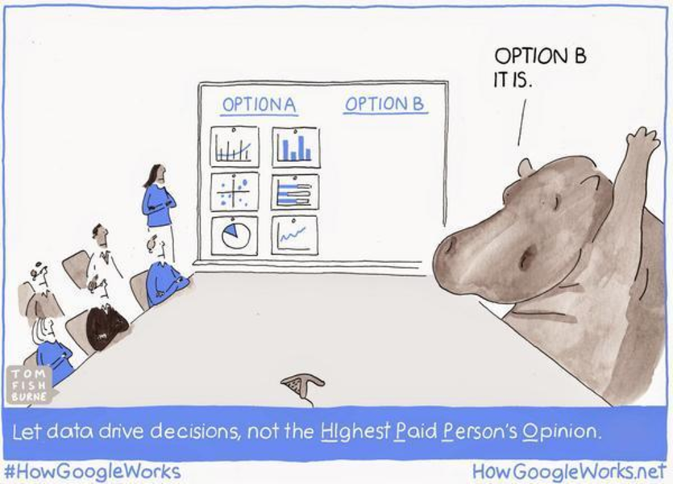
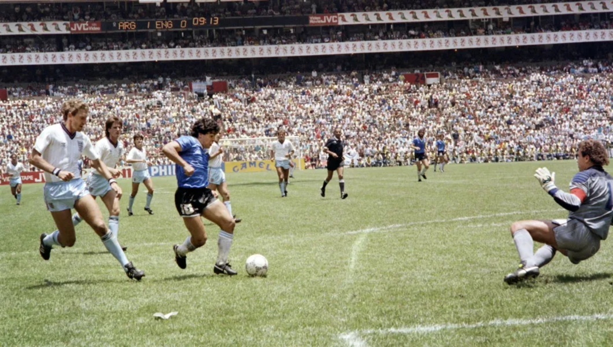

```{r knit_opts, include=FALSE}
library(conflicted)
library(tidyverse)
library(rlang)
library(cowplot)


source("lib_utils.R")

conflict_lst <- resolve_conflicts(
  c("xml2", "magrittr", "rlang", "dplyr", "readr", "purrr", "ggplot2")
  )


knitr::opts_chunk$set(
  tidy       = FALSE,
  cache      = FALSE,
  warning    = FALSE,
  message    = FALSE,
  fig.height =     8,
  fig.width  =    11
  )

options(
  width = 80L,
  warn  = 1,
  mc.cores = parallel::detectCores()
  )

set.seed(42)

theme_set(theme_cowplot())
```


# Introduction


## Who Am I?

\

Former quant

\

Insurance

\

Specialty risks


---


---

Nerd


# Key Concepts


## The Big Short


---


\


"The truth is like poetry--

\

-- and most people f**king hate poetry,"


---

Change

\

Uncertainty


# Three Ideas

---

\


Uncertainty

\

Simplicity

\

Culture


## Uncertainty


---


---


---


## Culture

---




## Simplicity

---



---


---

Great Goalscorer

\

vs

\

Scorer of Great Goals


# Summary


---

Culture

---

Thank You

\

mcooney@describedata.com

\

https://github.com/kaybenleroll/data_workshops
