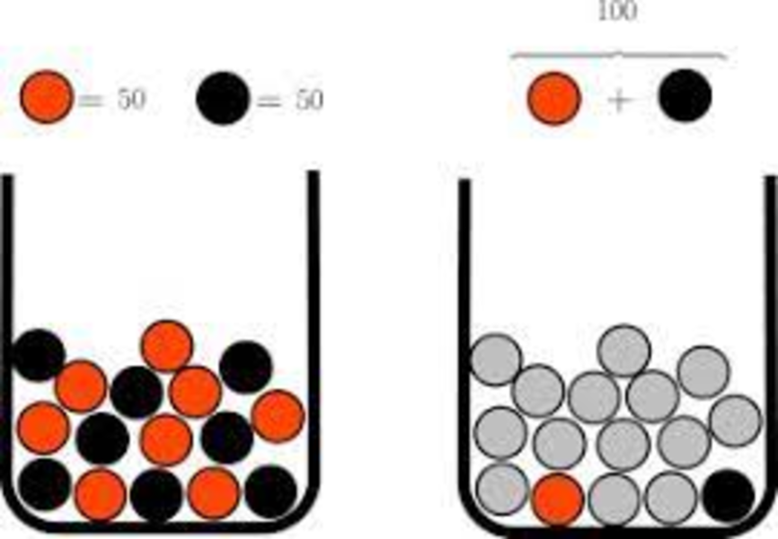
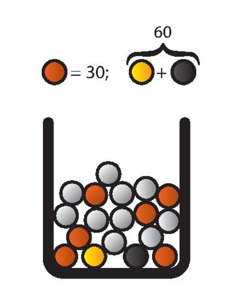

```{r knit_opts, include = FALSE}
library(conflicted)
library(tidyverse)
library(rlang)
library(cowplot)


source("lib_utils.R")

conflict_lst <- resolve_conflicts(
  c("xml2", "magrittr", "rlang", "dplyr", "readr", "purrr", "ggplot2")
  )


knitr::opts_chunk$set(
  tidy       = FALSE,
  cache      = FALSE,
  warning    = FALSE,
  message    = FALSE,
  fig.height =     8,
  fig.width  =    11
  )

options(
  width = 80L,
  warn  = 1,
  mc.cores = parallel::detectCores()
  )

set.seed(42)

theme_set(theme_cowplot())
```


# Knowledge

---

Mark Twain


---

It ain't what you don't know that gets you into trouble...

---

... It's what you know for sure that just ain't so.

---

## Donald Rumsfeld


---

IMAGE Known Knowns etc HERE


# Risk vs Uncertainty

---


Frank Knight - *Risk, Uncertainty and Profit* (1921)


# Psychology

## Ellsberg Paradox

---



---

*1R*: Left Red €100

*1B*: Left Black €100

---

*1R*: Left Red €100

*2R*: Right Red €100

---



---

*1R*: Red €100

*2R*: Black €100

---

*1R*: Red and Black €100

*2R*: Black and Yellow €100


# What Do We Do?

## Risk


# Summary


---

Thank You

\

mcooney@describedata.com

\

https://github.com/kaybenleroll/data_workshops
