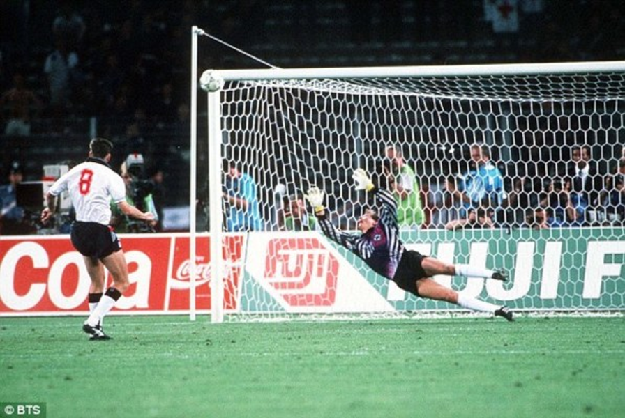

```{r knit_opts, include = FALSE}
library(conflicted)
library(tidyverse)
library(rlang)
library(cowplot)


source("lib_utils.R")

conflict_lst <- resolve_conflicts(
  c("xml2", "magrittr", "rlang", "dplyr", "readr", "purrr", "ggplot2")
  )


knitr::opts_chunk$set(
  tidy       = FALSE,
  cache      = FALSE,
  warning    = FALSE,
  message    = FALSE,
  fig.height =     8,
  fig.width  =    11
  )

options(
  width = 80L,
  warn  = 1,
  mc.cores = parallel::detectCores()
  )

set.seed(42)

theme_set(theme_cowplot())
```


# Knowledge

---

Mark Twain


---

It ain't what you don't know that gets you into trouble...

---

... It's what you know for sure that just ain't so.

---

## Donald Rumsfeld


---

IMAGE Known Knowns etc HERE

---


# Risk vs Uncertainty

---


Frank Knight - *Risk, Uncertainty and Profit* (1921)


# Problem

---

Just How Bad are England at Penalty Shootouts?




---

```{r show_england_tournaments, echo=FALSE}
england_penalty_tbl <- tribble(
    ~Year,      ~Opponent,  ~Tournament, ~Result
    ,1990, "West Germany",  "World Cup",  "Loss"
    ,1996,        "Spain",      "Euros",   "Win"
    ,1996,      "Germany",      "Euros",  "Loss"
    ,1998,    "Argentina",  "World Cup",  "Loss"
    ,2004,     "Portugal",      "Euros",  "Loss"
    ,2006,     "Portugal",  "World Cup",  "Loss"
    ,2012,        "Italy",      "Euros",  "Loss"
    ,2018,     "Colombia",  "World Cup",   "Win"
    ,2021,        "Italy",      "Euros",  "Loss"
)

england_penalty_tbl %>% (knitr::kable)(align = c('lllc'))
```


# Summary


---

Thank You

\

mcooney@describedata.com

\

https://github.com/kaybenleroll/data_workshops
