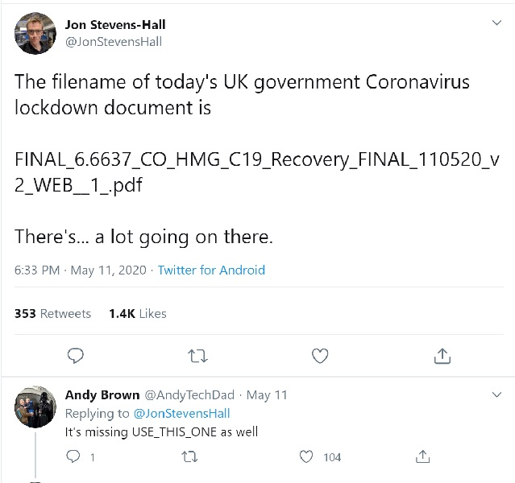

```{r knit_opts, include=FALSE, warning=FALSE, message=FALSE}
library(conflicted)
library(tidyverse)

conflict_prefer("filter",   "dplyr")
conflict_prefer("lag",      "dplyr")
conflict_prefer("select",   "dplyr")


knitr::opts_chunk$set(tidy       = FALSE,
                      cache      = FALSE,
                      message    = FALSE,
                      warning    = FALSE,
                      fig.height =     8,
                      fig.width  =    11
                      )


options(width = 80L,
        warn  = 1,
        mc.cores = parallel::detectCores()
        )


set.seed(42)
```


#  What is Reproducible Research?


---


---


## An Example?

---

Anecdotes???


## Meetups

\

Dublin Data Science

\

Insurely You're Joking (Dublin|London)

\

Anyone who will have me

---

Talks

\

Workshops

\

Informal help

---


---


---


---


---


---


---


## What To Do?

---


---

Reproducibility


# Reproducible Research

---


---

\


1. Source Control
1. Workbooks

---

\


1. Source Control
1. Workbooks
1. Makefiles
1. Containers and Docker


# Source Control

---


---


---



---


## git

\

Track changes

\

Collaboration

---


---

Issue tracking

\

Branch management


# Workbooks

---

What is research?

---

Outcome unknown...

---

Try lots of stuff...

---


---


---


---


---

Record of work

---


---

Jupyter vs Zeppelin vs Rmarkdown

---

NOT for production


# Makefiles


---


---


---


---


## Dependency Management

---

make and Makefiles

---

Directed Acyclic Graph (DAG)

---


---

sysadmin tasks


# Containers and Docker


## Rewind

---


---


---


---

```
Quitting from lines 272-288 (10_carinspricing_exploration.Rmd) 
Error in `[.tbl_df`(policyprop_dt, claim_count > 0) : 
  object 'claim_count' not found
Calls: <Anonymous> ... ggplot -> [ -> [.grouped_df -> NextMethod -> [.tbl_df

Execution halted
```

---


---

## Docker


---

Lightweight containers

\

Library versioning

---


---

Issues

---

APIs (Yahoo! Finance)


# Summary

## Aspects

\


1. Source Control
1. Workbooks
1. Makefiles
1. Containers and Docker

---

### Source Control

\

https://web.archive.org/web/20180924182907/http://hginit.com/

\

https://ohshitgit.com/

\

https://git-scm.com/book/en/v2

---

### Workbooks

\

https://www.dataquest.io/blog/jupyter-notebook-tutorial/

\

https://zeppelin.apache.org/docs/0.5.5-incubating/

\

https://rmarkdown.rstudio.com/articles_intro.html


---

### Makefiles

\

http://matt.might.net/articles/intro-to-make/

\

https://edoras.sdsu.edu/doc/make.html

\

https://www.gnu.org/software/make/manual/html_node/index.html


---

### Docker

\

http://ropenscilabs.github.io/r-docker-tutorial/

\

https://docker-curriculum.com/

\

https://docs.docker.com/get-started/


---

## Extras

\

[Software Carpentry](https://software-carpentry.org/)

\

https://gitlab.com/ecohealthalliance/drake-gitlab-docker-example

\


## Questions?

\

Email:

mickcooney@gmail.com

\

GitHub:

https://github.com/kaybenleroll/data_workshops


