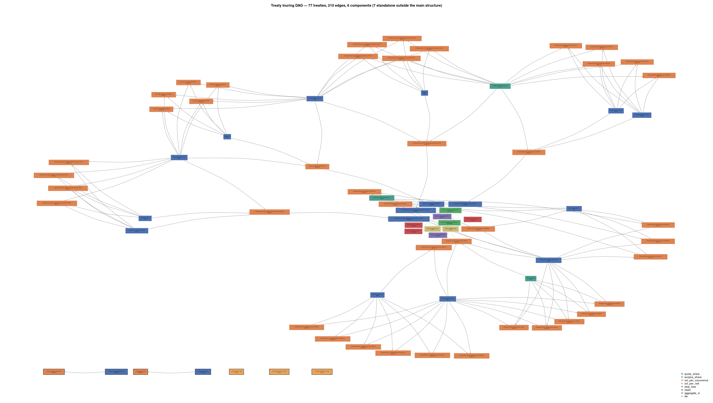

```{r knit_opts}
#| include: false

library(conflicted)
library(tidyverse)
library(magrittr)
library(rlang)
library(glue)
library(scales)
library(cowplot)
library(gt)
library(DiagrammeR)
library(igraph)
library(ggraph)
library(tidygraph)
library(arrow)


source("lib_utils.R")


conflict_lst <- resolve_conflicts(
  c("xml2", "magrittr", "rlang", "dplyr", "readr", "purrr", "ggplot2")
  )


options(
  width = 80L,
  warn  = 1,
  mc.cores = parallel::detectCores()
  )


theme_set(theme_cowplot())
```


```{r set_up_inuring_graph_loss_data}
#| echo: false

loss_events_tbl <- read_csv("demo_business/loss_events.csv")
loss_allocation_tbl <- read_csv("demo_business/loss_allocation_walkthrough.csv")

graph_nodes_tbl <- read_parquet("demo_business/nodes_tbl.parquet")
graph_edges_tbl <- read_parquet("demo_business/edges_tbl.parquet")


inuring_tblgraph <- tbl_graph(
  nodes = graph_nodes_tbl,
  edges = graph_edges_tbl,
  node_key = "treaty_id",
  directed = TRUE
)
```


# The Problem

---

::: {.custom-medium}
```{r show_loss_events}
#| echo: false

loss_events_tbl |>
  transmute(
    event_id, description, gross_loss = scales::label_currency()(gross_loss)
    ) |>
  knitr::kable(align = "llr")
```
:::

---

Who pays what?

---



---

How to allocate losses across treaties?


# Treaties as Functions

---

$$
Treaty: \text{Losses} \rightarrow \text{Recoveries}
$$

---

Quota Share (QS)

\


Excess of Loss (XoL)

\


Aggregate / Occurrence Limits


## Recovery Accounting


---

### 10XS10 XoL

\


10 million excess of 10 million

---

| Segment      | Gross Loss |
|--------------|-----------:|
| Construction |       5.0M |
| Legal        |      10.0M |
| I.T.         |       5.0M |
|              |            |
| Total        |      20.0M |


---

Treaty recovers 10M

---

How do we allocate them?

---

| Segment      | Treaty  | Recovery |
|--------------|---------|---------:|
| Construction | 10XS10  |     2.5M |
| Legal        | 10XS10  |     5.0M |
| I.T.         | 10XS10  |     2.5M |
|              |         |          |
| Total        | 10XS10  |    10.0M |


---

### 25% QS

\


25% quota-share (often with a limit)

---

| Segment      | Gross Loss |
|--------------|-----------:|
| Construction |       5.0M |
| Legal        |      10.0M |
| I.T.         |       5.0M |
|              |            |
| Total        |      20.0M |


---

Treaty recovers 5M

---


| Segment      | Treaty  | Recovery |
|--------------|---------|---------:|
| Construction | 25% QS  |    1.25M |
| Legal        | 25% QS  |    2.50M |
| I.T.         | 25% QS  |    1.25M |
|              |         |          |
| Total        | 25% QS  |    5.00M |


# Inuring

---

Sequencing of treaties


## Gross / Subject Losses

---

Subject Loss = Gross Loss - Inuring Recoveries

---

```{r show single_node_connected}
#| echo: false

target_node <- "XOL02_L1"  # node name/value to match

node_id <- inuring_tblgraph |>
  activate(nodes) |>
  as_tibble() |>
  mutate(row_id = row_number()) |>
  filter(treaty_id == target_node) |>
  pull(row_id)

treaty_subgraph <- inuring_tblgraph |>
  convert(
    to_local_neighborhood,
    node  = node_id,
    order = 1,
    mode  = "in"
    )

treaty_subgraph |>
  ggraph(layout = "stress") +
  geom_edge_link(arrow = arrow(length = unit(3, "mm")), end_cap = circle(3, "mm")) +
  geom_node_label(aes(label = treaty_id)) +
  theme_graph()
```


## Topological Sort


---

Inuring graph dictates calculation order

---

```{r show_full_graph}
#| echo: false

graph_layout <- inuring_tblgraph |> igraph::layout_with_fr()

ggraph(inuring_tblgraph, layout = graph_layout) +
  geom_edge_link(
    arrow  = arrow(angle = 14, type = "closed"),
    colour = "darkgrey"
    ) +
  geom_node_label(
    aes(label = treaty_id),
    size  = 2,
    repel = FALSE
    ) +
  scale_x_continuous(expand = expansion(0.03)) +
  theme_graph()

```

---

::: {.custom-small}
```{r show_inuring_sort}
#| echo: false

topo_order <- inuring_tblgraph |>
  igraph::topo_sort(mode = "out")

inuring_tblgraph |>
  activate(nodes) |>
  as_tibble() |>
  slice(as.integer(topo_order)) |>
  transmute(
    calc_order = row_number(),
    treaty_id, treaty_type, treaty_label, description
    ) |>
  head(15) |>
  knitr::kable()

```
:::


# Orchestration

---


::: {.custom-small}
```
1. Construct graph
2. Construct treaty functions
3. Determine treaty/loss coverage
4. Topological sort
5. Loop over each node:

    a. List inuring treaties
    b. List inuring losses/recoveries
    c. Keep covered losses/recoveries
    d. Calculate subject losses
    e. Calculate recoveries

6. Gather all per-node outputs
7. Construct outputs
```
:::

---

Treaty / Loss coverage non-trivial

---

Multiple ways to determine coverage

\


Many-to-many relationship

---

Gross / net premium losses

\


Organisation unit

\


Regulatory authority


# Questions

\


mickcooney@gmail.com

\


[https://github.com/kaybenleroll/data_workshops/talk_rr_reinsrecover_202607]()

