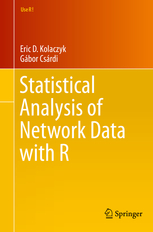

```{r knit_opts, include = FALSE}
knitr::opts_chunk$set(tidy  = FALSE
                     ,cache = FALSE
                     ,message = FALSE
                     ,warning = FALSE
                     ,fig.height =  8
                     ,fig.width  = 11)

library(conflicted)
library(tidyverse)
library(scales)
library(cowplot)
library(ggnetwork)
library(igraph)
library(igraphdata)
library(sand)
library(ggrepel)
library(intergraph)
library(ergm)

conflict_prefer('select',   'dplyr')
conflict_prefer('filter',   'dplyr')
conflict_prefer('simplify', 'igraph')


options(width = 80L
       ,warn  = 1
        )

set.seed(42)

source('custom_functions.R')
```


# Introduction to Network Data

All materials for this workshop is available in my standard GitHub repo:

https://github.com/kaybenleroll/dublin_r_workshops





The content of this workshop is based on the book "Statistical Analysis of
Network Data with R" by Kolaczyk and Csardi. The data from this book is
available from CRAN via the package `sand` and there is a GitHub repo for the
code in the book also:

https://github.com/kolaczyk/sand


Additional ideas and elements and concepts were
taken from the Coursera course "Social and Economic Networks" taught by
Matthew O. Jackson

https://www.coursera.org/learn/social-economic-networks


## Example Networks

In this workshop we are going to use three different networks as reference
datasets to illustrate the concepts we discuss.


### Florentine Marriage Data

```{r load_florentine_data, echo=TRUE}
data(flo, package = 'network')

florence_igraph <- graph_from_adjacency_matrix(flo, mode = 'undirected')

plot(florence_igraph)
```

We can use the package `ggnetwork` to allow us to plot networks within `ggplot2`

```{r plot_florentine_ggnetwork, echo=TRUE}
florence_layout <- ggnetwork(florence_igraph, layout = 'fruchtermanreingold')

ggplot(florence_layout, aes(x = x, y = y, xend = xend, yend = yend)) +
    geom_edges() +
    geom_label(aes(label = vertex.names), size = 5) +
    theme_blank()
```

```{r show_graph_details, echo=TRUE}
### Show graph vertices
V(florence_igraph)


### Show graph edges
E(florence_igraph)
```


To help access the edgelist in a more usable form we convert the edgelist to a
matrix, showing the origin and destination nodes.

```{r show_florence_edgelist, echo=TRUE}
as_edgelist(florence_igraph)
```

We also want to look at the adjacency matrix for this network

```{ show_florence_adjacency, echo=TRUE}
as_adjacency_matrix(florence_igraph)
```

The elements of a graph can all have attributes:

```{r show_element_attributes, echo=TRUE}
graph_attr_names(florence_igraph)

vertex_attr_names(florence_igraph)

edge_attr_names(florence_igraph)
```


Subgraphs are subsets of graphs that are part of the whole.

```{r show_florence_subgraph, echo=TRUE}
family_keep <- c('Medici', 'Barbadori', 'Ridolfi','Tornabuoni','Pazzi'
                ,'Salviati', 'Albizzi', 'Guadagni')

florence_subgraph <- induced_subgraph(florence_igraph, family_keep)

ggplot(florence_subgraph, aes(x = x, y = y, xend = xend, yend = yend)) +
    geom_edges() +
    geom_label(aes(label = vertex.names), size = 5) +
    theme_blank()
```

### US Airport Data

```{r load_usairport_data, echo=TRUE}
data(USairports)


### Show graph vertices
V(USairports)


### Show graph edges
E(USairports)
```

This is a much larger network, and visualising it is likely going to be a mess,
but we will try anyway.

```{r plot_usairport_data, echo=TRUE}
ggplot(USairports, aes(x = x, y = y, xend = xend, yend = yend)) +
    geom_edges() +
    geom_label(aes(label = vertex.names), size = 5) +
    theme_blank()
```

Yeah, it is a mess.

We will try again with a small subgraph, using just 15 nodes

```{r plot_usairport_subgraph, echo=TRUE}
usairport_subgraph <- induced_subgraph(USairports, 1:15)

ggplot(usairport_subgraph, aes(x = x, y = y, xend = xend, yend = yend)) +
    geom_edges() +
    geom_label(aes(label = vertex.names), size = 5) +
    theme_blank()
```

Now that we have seen this network, we look at what additional information is
here.

```{r show_element_attributes_usairports, echo=TRUE}
graph_attr_names(USairports)

vertex_attr_names(USairports)

edge_attr_names(USairports)
```

We see that the edges in particular now have a number of attributes. We access
them through `edge_attr()`

```{r list_airport_edge_attributes, echo=TRUE}
edge_attr(USairports) %>%
    as_tibble()
```

### Lazega Lawyers Network

```{r load_lazega_data, echo=TRUE}
data(lazega)

lazega <- lazega %>% upgrade_graph()  # Data is in deprecated format.


### Show graph vertices
V(lazega)


### Show graph edges
E(lazega)


lazega_igraph  <- lazega %>% upgrade_graph()
lazega_network <- lazega %>% intergraph::asNetwork()
```


```{r plot_lazega_data, echo=TRUE}
ggplot(lazega, aes(x = x, y = y, xend = xend, yend = yend)) +
    geom_edges() +
    geom_label(aes(label = vertex.names), size = 3) +
    theme_blank()
```

```{r show_element_attributes_lazega, echo=TRUE}
graph_attr_names(lazega)

vertex_attr_names(lazega)

edge_attr_names(lazega)
```

We see that the vertices have the attributes but the edges have none.

```{r show_lazega_edge_attr, echo=TRUE}
vertex_attr(lazega) %>%
    as_tibble()
```


### Exercises

  1. Read in the network data contained in the file `NetScience.net`.
  1. Visualise the network using both base `plot` and `ggplot2`.
  1. Investigate the vertex and edge attributes.
  1. Is this graph directed or undirected?
  1. How many edges and vertices does it have?
  1. Is it a simple graph?
 


## Visualising Network Data

Plotting network data is not automatic - mathematical concepts allow us to
convert network topology into a form amenable to plotting.

```{r plot_florence_graph, echo=TRUE}
plot_1 <- ggplot(florence_igraph, aes(x = x, y = y, xend = xend, yend = yend)) +
    geom_edges() +
    geom_label(aes(label = vertex.names), size = 3) +
    theme_blank()

plot_2 <- ggplot(florence_igraph, aes(x = x, y = y, xend = xend, yend = yend)) +
    geom_edges() +
    geom_label(aes(label = vertex.names), size = 3) +
    theme_blank()

plot_3 <- ggplot(florence_igraph, aes(x = x, y = y, xend = xend, yend = yend)) +
    geom_edges() +
    geom_label(aes(label = vertex.names), size = 3) +
    theme_blank()

plot_4 <- ggplot(florence_igraph, aes(x = x, y = y, xend = xend, yend = yend)) +
    geom_edges() +
    geom_label(aes(label = vertex.names), size = 3) +
    theme_blank()


plot_grid(plot_1, plot_2, plot_3, plot_4, ncol = 2)
```

### Creating Layouts

To plot graphs visually, we need a way to transform the graphs into 2D
coordinates. A number of layout algorithms exist.

To show the differences, we plot the Florentine network using a number of
different layout algorithms.

```{r plot_florence_fr, echo=TRUE}
ggplot(ggnetwork(florence_igraph, layout = 'fruchtermanreingold')
      ,aes(x = x, y = y, xend = xend, yend = yend)) +
    geom_edges() +
    geom_label(aes(label = vertex.names)) +
    ggtitle('The Florentine Network Using Fruchterman-Reingold Layout') +
    theme_blank()
```


```{r plot_florence_spring, echo=TRUE}
ggplot(ggnetwork(florence_igraph, layout = 'spring')
      ,aes(x = x, y = y, xend = xend, yend = yend)) +
    geom_edges() +
    geom_label(aes(label = vertex.names)) +
    ggtitle('The Florentine Network Using Spring Layout') +
    theme_blank()
```


```{r plot_florence_mds, echo=TRUE}
ggplot(ggnetwork(florence_igraph, layout = 'mds')
      ,aes(x = x, y = y, xend = xend, yend = yend)) +
    geom_edges() +
    geom_label(aes(label = vertex.names)) +
    ggtitle('The Florentine Network Using MDS Layout') +
    theme_blank()
```

```{r plot_florence_circle, echo=TRUE}
ggplot(ggnetwork(florence_igraph, layout = 'circle')
      ,aes(x = x, y = y, xend = xend, yend = yend)) +
    geom_edges() +
    geom_label(aes(label = vertex.names)) +
    ggtitle('The Florentine Network Using Circular Layout') +
    theme_blank()
```

We save the FR layout for future plotting so that all plots looks the same


```{r create_florentine_layout, echo=TRUE}
florentine_fr_layout <- ggnetwork(florence_igraph, 'fruchtermanreingold')
```


### Exercises

  1. Produce similar visualisations as appropriate for the other graphs.
  1. Investigate alternative layout algorithms for the Florentine network.
  1. Try those layouts on the other network data.
  
  
# Network Statistics

## Network Degree

### Degree of Vertex

The *degree* of a vertex is the count of connections from that vertex.

We now look at the distribution of vertex degree for the Florentine network:


```{r plot_florentine_degree_distribution, echo=TRUE}
ggplot() +
    geom_bar(aes(x = igraph::degree(florence_igraph))) +
    xlab("Vertex Degree") +
    ylab("Count of Degrees")
```

### Edge Density

The *edge density* is the ratio of the edge count on the graph with the total
possible count of edges on the graph.

From combinatorics, the total possible count of edges is $\frac{N(N-1)}{2}$.

Thus, for a network of order $N_v$ and size $N_e$, the density is given by

$$
\text{density} = \frac{2 N_v}{N_e (N_e - 1)}
$$


```{r calc_edge_density, echo=TRUE}
florence_igraph %>% edge_density
```

### Average Neighbour Degree

Another interesting quantity is the average degree of all the neighbours of
each vertex.

```{r plot_degree_knn, echo=TRUE}
flor_knn <- knn(florence_igraph)$knn

flor_knn_tbl <- data_frame(family = names(flor_knn)
                          ,degree = igraph::degree(florence_igraph)
                          ,knn    = flor_knn
                           )


ggplot(flor_knn_tbl) +
    geom_point(aes(x = degree, y = knn)) +
    geom_text_repel(aes(x = degree, y = knn, label = family)) +
    expand_limits(y = 0) +
    xlab("Vertex Degree") +
    ylab("KNN Degree")
```


### Exercises

  1. Produce the degree distribution for the other networks
  1. Calaculate the average neighbour degree distribution for the other networks
  1. What can we infer about the importance of a vertex from these values?


## Measures of Centrality

### Between-ness Centrality

Between-ness measures how often a vertex comes between two other vertices in
the graph.

$$
c_B(\nu) = \sum_{s \neq t \neq \nu \in V} \frac{\sigma(s, t | \nu)}{\sigma(s,t)}
$$

where $\sigma(s, t| \nu)$ is the count of shortest paths between $s$ and $t$
that goes through $\nu$ and $\sigma(s, t)$ is the total number of shortest
paths between $s$ and $t$.

We now calculate the between-ness centrality for each vertex in the Florence
marriage network

```{r florence_graph_betweenness, echo=TRUE}
florence_betweenness <- florence_igraph %>%
    (igraph::betweenness)() %>%
    sort(decreasing = TRUE)

ggplot() +
    geom_col(aes(x = names(florence_betweenness), y = florence_betweenness)) +
    xlab("Family") +
    ylab("Between-ness") +
    theme(axis.text.x = element_text(angle = 90, vjust = 0.5))
```


### Closeness Centrality

Closeness centrality is measure of the distance of the vertex from other
vertices in the graph.

$$
c_{Cl}(\nu) = \frac{1}{\sum_{u \in V} \text{dist}(u, \nu)}
$$


```{r florence_graph_closeness, echo=TRUE}
florence_closeness <- florence_igraph %>%
    (igraph::closeness)() %>%
    sort(decreasing = TRUE)

ggplot() +
    geom_col(aes(x = names(florence_closeness), y = florence_closeness)) +
    xlab("Family") +
    ylab("Closeness") +
    theme(axis.text.x = element_text(angle = 90, vjust = 0.5))
```


### Eigenvector Centrality

Eigenvector centrality is a class of centrality measures based on linear
systems derived from the graph.

The most common of these are the eigenvectors of the adjacency matrix produced
from the graph.

The key idea here is that vertices which are 'central' in the network are so
due to their neighbours being 'central'. This concept is inherently implicit
in nature and so is calculated via linear algebra means.


```{r florence_graph_eigenvector, echo=TRUE}
florence_eigencent <- florence_igraph %>%
    eigen_centrality() %>%
    .$vector %>%
    sort(decreasing = TRUE)

ggplot() +
    geom_col(aes(x = names(florence_eigencent), y = florence_eigencent)) +
    xlab("Family") +
    ylab("Eigenvector Centrality") +
    theme(axis.text.x = element_text(angle = 90, vjust = 0.5))
```


### Articulation Points (Cutpoints)

Another way of thinking about centrality is a point that joins two components -
that is, removing the vertex increases the count of components of the graph.

Identifying articulation points may highlight vulnerabilties in the network, or
help identify key vertices that would otherwise be overlooked in analysis.


```{r florence_graph_articulation, echo=TRUE}
florence_artic <- florence_igraph %>% articulation_points() %>% names()

artic_label_tbl <- data_frame(vertex.names = V(florence_igraph) %>% names()) %>%
    mutate(is_artic = map_lgl(vertex.names, function(x) x %in% florence_artic))

florentine_plot_layout <- florentine_fr_layout %>%
    merge(artic_label_tbl, by = 'vertex.names')

florentine_artic_plot <- ggplot(florentine_plot_layout
                               ,aes(x = x, y = y, xend = xend, yend = yend)) +
    geom_edges() +
    geom_nodelabel(aes(label = vertex.names, fill = is_artic)) +
    theme_blank(legend.position = 'none')

florentine_artic_plot %>% plot()
```


### Edge Betweenness

Edge betweenness is a similar idea as for between-ness centrality - we want to
look at which edges are the most influential in the network. 

```{r florence_graph_edge_betweenness, echo=TRUE}
florence_edge_names <- florence_igraph %>%
    as_edgelist() %>%
    as_tibble() %>%
    mutate(edge_name = paste0(V1, '--', V2)) %>%
    pull(edge_name)

florence_edge_betweenness <- florence_igraph %>%
    igraph::edge_betweenness()

florence_edge_between_tbl <- data_frame(
    edge_names       = florence_edge_names
   ,edge_betweenness = florence_edge_betweenness
)


ggplot(florence_edge_between_tbl) +
    geom_col(aes(x = edge_names, y = edge_betweenness)) +
    xlab("Edge Names") +
    ylab("Edge Betweenness") +
    theme(axis.text.x = element_text(angle = 90, vjust = 0.5))
```


### Line Graphs

Many measures of vertex centrality do not transfer as readily as betweenness
centrality. For that reason, we can convert a network into a *line graph* - 
each edge in the original graph becomes a vertex in its line graph and we
connect two of the 'edge nodes' with an edge if the edge shares a vertex in the
original.

```{r show_florence_line_graph, echo=TRUE}
florence_linegraph_igraph <- florence_igraph %>%
    make_line_graph()

florence_linegraph_igraph <- florence_linegraph_igraph %>%
    set_vertex_attr(name = 'name', value = florence_edge_names)


ggplot(florence_linegraph_igraph, aes(x = x, y = y, xend = xend, yend = yend)) +
    geom_edges() +
    geom_label(aes(label = vertex.names), size = 2) +
    theme_blank()
```

We can now use the line graph to discover information about the edges in the
original graph.


### Exercises

  1. Calculate the centrality measures for the other networks
  2. Construct the line graphs for these networks
  3. Discover the important edges using the line graphs


## Network Cohesion

### Cliques

A *clique* is a 'maximally-connected subgraph', that is, it is a subset of the
nodes of the graph that are all connected to one another.

```{r plot_clique_distribution, echo=TRUE}
clique_size <- florence_igraph %>%
    cliques %>%
    map_int(length)

ggplot() +
    geom_bar(aes(x = clique_size)) +
    xlab("Clique Size") +
    ylab("Count")
```


### Clustering Co-efficient / Transitivity

The transitivity of the network is a measure of the 'density' of connections
in the network. It is the ratio of triangles in the network to possible
triangles.

Local transitivity does the same for all triangles contain the vertex.

```{r calculate_transitivities, echo=TRUE}
florence_igraph %>%
    transitivity()

florence_igraph %>%
    transitivity(type = 'local', vids = c('Strozzi', 'Guadagni', 'Medici'))
```

### Shortest Paths

The shortest path measures are measures of the size and connectivity of the
graph

```{r show_distance_stats, echo=TRUE}
florence_igraph %>% mean_distance()

florence_igraph %>% diameter()
```

## Graph Partitioning

### Hierarchical Partitioning

```{r partition_florence_graph, echo=TRUE}
florence_partition <- cluster_fast_greedy(florence_igraph)

florence_partition %>% print

florence_partition %>% str()
```

We can now replot the network but colour each of the nodes by their cluster
membership.


```{r show_florentine_hier_cluster_membership, echo=TRUE}
hier_label_tbl <- data_frame(
    vertex.names = V(florence_igraph) %>% names()
   ,cluster_hier = florence_partition %>% membership() %>% as.character()
)

florentine_plot_layout <- florentine_fr_layout %>%
    merge(hier_label_tbl, by = 'vertex.names')

cluster_hier_plot <- ggplot(florentine_plot_layout
                           ,aes(x = x, y = y, xend = xend, yend = yend)) +
    geom_edges() +
    geom_nodelabel(aes(label = vertex.names, fill = cluster_hier)) +
    theme_blank()

cluster_hier_plot %>% plot()
```


### Spectral Partitioning

We can use more direct linear algebra routines to partition the graph. To do
this we construct the 'graph Laplacian' from the degrees of each vertex and
its adjacency matrix.

$$
\mathbf{L} = \mathbf{D} - \mathbf{A}
$$

By analysing the eigenvalues and eigenvectors of this matrix, and recursively
applying splits to the graphs based on the size of the eigenvalues, we break
this network into pieces.


```{r show_florentine_laplacian, echo=TRUE}
florency_laplacian <- laplacian_matrix(florence_igraph)

flor_laplac_eigen <- eigen(florency_laplacian)

flor_laplac_eigen %>% print(digits = 2)
```

We look at the eigenvalues ranked in order.

```{r plot_laplacian_values, echo=TRUE}
ggplot() +
    geom_line(aes(x = seq_along(flor_laplac_eigen$values)
                 ,y = flor_laplac_eigen$values)) +
    expand_limits(y = 0) +
    xlab("Eigenvalue Ranking") +
    ylab("Eigenvalue")
```

We now cluster using these spectral methods

```{r show_florentine_spec_cluster_membership, echo=TRUE}
florence_spec_partition <- florence_igraph %>%
    cluster_leading_eigen()

spec_label_tbl <- data_frame(
    vertex.names = V(florence_igraph) %>% names()
   ,cluster_spec = florence_spec_partition %>% membership() %>% as.character()
)

florentine_plot_layout <- florentine_fr_layout %>%
    merge(spec_label_tbl, by = 'vertex.names')

cluster_spec_plot <- ggplot(florentine_plot_layout
                           ,aes(x = x, y = y, xend = xend, yend = yend)) +
    geom_edges() +
    geom_nodelabel(aes(label = vertex.names, fill = cluster_spec)) +
    theme_blank()

cluster_spec_plot %>% plot()
```

We plot the two groupings beside each other to compare them.

```{r compare_cluster_plot, echo=TRUE}
plot_grid(cluster_hier_plot, cluster_spec_plot, ncol = 2)
```


### Exercises

  1. Run the clustering algorithms for the other network data.


## Assortativity

*Assortativity* is a measure, analogous to correlation, that measures the
tendency for nodes will similar properties to connect to one another.

The Florentine marriage data is a little unusual in that it does not contain
any properties on the vertices or edges, but assortativity in degree can be
calculated - measuring the tendency for high degree nodes to connect to one
another)

```{r calculate_florentine_degree_assortativity, echo=TRUE}
assortativity_degree(florence_igraph)
```

There are slightly different calculations for assortativity, depending on
whether the attribute is numerical or categorical.

To test this, we will add the hierarchical clustering ID from the previous
section to the Florentine graph and then measure the assortivity associated
with that attribute.

```{r calculate_floretine_cluster_assortativity, echo=TRUE}
assortativity_nominal(florence_igraph, membership(florence_partition))

assortativity_nominal(florence_igraph, membership(florence_spec_partition))
```

### Exercises

  1. Calculate the assortativity of membership for Florentine data as binary membership.
  1. Calculate the assortativity for the other networks.


# Random Graph Models

We now move on to modelling graph data using statistical methods.

To begin, we start with very simple generative processes for graphs,
investigating how we can use these methods to approximate data we have.

## Traditional Models

We start with basic statistical models where models are produced purely at
random to match basic measures of graphs such as node and edge count, degree
distributions and so on.

The building block for these are *Erdos-Renyi* models, probably the simplest
models we can produce.


### Erdos-Renyi Graph Models

The simplest random graph model is one where we have a fixed number of nodes
and have either a fixed count of edges with equally likely probability - the 
$G(n,m)$ model, or we assign each edge a fixed probability of occurring - the
$G(n,p)$ model.

We start with the $G(n,m)$ model on a network with 50 nodes so that processing
and visualisation is fast.

```{r show_gnm_models, echo=TRUE}
gnmsample_igraph <- sample_gnm(50, 75)

ggplot(ggnetwork(gnmsample_igraph, layout = 'fruchtermanreingold')
      ,aes(x = x, y = y, xend = xend, yend = yend)) +
    geom_edges() +
    geom_label(aes(label = vertex.names)) +
    ggtitle('Sample G(n,m) Graph') +
    theme_blank()
    
ggplot(ggnetwork(gnmsample_igraph, layout = 'circle')
      ,aes(x = x, y = y, xend = xend, yend = yend)) +
    geom_edges() +
    geom_label(aes(label = vertex.names)) +
    ggtitle('Sample G(n,m) Graph with Circular Layout') +
    theme_blank()

```

Similarly, we generate a $G(n, p)$ graph.

```{r show_gnp_models, echo=TRUE}
gnpsample_igraph <- sample_gnp(50, 0.05)

ggplot(ggnetwork(gnpsample_igraph, layout = 'fruchtermanreingold')
      ,aes(x = x, y = y, xend = xend, yend = yend)) +
    geom_edges() +
    geom_label(aes(label = vertex.names)) +
    ggtitle('Sample G(n,p) Graph') +
    theme_blank()
    
ggplot(ggnetwork(gnpsample_igraph, layout = 'circle')
      ,aes(x = x, y = y, xend = xend, yend = yend)) +
    geom_edges() +
    geom_label(aes(label = vertex.names)) +
    ggtitle('Sample G(n,p) Graph with Circular Layout') +
    theme_blank()
```


### Generalised Random Graph Models

Expanding this concept, we can generate graphs based on more advanced measures
of the graph, such as the degree distribution.

To show how this works, we create a 50-node graph where each node has a degree between
1 and 4.

```{r sample_degree_dist_graph, echo=TRUE}
sample_degreedist <- sample(1:4, 50, replace = TRUE)

degdistsample_igraph <- sample_degseq(sample_degreedist, method = 'simple.no.multiple')

ggplot(ggnetwork(degdistsample_igraph)
      ,aes(x = x, y = y, xend = xend, yend = yend)) +
    geom_edges() +
    geom_label(aes(label = vertex.names)) +
    ggtitle('Sample Degree Distribution Graph') +
    theme_blank()
```

More advanced algorithms exist to construct random graphs on other
characteristics, but most of those rely on Markov Chain Monte Carlo methods
and are beyond the scope of this workshop.

### Assessing Random Graph Models

Now that we have a few methods for producing these random graphs, the next
logical issue is assessing how well these models capture aspects of our data.

#### Florentine Marriage Network

As an example, we use the Florentine dataset, and produce some random graphs
that match our data and compare the other measures such as clustering, diameter
and average path length to what our models produce.

*NOTE:* This code may look a little cryptic and overly-concise at first, as I use
functional methods to produce the simulations. There is nothing fancy
happening here, so look up the functions in `purrr` if you get confused.

```{r model_florentine_data_gnm, echo=TRUE}
n_iter <- 1000

flor_count_node <- gorder(florence_igraph)
flor_count_edge <- gsize (florence_igraph)

sim_data_tbl <- data_frame(sim_id = 1:n_iter) %>%
    mutate(graph      = rerun(n_iter, sample_gnm(n = flor_count_node, flor_count_edge))
          ,trans      = map_dbl(graph, transitivity)
          ,diam       = map_dbl(graph, diameter)
          ,meandist   = map_dbl(graph, mean_distance)
          ,max_degree = map_dbl(graph, function(x) x %>% igraph::degree() %>% max)
          ,n_comp     = map_dbl(graph, function(x) x %>% count_components)
          ,n_clust    = map_dbl(graph, function(x) x %>% cluster_fast_greedy() %>% length)
           )

graph_vals_tbl <- data_frame(
    parameter = c('trans','diam','meandist', 'max_degree', 'n_comp', 'n_clust')
   ,graph_val = c(florence_igraph %>% transitivity
                 ,florence_igraph %>% diameter
                 ,florence_igraph %>% mean_distance
                 ,florence_igraph %>% igraph::degree() %>% max
                 ,florence_igraph %>% count_components()
                 ,florence_igraph %>% cluster_fast_greedy() %>% length()
                 )
    )

plot_data_tbl <- sim_data_tbl %>%
    select(-graph) %>%
    gather('parameter','value', -sim_id)


ggplot(plot_data_tbl) +
    geom_histogram(aes(x = value), bins = 50) +
    geom_vline(aes(xintercept = graph_val), colour = 'red', data = graph_vals_tbl) +
    facet_wrap(~parameter, scales = 'free') +
    scale_y_continuous(label = comma) +
    xlab('Value') +
    ylab('Count')
```

We do something similar for the G(n,p) model

```{r model_florentine_data_gnp, echo=TRUE}
n_iter <- 1000

flor_count_node <- gorder(florence_igraph)
flor_count_edge <- gsize (florence_igraph)

edge_prop <- flor_count_edge / (0.5 * flor_count_node * (flor_count_node-1))


sim_data_tbl <- data_frame(sim_id = 1:n_iter) %>%
    mutate(graph      = rerun(n_iter, sample_gnp(n = flor_count_node, p = edge_prop))
          ,trans      = map_dbl(graph, transitivity)
          ,diam       = map_dbl(graph, diameter)
          ,meandist   = map_dbl(graph, mean_distance)
          ,max_degree = map_dbl(graph, function(x) x %>% igraph::degree() %>% max)
          ,n_comp     = map_dbl(graph, function(x) x %>% count_components)
          ,n_clust    = map_dbl(graph, function(x) x %>% cluster_fast_greedy() %>% length)
           )

graph_vals_tbl <- data_frame(
    parameter = c('trans','diam','meandist', 'max_degree', 'n_comp', 'n_clust')
   ,graph_val = c(florence_igraph %>% transitivity
                 ,florence_igraph %>% diameter
                 ,florence_igraph %>% mean_distance
                 ,florence_igraph %>% igraph::degree() %>% max
                 ,florence_igraph %>% count_components()
                 ,florence_igraph %>% cluster_fast_greedy() %>% length()
                 )
    )

plot_data_tbl <- sim_data_tbl %>%
    select(-graph) %>%
    gather('parameter','value', -sim_id)


ggplot(plot_data_tbl) +
    geom_histogram(aes(x = value), bins = 50) +
    geom_vline(aes(xintercept = graph_val), colour = 'red', data = graph_vals_tbl) +
    facet_wrap(~parameter, scales = 'free') +
    scale_y_continuous(label = comma) +
    xlab('Value') +
    ylab('Count')
```

The $G(n,p)$ model looks very similar, as expected.

Finally, We also try the degree distribution sample


```{r model_florentine_data_degreedist, echo=TRUE}
flor_degdist <- igraph::degree(florence_igraph)


sim_data_tbl <- data_frame(sim_id = 1:n_iter) %>%
    mutate(graph      = rerun(n_iter, sample_degseq(flor_degdist) %>% simplify())
          ,trans      = map_dbl(graph, transitivity)
          ,diam       = map_dbl(graph, diameter)
          ,meandist   = map_dbl(graph, mean_distance)
          ,max_degree = map_dbl(graph, function(x) x %>% igraph::degree() %>% max)
          ,n_comp     = map_dbl(graph, function(x) x %>% count_components)
          ,n_clust    = map_dbl(graph, function(x) x %>% cluster_fast_greedy() %>% length)
           )

graph_vals_tbl <- data_frame(
    parameter = c('trans','diam','meandist', 'max_degree', 'n_comp','n_clust')
   ,graph_val = c(florence_igraph %>% transitivity
                 ,florence_igraph %>% diameter
                 ,florence_igraph %>% mean_distance
                 ,florence_igraph %>% igraph::degree() %>% max
                 ,florence_igraph %>% count_components()
                 ,florence_igraph %>% cluster_fast_greedy() %>% length()
                 )
    )

plot_data_tbl <- sim_data_tbl %>%
    select(-graph) %>%
    gather('parameter','value', -sim_id)


ggplot(plot_data_tbl) +
    geom_histogram(aes(x = value), bins = 50) +
    geom_vline(aes(xintercept = graph_val), colour = 'red', data = graph_vals_tbl) +
    facet_wrap(~parameter, scales = 'free') +
    scale_y_continuous(label = comma) +
    xlab('Value') +
    ylab('Count')
```

While small and useful to illustrate the basics, the Florentine marriage network
may not be a sound example for the purposes of illustrating the quality of these
statistical models.

Due to its small size, the number of possible networks with these node and edge
counts is low, so it is likely that any random graph will agree with it because
of this.

It is more instructive to try larger networks, and see how effective
these simple models are at reconstructing them.

*SPOILER ALERT*: They kinda suck at it


#### Lazega Network

We now try the above models on the Lazega data

```{r model_lazega_data_gnm, echo=TRUE}
lazega_count_node <- gorder(lazega_igraph)
lazega_count_edge <- gsize (lazega_igraph)

run_gnm <- function() sample_gnm(n = lazega_count_node, lazega_count_edge)

lazega_gnm_lst <- run_network_model_assessment(lazega_igraph, run_gnm, n_iter = 1000)

plot(lazega_gnm_lst$assess_plot)
```

As you can see, the Lazega network is larger than the Florentine network
(though still small in absolute terms) and we already see that the observed
values of the network differ from our simulations.

The clustering coefficient in the Lazega network in particular is not well
captured by the model.

We try the degree distribution model too, and see if that does a better job.

```{r model_lazega_data_degdist, echo=TRUE}
lazega_degdist <- lazega_igraph %>% igraph::degree()

run_degdist <- function() sample_degseq(lazega_degdist) %>% simplify()

lazega_degdist_lst <- run_network_model_assessment(lazega_igraph, run_degdist, n_iter = 1000)

plot(lazega_degdist_lst$assess_plot)
```

We see similar results to before, but once again the clustering is not well
captured.


## Mechanistic Random Graph Models

Our basic random graph models do not capture the higher levels of clustering
observed in real-world networks.


### Small World Models

The basic small world model is the Watts-Strogatz model. This creates a lattice
network of size $N$, connecting all neighbours within a particular path length
$k$, giving us a total edge count of $Nk$. We then randomly move the edges to
other nodes with probabiity $p$.

For $p=0$, we have a transitivity value $C(p)$ of

$$
C(p) = \frac{3(k-2)}{4(k-1)} . (1 - p)^3
$$

To fit this model to real data, we set $k$ from the edge count, and then fit
the appropriate $p$ to match our observed transitivity.


```{r fit_lazega_watts_strogatz, echo=TRUE}
lazega_node_count <- lazega_igraph %>% vcount()
lazega_edge_count <- lazega_igraph %>% ecount()
lazega_cluster    <- lazega_igraph %>% transitivity()

lazega_k <- (lazega_edge_count / lazega_node_count) %>% ceiling()


calc_trans <- function(p_iter) {
    trans <- rerun(10, sample_smallworld(1, lazega_node_count, lazega_k, p_iter) %>% transitivity) %>%
        unlist() %>%
        mean()
    
    return(trans)
}


lazega_p <- optimize(function(x) abs(calc_trans(x) - lazega_cluster), c(0.01, 0.2))$minimum

run_ws <- function() sample_smallworld(1, size = lazega_node_count, nei = lazega_k, p = lazega_p) %>%
                        simplify()

lazega_ws_lst <- run_network_model_assessment(lazega_igraph, run_ws, n_iter = 1000)

plot(lazega_ws_lst$assess_plot)
```


### Preferential Attachment Models

With the preferential attachment model, we add new nodes and weight the
probability of attachment to existing nodes by the degree of each node.

In the simple model, we use a probability weight as

$$
P(v_i) = \frac{d_{v_i}}{\sum_{v_j \in V} d_{v_j}}
$$

As the network grows, we have a 'rich get richer' effect as nodes
on the network tend to get more and more nodes attached to them.

```{r show_preferential_attachment_graph, echo=TRUE}
samplepa_igraph <- sample_pa(50, power = 1, m = 1, directed = FALSE)

samplepa_plot <- ggplot(samplepa_igraph
                       ,aes(x = x, y = y, xend = xend, yend = yend)) +
    geom_edges() +
    geom_label(aes(label = vertex.names)) +
    theme_blank()

samplepa_plot %>% plot()
```

For the degree distribution, we expect a small number of high degree nodes
and the rest being low counts.

```{r prefattach_degree_dist, echo=TRUE}
samplepa_degdist <- igraph::degree(samplepa_igraph)

summary(samplepa_degdist)

ggplot() +
    geom_histogram(aes(x = samplepa_degdist), bins = 20) +
    xlab("Degree") +
    ylab("Node Count")
```

Asymptotically, the degree distribution tends towards a power law of the form

$$
P(d) \sim d^{-3}
$$

Because of this tail effect, we will generate a bigger network and look at the
degree distribution.

```{r generate_larger_pa_graph, echo=TRUE}
largepa_degreedist <- sample_pa(1000, power = 1, m = 1, directed = FALSE) %>%
    igraph::degree()

summary(largepa_degreedist)

ggplot() +
    geom_histogram(aes(x = largepa_degreedist), bins = 50) +
    xlab("Degree") +
    ylab("Node Count")
```


We now look at some basic comparisons of the Preferential Attachment model to
the Lazega network

```{r fit_lazega_pref_attach, echo=TRUE}
lazega_node_count <- lazega_igraph %>% vcount()

run_pa <- function() sample_pa(lazega_node_count, power = 1, m = 1, directed = FALSE) %>%
                        simplify()

lazega_pa_lst <- run_network_model_assessment(lazega_igraph, run_pa, n_iter = 1000)

plot(lazega_pa_lst$assess_plot)
```

As we see, the transitivity for the Preferential Attachment models tend to be
very low.


# Exponential Random Graph Models

The previous models we have used served a purpose, but are limited - these
approaches are analogous to building models by fitting distributions.

We now move on to more sophisticated statistical models - Exponential Random
Graph Models (ERGMs) in particular. Other approaches exist, such as stochastic
block models and latent network models, but we will not have much time to
discuss these.

Suppose we have a graph $G = (V, E)$ - let $Y$ be the adjacency matrix for this
graph and $y$ is a particular realisation of this graph.

$$
P(Y = y) = \frac{1}{\kappa} \, \exp \left( \sum_H \theta_H g_H(y) \right)
$$

where

  * $H$ is a network configuration
  * $g_H(y)$ is an indicator function for $y$ matching the configuration $H$ 
  * $\theta_H$ being non-zero means that $Y_{ij}$ are dependent
  * $\kappa$ is the normalisation constant

In simpler terms, we fit the network based on counts of characteristics of the
graph such as edges, triangles, stars and anything else we can think of.


## Network Characteristics

We build our first model from edges - we assume only the presence of edges
between nodes is relevant for the creation of the graph.

The function `summary.statistics` counts the various configurations in the
network.

```{r ergm_lazega_edge_counts, echo=TRUE}
summary.statistics(lazega_network ~ edges)
```

We now extend this model to see other configuration types including k-stars
and so on.

```{r ergm_lazega_config_counts, echo=TRUE}
summary.statistics(lazega_network ~ edges + kstar(2) + kstar(3) + triangle)
```

In practice, adding $k$-stars directly as characteristics of networks results
in poor fits so we instead have an alternative formulation that allows us to
fit for all orders of star effects simultaneously. The ones we discuss are all
parameterised allowing control over how the characteristics affect the value.

### Alternating k-Star Statistic `altkstar`

$$
\text{AKS}_{\lambda}(y) = \sum_{k=2}^{N_v-1} (-1)^k \frac{S_k(y)}{\lambda^{k-2}}
$$
where $S_k(y)$ is the number of $k$-stars in the graph.


### Geometrically-Weighted Degree Count `gwdegree`

$$
\text{GWD}_{\gamma}(y) = \sum_{d=0}^{N_v-1} e^{-\gamma d} \, N_d(y)
$$

where $N_d(y)$ is the number of vertices of degree $d$.

### Alternating k-Triangles `gwesp`

$$
\text{AKT}_{\lambda}(y) = 3T_1 + \sum_{k=2}^{N_v-2} (-1)^{k+1} \frac{T_k(y)}{\lambda^{k-1}}
$$

where $T_k$ is the number of $k$-triangles, the set of $k$ individual triangles
sharing a common base.


In our models we use the AKT quantity to match the textbook, but any can be
used.


```{r ergm_lazega_alt, echo=TRUE}
summary.statistics(lazega_network ~ edges + gwesp(1, fixed = TRUE))

summary.statistics(lazega_network ~ edges + triangles + gwdegree(1, fixed = TRUE))
```


## Attribute Characteristics

So far we have kept our focus on purely topographic properties of the networks,
ignoring the attributes of the edges or vertices.

It is natural to expect that the existence or not of an edge between two
vertices to also depend on the attributes of those vertices. We can incorporate
them into our ERGMs as additional terms.

Vertex attributes can influence a graph in two ways: a value on a vertex may
influence the probability of an edge being connected (analogous to a 'main'
effect in standard modelling), and the values on both vertices may influence
the probability (analogous to 'interactions' or 'second-order effects').

These predictors are added to a formula via the `nodemain` and `match` terms.

```{r ergm_lazega_vertex_formula, echo=TRUE}
summary.statistics(lazega_network ~ edges + triangles + gwdegree(1, fixed = TRUE) +
    nodemain('Practice') + match('Office'))
```


# Fitting ERGMs

To fit these models, we use an MCMC algorithm to calculate the MLE for the
model. The `ergm()` function performs this optimisation.

## Node Geometry

We start fitting the model with some simple geometries as predictors.

```{r fit_ergm_01, echo=TRUE}
lazega_01_ergm <- ergm(lazega_network ~ edges + triangles + gwesp(1)
   ,control = control.ergm(seed = 42)
)

run_ergm <- function() simulate.ergm(lazega_01_ergm) %>% intergraph::asIgraph()

lazega_01_lst <- run_network_model_assessment(lazega_igraph, run_ergm, n_iter = 1000)

plot(lazega_01_lst$assess_plot)

summary(lazega_01_ergm)
```

We have simulated new graphs from this model using `simulate.ergm()` so we
will produce one and then plot the two beside each other.

```{r plot_simulated_graph, echo=TRUE}
plot_1 <- ggplot(lazega_igraph, aes(x = x, y = y, xend = xend, yend = yend)) +
    geom_edges() +
    geom_label(aes(label = vertex.names), size = 5) +
    theme_blank()

plot_2 <- ggplot(simulate.ergm(lazega_01_ergm), aes(x = x, y = y, xend = xend, yend = yend)) +
    geom_edges() +
    geom_label(aes(label = vertex.names), size = 5) +
    theme_blank()


plot_grid(plot_1, plot_2, ncol = 2)
```

We will have a look at the degree distribution of the original network and the
simulated ERGM from it.

```{r plot_degree_dist_simulated_graph_01, echo=TRUE}
lazega_degdist <- lazega_igraph %>%
    igraph::degree()

lazega_01_degdist <- simulate.ergm(lazega_01_ergm) %>%
    intergraph::asIgraph() %>%
    igraph::degree()

plot_1 <- ggplot() +
    geom_histogram(aes(x = lazega_degdist), binwidth = 1) +
    xlab("Degree") +
    ylab("Count") +
    ggtitle("Original Network")

plot_2 <- ggplot() +
    geom_histogram(aes(x = lazega_01_degdist), binwidth = 1) +
    xlab("Degree") +
    ylab("Count") +
    ggtitle("ERGM Simulation")

plot_grid(plot_1, plot_2, ncol = 2)
```


## Vertex Attributes

We now want to see the model running with vertex attributes as part of the
model.

```{r fit_ergm_02, echo=TRUE}
lazega_02_ergm <- ergm(lazega_network ~ edges + triangles +
    gwesp(1) + nodefactor('Practice') +
    nodemain('Seniority') + nodematch('Gender') + match('Office')
   ,control = control.ergm(seed = 42)
)


run_02_ergm <- function() simulate.ergm(lazega_02_ergm) %>% intergraph::asIgraph()

lazega_02_lst <- run_network_model_assessment(lazega_igraph, run_02_ergm, n_iter = 1000)

plot(lazega_02_lst$assess_plot)

summary(lazega_02_ergm)
```


```{r plot_degree_dist_simulated_graph_02, echo=TRUE}
lazega_degdist <- lazega_igraph %>%
    igraph::degree()

lazega_02_degdist <- simulate.ergm(lazega_02_ergm) %>%
    intergraph::asIgraph() %>%
    igraph::degree()

plot_1 <- ggplot() +
    geom_histogram(aes(x = lazega_degdist), binwidth = 1) +
    xlab("Degree") +
    ylab("Count") +
    ggtitle("Lazega")

plot_2 <- ggplot() +
    geom_histogram(aes(x = lazega_01_degdist), binwidth = 1) +
    xlab("Degree") +
    ylab("Count") +
    ggtitle("Model 01")

plot_3 <- ggplot() +
    geom_histogram(aes(x = lazega_02_degdist), binwidth = 1) +
    xlab("Degree") +
    ylab("Count") +
    ggtitle("Model 02")

plot_grid(plot_1, plot_2, plot_3, ncol = 3)
```


# High-School Network

The `faux.dixon.high` dataset is a simulated dataset modelled from high-school
friendships. The network is directed, but we fit an undirected version in this
workshop.

```{r load_dixon_network, echo=TRUE}
data(faux.dixon.high)

dixon_igraph <- faux.dixon.high %>%
    asIgraph() %>%
    as.undirected() %>%
    simplify()

dixon_network <- dixon_igraph %>%
    asNetwork()


dixon_plot <- ggplot(ggnetwork(dixon_igraph, layout = 'fruchtermanreingold')
                    ,aes(x = x, y = y, xend = xend, yend = yend)) +
    geom_edges(alpha = 0.1) +
    geom_nodes(aes(colour = race), size = 3) +
    ggtitle('The Dixon High-school Network') +
    theme_blank()

dixon_plot %>% plot()
```

## Random Graphs Models

Before we try the ERGMs, we will use a few basic random graph models first.
Models such as these are not able to capture aspects like assortativity, but
it may be able to generate the topology at least.

### Dixon G(n,m) Model

We start fitting a $G(n,m)$ model, and see how effective we are at capturing
structure in the model.

```{r fit_dixon_gnm_model, echo=TRUE}
dixon_count_node <- gorder(dixon_igraph)
dixon_count_edge <- gsize (dixon_igraph)

run_gnm <- function() sample_gnm(n = dixon_count_node, dixon_count_edge)

dixon_gnm_lst <- run_network_model_assessment(dixon_igraph, run_gnm, n_iter = 1000)

plot(dixon_gnm_lst$assess_plot)
```

This model cannot account for the network structure at all.

### Dixon Degree-Distribution Model

We try fitting the degree distribution.

```{r fit_dixon_degdist_model, echo=TRUE}
dixon_degdist <- dixon_igraph %>% igraph::degree()

run_degdist <- function() sample_degseq(dixon_degdist) %>% simplify()

dixon_degdist_lst <- run_network_model_assessment(dixon_igraph, run_degdist, n_iter = 1000)

plot(dixon_degdist_lst$assess_plot)
```

This model captures the connectedness of the Dixon network in terms of clusters
and components, but the transitivity and avaerage path length is much lower than
observed.


### Dixon Preferential-Attachment Model

Before moving on to ERGMs, we try a PA model.

```{r fit_dixon_pa_model, echo=TRUE}
dixon_node_count <- dixon_igraph %>% vcount()

run_pa <- function() sample_pa(dixon_node_count, power = 1, m = 1, directed = FALSE) %>%
                        simplify()

dixon_pa_lst <- run_network_model_assessment(dixon_igraph, run_pa, n_iter = 1000)

plot(dixon_pa_lst$assess_plot)
```


## Dixon ERGMs

### Edges-only ERGM

We now move on to fitting ERGMs with this data, and we start with just basic
geometries such as edges and $k$-cores. Our first model fits on edges only.

```{r fit_dixon_model_01_ergm, echo=TRUE}
dixon_model_01_ergm <- ergm(dixon_network ~ edges
   ,control = control.ergm(seed = 421)
)


run_01_ergm <- function() simulate.ergm(dixon_model_01_ergm) %>% intergraph::asIgraph()

dixon_01_lst <- run_network_model_assessment(dixon_igraph, run_01_ergm, n_iter = 1000)

plot(dixon_01_lst$assess_plot)

summary(dixon_model_01_ergm)
```


### Adding More Geometries

Having tried to the edges as a predictor to the model, we now look to add
additional geometries.

We start by adding triangles to the model, and checking the diagnostics.

```{r fit_dixon_model_triangle_ergm, echo=TRUE}
# dixon_triangle_ergm <- ergm(dixon_network ~ edges + triangles
#    ,control = control.ergm(seed = 421, MCMLE.maxit = 2)
# )
# 
# mcmc.diagnostics(dixon_triangle_ergm)
```


```{r fit_dixon_model_02_ergm, echo=TRUE}
# first_dixon_model_02_ergm <- quietly(ergm)(dixon_network ~ edges + gwesp(1.0, fixed=TRUE)
#    ,control = control.ergm(seed = 422)
# )

dixon_model_02_ergm <- ergm(dixon_network ~ edges + gwesp(0.1, fixed=TRUE)
   ,control = control.ergm(seed = 422)
)

mcmc.diagnostics(dixon_model_02_ergm)


run_02_ergm <- function() simulate.ergm(dixon_model_02_ergm) %>% intergraph::asIgraph()

dixon_02_lst <- run_network_model_assessment(dixon_igraph, run_02_ergm, n_iter = 1000)

plot(dixon_02_lst$assess_plot)

summary(dixon_model_02_ergm)
```


### Adding Vertex Attributes


```{r fit_dixon_model_03_ergm, echo=TRUE}
model_03_formula <- formula(
    dixon_network ~ edges + gwesp(0.1, fixed=TRUE) + absdiff('grade') +
        nodefactor('race') + nodefactor('grade') + nodefactor('sex')
)

dixon_model_03_ergm <- ergm(model_03_formula, control = control.ergm(seed = 423))

mcmc.diagnostics(dixon_model_03_ergm)


run_03_ergm <- function() simulate.ergm(dixon_model_03_ergm) %>% intergraph::asIgraph()

dixon_03_lst <- run_network_model_assessment(dixon_igraph, run_03_ergm, n_iter = 1000)

plot(dixon_03_lst$assess_plot)

summary(dixon_model_03_ergm)
```

### Adding Assortativity Features


```{r fit_dixon_model_04_ergm, echo=TRUE}
model_04_formula <- formula(
    dixon_network ~ edges + gwesp(0.1, fixed=TRUE) + absdiff('grade') +
        nodefactor('race') + nodefactor('grade') + nodefactor('sex') +
        nodematch('grade', diff=TRUE) + nodematch('sex', diff=FALSE) +
        nodematch('race', diff=TRUE) + degree(0:3)
)

dixon_model_04_ergm <- ergm(model_04_formula, control = control.ergm(seed = 423))

mcmc.diagnostics(dixon_model_04_ergm)


run_04_ergm <- function() simulate.ergm(dixon_model_04_ergm) %>% intergraph::asIgraph()

dixon_04_lst <- run_network_model_assessment(dixon_igraph, run_04_ergm, n_iter = 1000)

plot(dixon_04_lst$assess_plot)

summary(dixon_model_04_ergm)
```


# R Environment

```{r show_session_info, echo=TRUE, message=TRUE}
devtools::session_info()
```


