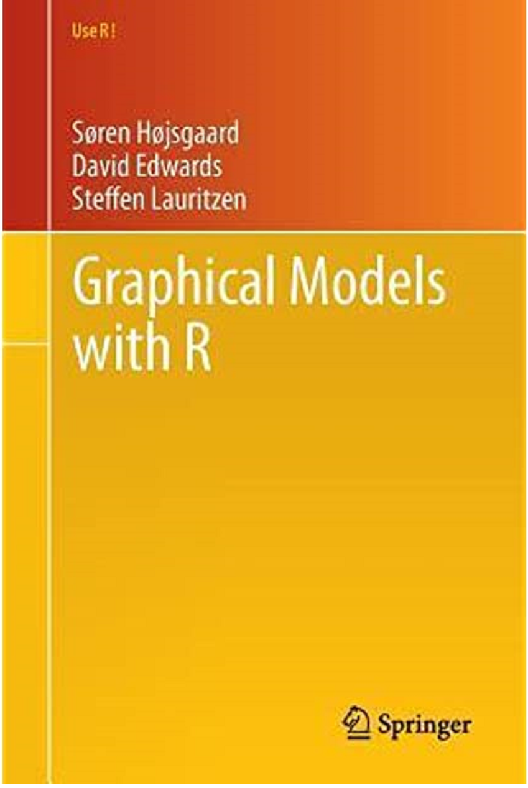

```{r knit_opts, include = FALSE}
knitr::opts_chunk$set(tidy       = FALSE,
                      cache      = FALSE,
                      message    = FALSE,
                      warning    = FALSE,
                      fig.height =     8,
                      fig.width  =    11)

library(conflicted)
library(tidyverse)
library(magrittr)
library(scales)
library(cowplot)
library(gRain)


source("custom_functions.R")

resolve_conflicts(c("magrittr", "rlang", "dplyr", "readr", "purrr", "ggplot2"))


options(width    = 80L,
        warn     = 1,
        mc.cores = parallel::detectCores()
        )


set.seed(42)

theme_set(theme_cowplot())
```


---


All code and data for this workshop is available at the following URL:

https://github.com/kaybenleroll/data_workshops

Code is available in the `ws_pgm_202009/` directory.


Content in this workshop is based on the book
[Probabalistic Graphical Models: Principles and Techniques](http://www.springer.com/us/book/9781461422983)
by Soren Hojsgaard.




Also look at the vignettes for the packages
[`gRain`](https://cran.r-project.org/web/packages/gRain/index.html)
and
[`gRbase`](https://cran.r-project.org/web/packages/gRbase/index.html)


Remember that this topic is massive. I could easily give a full
semester course on this stuff to really do it justice, so most of this
workshop is just me working through the material as I learn it.


As a result, it is highly likely this worksheet and code contains
typos, errors, logical flaws and other mistakes in need of correction
in this workshop, so if you note any, please let me know so I can try
to fix them!


If you want to look into this topic more, there is an old Coursera
course by Daphne Koller (tough going but excellent):

https://www.coursera.org/learn/probabilistic-graphical-models


This course was based on her textbook

[Probabalistic Graphical Models: Principles and Techniques](http://pgm.stanford.edu/)


# Basic Concepts

A graph is a mathematical object that can be defined as a pair

$$
\mathcal{G} = (V, E),
$$

where $V$ is a set of *vertices* or *nodes*, and $E$ is a set of *edges* that
joins two vertices. Edges in general may be directed, undirected or bidirected.
They are typically visualised by using shapes or points for the nodes and
lines for the edges.


The concept of *conditional independence* is related to that of
*statistical independence*. Suppose we have three random variables $A$, $B$ and
$C$, then $A$ and $B$ are *conditionally independent* given $C$, written

$$
A \perp B \, | \, C,
$$

iff, for every given value $c$ in $C$, $A$ and $B$ are independent in the
conditional distribution given $C = c$.


Another way of saying this is that for some $f$ a generic density or
probability mass function, then one characteristic of $A \perp B \, | \, C$
is that

$$
f(a, b \, | \, c) = f(a \, | \, c) f(b \, | \, c).
$$


An equivalent characterisation is that the joint density of $A$, $B$
and $C$ factorises as

$$
f(a, b, c) = g(a, c) \, h(b, c).
$$


Finally, we will also make heavy use of Bayes' Rule, the standard
formula for relating conditional probabilities:

$$
P(A|B) = \frac{P(A,B)}{P(B)} = \frac{P(B|A) P(A)}{P(B)}.
$$


## Conditional Probability

To explain the concept of conditional probability we first look at some basic
exercises in probability.

In the following questions, we are rolling two six-sided dice (denoted 2D6)
with $D_1$ and $D_2$ denoting the result of the first and second die
respectively, and we denote $T$ as being the sum of the two - i.e.

$$
T = D_1 + D_2
$$


*Question:* We start simple - with no further detail, what is the probability
of the total being 11?

*Answer:* We do not know anything about $D_1$ or $D_2$, so there are two
outcomes that result in $T = 11$: $(D_1 = 5, D_2 = 6)$ or
$(D_1 = 6, D_2 = 5)$. Thus, the probability of rolling 11 is

$$
P(T = 11) = \frac{2}{36} = 0.05556
$$

---

*Question:* What is the probability of getting 11 if the first dice is 5?

*Answer:* Out total is 11 if the second dice is 6, so there is only 1 possible
outcome of those six possible rolls.

$$
P(T = 11 \, | \, D_1 = 5) = \frac{1}{6} = 0.1667
$$

### Exercises

We now ask a few questions to ensure you understand these concepts.

  1. If the second dice is a 4, what is the probability the total was 7?
  1. What is the probability of the total being 10 or greater?
  1. If we know the first dice roll is 4, what is the probability of the total
     being 10 or greater?
  1. If we know the second dice roll is 2, what is the probability of the total
     being 10 or greater?
  1. What is the probability of the total being 3 or less?


## Conditional Dependence

Now suppose we know the totals of each dice instead? Suppose we know that
$T = 9$ and we have the following distribution for $D_1$:

$$
P(D_1) = \{0, \, 0, \, 0, \, 0, \, 0.5, \, 0.5 \}
$$
induces the following probability distribution for $D_2$:

$$
P(D_2) = \{0, \, 0, \, 0.5, \, 0.5, \, 0, \, 0 \}
$$

because $D_1 = 5 \implies D_2 = 4$ and $D_1 = 6 \implies D_2 = 3$


Thus, while we conceptually think of $D_1$ and $D_2$ as being independent of
one another, they become dependent if we have knowledge of $T$. In this case we
say that $D_1$ and $D_2$ are *conditionally dependent on one another given* $T$.


Now we define new variables, $X_1$ and $X_2$:

$$
X_1 =
\begin{cases}
  1 \text{ iff } T \text{ even}\\
  0 \text{ otherwise}
\end{cases}
\;
X_2 =
\begin{cases}
  1 \text{ iff } T >= 9\\
  0 \text{ otherwise}
\end{cases}
$$

Given no further information, we say that $X_1$ and $X_2$ are dependent, as
knowing information about one variables affects our knowledge of the other.

However, what happens if we know something about $T$?

In this case, we say that $X_1$ and $X_2$ are *independent given* $T$.


# Bayesian Network

We start with *Bayesian Networks* - where the nodes on the graph represent
discrete random variables.


## The Sprinkler Network

We start with a basic example of a Bayes Network: the sprinkler network.


```{r sprinkler_graph, echo=TRUE}
yn <- c("Yes", "No")

cptable_lst <- list(
  cptable(~Rain,                        levels = yn, values = c(2, 8)),
  cptable(~Sprinkler + Rain,            levels = yn, values = c(1, 99, 4, 6)),
  cptable(~wetGrass + Rain + Sprinkler, levels = yn, values = c(99, 1, 8, 2, 9, 1, 0, 1))
)

sprinkler_cptlist <- cptable_lst %>% compileCPT()
sprinkler_grain   <- sprinkler_cptlist %>% grain()

sprinkler_grain %>% plot()
```


Two events can cause grass to be wet: Either the sprinkler is on or
it is raining. Rain has a direct effect on the use of the sprinkler
(namely that when it rains, the sprinkler is usually not turned on).


This can be modeled with a Bayesian network. The variables
(R)ain, (S)prinkler, Wet(G)rass have two possible values: (y)es
and (n)o.


We can factorise the joint probability mass function as

$$
p_{GSR}(g, s, r) = p_{G|SR}(g | s, r) p_{S|R}(s | r) p_R(r)
$$

or overloading the notation a little:

$$
P(G, S, R) = P(G \, | \, S, R) \; P(S, R) = P(G \, | \, S, R) \; P(S \, | \, R) \; P(R)
$$


This means we can construct the joint probability table by starting with the
$conditional probability tables$ (CPTs).


Create the 3 CPTs using the `parray()` function and the following conditional
probabilities:

\begin{align*}
P(R)     &= 0.2 \\
P(S|R)   &= 0.01 & P(S|\neg R)    &= 0.4\\
P(G|S,R) &= 0.99 & P(G|S, \neg R) &= 0.9 & P(G|\neg S, R) &= 0.8 & P(G|\neg S, \neg R) &= 0
\end{align*}


First we want to construct this network using our various conditional
probabilities:

```{r sprinkler_conditional_distributions, echo=TRUE}
yn <- c("yes", "no")

## P(R)
p_R <- parray("Rain", levels = list(yn), values = c(.2, .8));

## P(S|R)
p_S_R <- parray(
  varNames = c("Sprinkler", "Rain"),
  levels   = list(yn, yn), 
  values   = c(0.01, 0.99, 0.4, 0.6)
)

## P(G|S,R)
p_G_SR <- parray(
  varNames = c("GrassWet", "Sprinkler", "Rain"),
  levels   = list(yn, yn, yn),
  values   = c(0.99, 0.01, 0.8, 0.2, 0.9, 0.1, 0, 1)
)

ftable(p_G_SR, row.vars = "GrassWet")
```

We now combine these probabilities into a full joint distribution `p_GSR`:

```{r sprinkler_full_joint, echo=TRUE}
p_GSR <- tabListMult(
  list(p_G_SR, p_S_R, p_R)
)

ftable(p_GSR, row.vars = "GrassWet")
```


No suppose we know that the grass is wet. What is the probability it is
raining?


```{r sprinkler_grasswet_raining, echo=TRUE}
p_RG  <- tabMarg(p_GSR, c("Rain", "GrassWet"))  ## P(R,G)
p_G   <- tabMarg(p_RG, "GrassWet")              ## P(G)
p_R_G <- tabDiv(p_RG, p_G)                      ## P(R|G)
```

Reading across this CPT, we see that if the grass is wet, there is about a 36\%
chance it is due to rain.


While the above methods of manipulating CPTs works, the package `gRain`
provides us better functionality for answering questions such as this given
observed evidence.


# Genetic Inheritance

We now turn our attention to analysing genetic inheritance on the chromosomes
for a given DNA sequence.

An *allele* is the DNA sequence at a marker and can take two values marked
$A$ or $B$ (in practice there can be 10 or 20 different values).

A *genotype* is an unordered pair of alleles: $AA$, $AB$, or $BB$.

The genotype of a person at a specific marker is a random variable with state
space $\{AA, AB, BA\}$.

We are interested in the joint distribution of genotypes for a group of people.


```{r genetics_graph, echo=FALSE, results='hide'}
ab <- c("A", "B")

genetics_cptlist <- list(
    cptable(~father,                  levels = ab, values = c(1, 1)),
    cptable(~mother,                  levels = ab, values = c(1, 1)),
    cptable(~child + mother + father, levels = ab, values = c(1, 1, 1, 1, 1, 1, 1, 1))
    ) %>%
  compileCPT()

genetics_grain <- genetics_cptlist %>% grain()

genetics_grain %>% iplot()
```

We need to make a number of assumptions regarding genetic inheritance that we
list here:

  * A child inherits one allele from each parent independently.
  * The parent’s two alleles have equal probability of being passed on to the
    child.
  * Each combination has probability $0.25$; some lead to the same genotype for the
    child.


So in this case we have the the joint probability distribution as
being

\[ P(m, f, c) = P(m) \, P(f) \, P(c \, | \, m, f) \]


```{r genotype_table, echo=FALSE}
genotypes <- c("AA", "AB", "BB");

calc_allele_prob <- function(child, mother, father) {
  child  <- strsplit(child,  "")[[1]]
  mother <- strsplit(mother, "")[[1]]
  father <- strsplit(father, "")[[1]]

  ## Probability of inheriting allele a from genotype gt
  P <- function(a, gt) ((a == gt[1]) + (a == gt[2])) / 2

  if(child[1] != child[2]) {
    P(child[1], mother) * P(child[2], father) + P(child[1], father) * P(child[2], mother)
  } else {
    P(child[1], mother) * P(child[2], father)
  }
}


prob_tbl <- expand_grid(
    child  = genotypes,
    mother = genotypes,
    father = genotypes
  ) %>%
  mutate(prob = pmap_dbl(list(child  = child,
                              mother = mother,
                              father = father),
                         calc_allele_prob)
         )

prob_tbl %>% print()
prob_tbl %>% glimpse()
```


Suppose we have a population frequency of alleles being 70\% $A$ and 30\% $B$.
We want to calculate the distribution of genotypes in the population.

This is a straightforward application of the Binomial distribution, and we use
the R function `dbinom()`


```{r calculate_genotype_distribution, echo=TRUE}
genotype_probs <- dbinom(0:2, size = 2, prob = 0.3)

print(genotype_probs)
```

Thus we have it that 49\% of the population have genotype $AA$, 42\% are $AB$
and 9\% are $BB$.

We now want to construct the CPTs for each of the nodes on the network:

```{r construct_genetic_cpts, echo=TRUE}
mother_cpt <- cptable(~ mother, values = genotype_probs, levels = genotypes)
print(mother_cpt)

father_cpt <- cptable(~ father, values = genotype_probs, levels = genotypes)
print(father_cpt)

p_inheritance <- prob_tbl %>%
  arrange(father, mother, child) %>%
  pull(prob)

child_cpt  <- cptable(~ child | mother + father,
                      values = p_inheritance,
                      levels = genotypes)
print(child_cpt)
```


Using the CPTs, we construct the Bayesian network:


```{r construct_genetic_network, echo=TRUE}
genetic_family_grain <- list(child_cpt, mother_cpt, father_cpt) %>%
  compileCPT() %>%
  grain()

plot(genetic_family_grain)
```


## Querying the Network

By using the `gRain` package it allows us to use the in-built functionality to
query the network.

To start with, we want to see the marginal distribution of alleles for the
father.

```{r query_father_marginal_distribution, echo=TRUE}
querygrain(genetic_family_grain, nodes = "father")
```

We can also look at the joint distribution of the mother and child:


```{r query_mother_child_joint_distribution, echo=TRUE}
querygrain(
  genetic_family_grain,
  nodes = c("child", "mother"),
  type  = "joint"
)
```

We can pass this output to `ftable()` if we want:


```{r query_mother_child_ftable, echo=TRUE}
querygrain(
    genetic_family_grain,
    nodes = c("child", "mother"),
    type  = "joint"
    ) %>%
  ftable(col.vars = "child")
```


We can also produce the conditional distributions for each of the possible
values for the father given values of the mother and child.

```{r show_father_conditional_tables, echo=TRUE}
querygrain(
    genetic_family_grain,
    nodes = c("father", "child", "mother"),
    type  = "conditional"
  ) %>%
  ftable(col.vars = "father")
```


## Paternity Test

Now suppose we know that a child has genotype $AB$, and the mother has genotype
$BB$. Given that a man has genotype $AB$, what can we say about the chances of
the man being the father of the child?

This is a more complicated question than it sounds, as we need to think about
a few different ideas. We make use of the `pEvidence()` and `setEvidence()`.


```{r family_fmc_evidence, echo=TRUE}
p_fmc <- genetic_family_grain %>%
  setEvidence(evidence = list(mother = "BB", child = "AB", father = "AB"))

p_fmc %>% print()
p_fmc %>% pEvidence()
```

So we now have a probability for finding this particular combination of alleles
in a mother / father / child grouping.

So now we calculate the probability of any given man being $AB$?

```{r family_f_evidence, echo=TRUE}
p_f <- genetic_family_grain %>%
  setEvidence(evidence = list(father = "AB"))

p_f %>% print()
p_f %>% pEvidence()
```


Finally, we look at the probability of the child being $AB$ with a mother $BB$.

```{r family_mc_evidence, echo=TRUE}
p_mc <- genetic_family_grain %>%
  setEvidence(evidence = list(mother = "BB", child = "AB"))

p_mc %>% print()
p_mc %>% pEvidence()
```

So now we need to look at the various ratios of these probabilities to assess
probabilities.

```{r calculate_conditional_probabilities, echo=TRUE}
p_man <- pEvidence(p_fmc) / pEvidence(p_f)

p_father <- p_man / pEvidence(p_mc)
```


## Extended Genetic Family

We can now extend this model to add extended families, such as uncle/aunts and
grandparents.


```{r create_extended_family_network, echo=TRUE}
c_mf <- parray(c("child", "mother", "father"),
               levels = rep(list(genotypes), 3),
               values = p_inheritance
               )

f_gmgf <- parray(c("father", "grandmother", "grandfather"),
                 levels = rep(list(genotypes), 3),
                 values = p_inheritance
                 )

u_gmgf <- parray(c("uncle", "grandmother", "grandfather"),
                 levels = rep(list(genotypes), 3),
                 values = p_inheritance
                 )

m  <- parray("mother",      levels = list(genotypes), values = genotype_probs)
gf <- parray("grandfather", levels = list(genotypes), values = genotype_probs)
gm <- parray("grandmother", levels = list(genotypes), values = genotype_probs)


extended_family_grain <- list(c_mf, m, f_gmgf, u_gmgf, gm, gf) %>%
  compileCPT() %>%
  grain()

extended_family_grain %>% iplot()

```


Now suppose the man is dead and we do not have any genetic information for him,
but we know his brother tests as $AA$. How does this affect the evidence for
potential paternity?

```{r family_uncle_evidence, echo=TRUE}
p_uncle <- extended_family_grain %>%
  setEvidence(evidence = list(mother = "BB", child = "AB", uncle = "AA"))

p_uncle %>% print()
p_uncle %>% pEvidence()
```

We also want to show how we calculate similar values by using `querygrain()`.

```{r family_uncle_querygrain, echo=TRUE}
extended_family_grain %>%
  querygrain(nodes = c("child", "mother", "uncle"),
             type = "joint") %>%
  ftable(col.vars = "uncle")
```


# Chest-Clinic Network

We now turn our attention to the 'Chest-Clinic Network' as an example of a 
Bayesian network.

Based on research by Lauritzen and Spiegelhalter, we construct a network based
on the following domain knowledge:


> Shortness-of-breath (dyspnoea) may be due to tuberculosis, lung cancer or
> bronchitis, or none of them, or more than one of them. A recent visit to Asia
> increases the chances of tuberculosis, while smoking is known to be a risk
> factor for both lung cancer and bronchitis.  The results of a single chest
> X-ray do not discriminate between lung cancer and tuberculosis, as neither
> does the presence or absence of dyspnoea.

We use this knowledge to construct a Bayesian network - breaking up the above
into discrete pieces of knowledge.


```{r construct_chest_clinic_dag, echo=TRUE}
chestclinic_dag <- list(
    "asia",
    c("tub", "asia"),
    "smoke",
    c("lung", "smoke"),
    c("bronc", "smoke"),
    c("either", "lung", "tub"),
    c("xray", "either"),
    c("dysp", "bronc", "either")
    ) %>%
  dag()

chestclinic_dag %>% plot()
```

Now that we have our network, we can use data to construct the CPTs. Assuming
no data is missing, we can use a tibble of data to set the probabilities.

```{r load_chest_sim_data, echo=TRUE}
data(chestSim500)
data(chestSim1000)
data(chestSim10000)


chestdata_500_tbl   <- chestSim500   %>% as_tibble()
chestdata_1000_tbl  <- chestSim1000  %>% as_tibble()
chestdata_10000_tbl <- chestSim10000 %>% as_tibble()

chestdata_500_tbl   %>% glimpse()
chestdata_1000_tbl  %>% glimpse()
chestdata_10000_tbl %>% glimpse()
```

We now can build multiple networks for each of the datasets we have.


```{r construct_chestclinic_grain_network, echo=TRUE}
chestsim_500_grain <- chestclinic_dag %>%
  grain(data = chestdata_500_tbl, smooth = 0.1) %>%
  compile(propagate = TRUE)

chestsim_1000_grain <- chestclinic_dag %>%
  grain(data = chestdata_1000_tbl, smooth = 0.1) %>%
  compile(propagate = TRUE)

chestsim_10000_grain <- chestclinic_dag %>%
  grain(data = chestdata_10000_tbl, smooth = 0.1) %>%
  compile(propagate = TRUE)
```

The unconditional probability of a patient having lung cancer should match
the proportion of cases in the dataset.

```{r calculate_500_unconditional_prob, echo=TRUE}
chestsim_500_grain %>%
  querygrain(nodes = "lung", type = "joint")

chestdata_500_tbl %>%
  count(lung, name = "count") %>%
  mutate(prob = count / sum(count))
```

We do the same thing for the other networks we constructed.

First we look at the 1,000 row dataset.

```{r calculate_1000_unconditional_prob, echo=TRUE}
chestsim_1000_grain %>%
  querygrain(nodes = "lung", type = "joint")

chestdata_1000_tbl %>%
  count(lung, name = "count") %>%
  mutate(prob = count / sum(count))
```


Now we look at the network based on 10,000 datapoints.

```{r calculate_10000_unconditional_prob, echo=TRUE}
chestsim_10000_grain %>%
  querygrain(nodes = "lung", type = "joint")

chestdata_10000_tbl %>%
  count(lung, name = "count") %>%
  mutate(prob = count / sum(count))
```


## Using Evidence

We can use given evidence to adjust the conditional probabilities.

Suppose the individual has visited Asia and has dyspnoea, what is the
conditional probability that the person has lung cancer?

```{r chestclinic_500_asia_dysp_query, echo=TRUE}
chestsim_500_grain %>%
  querygrain(
    nodes    = "lung",
    evidence = list(asia = 'yes', dysp = 'yes'),
    type     = "marginal"
    )
```

Given this evidence we see the probability of lung cancer has now increased to
around 6.5\%.

We repeat this exercise for the 1,000 network and see what probability it
shows.

```{r chestclinic_1000_asia_dysp_query, echo=TRUE}
chestsim_1000_grain %>%
  querygrain(
    nodes    = "lung",
    evidence = list(asia = 'yes', dysp = 'yes'),
    type     = "marginal"
    )
```

In this network, the probability is 10%.

```{r chestclinic_10000_asia_dysp_query, echo=TRUE}
chestsim_10000_grain %>%
  querygrain(
    nodes    = "lung",
    evidence = list(asia = 'yes', dysp = 'yes'),
    type     = "marginal"
    )
```

As before, the probability is about 10\%.


# R Environment

```{r show_session_info, echo=TRUE, message=TRUE}
sessioninfo::session_info()
```
