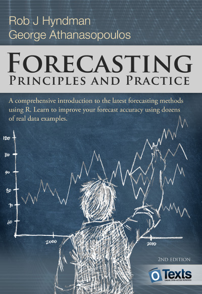
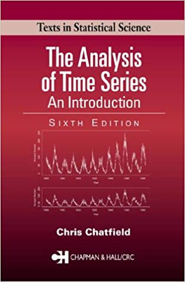

```{r knit_opts, include = FALSE}
rm(list = ls()); gc()

knitr::opts_chunk$set(tidy  = FALSE
                     ,cache = FALSE
                     ,message = FALSE
                     ,warning = FALSE
                     ,fig.height =  8
                     ,fig.width  = 11)

library(tidyverse)
library(tidyquant)
library(scales)
library(cowplot)
library(cranlogs)
library(timetk)
library(sweep)
library(seasonal)
library(forecast)
library(broom)


options(width = 80L
       ,warn  = 1
        )

set.seed(42)

theme_set(theme_cowplot())


source('custom_functions.R')
```


# Introduction

Time series occur in most fields of study that produce quantitative data.
Whenever quantities are measured over time, those measurements form a
time-series, or more formally, a discrete-time stochastic process.

## Workshop Materials

All materials for this workshop is available in my standard GitHub repo:

https://github.com/kaybenleroll/data_workshops


The content of this workshop is partly based on the book "Introductory Time
Series with R" by Paul Cowpertwait and Andrew Metcalfe. The data from this book
is available from the website:

http://www.maths.adelaide.edu.au/emac2009/


For further resources, anyone with an interest in this topic should take a
look at the book "Forecasting: Principles and Practice" by Rob J Hyndman and
George Athanasopoulos



While available as in dead-tree form, the full text is available online:

https://otexts.com/fpp2/


One final recommendation is the book "The Analysis of Time Series" by
Christopher Chatfield. This is a principles and theory-based book on the
underlying statistical concepts around time-series analysis and does not
contain much in the way of code, but is still highly recommended.




### R Packages

In this workshop we focus on the use of 'tidy'-style tools in the analysis of
time-series. In particular we look at packages such as `tidyquant` that enable
and simplify this approach to time-series analysis.


## Basic Concepts

A famous example of a time-series is count of airline passengers in the US,
as shown in the figure below. This is a simple univariate time-series, with
measurements taken on a monthly basis over a number of years, each datum
consisting of a single number - the number of passengers travelling via
a commercial flight that month.

```{r plot_air_passenger_timeseries, echo=TRUE}
plot(AirPassengers)
```

Before we begin analysing such data, we first need to create a mathematical
framework to work in. Fortunately, we do not need anything too
complicated, and for a finite time-series of length $N$, we model the time
series as a sequence of $N$ random variables, $X_i$, with $i = 1, 2, ..., N$.

Note that each individual $X_i$ is a wholly separate random variable: we only
ever have a single measurement from each random variable. In many cases we
simplify this, but it is important to understand and appreciate that such
simplifications are just that. Time series are difficult to analyse.

Before we get to any of that though, and before we try to build any kind of
models for the data, we always start with visualising the data. Often, a simple
plot of the data helps use pick out aspects to analyse and incorporate into the
models. For time series, one of the first things to do is the *time plot*, a
simple plot of the data over time.

For the passenger data, a few aspects stand out that are very common in time
series. It is apparent that the numbers increase over time, and this systematic
change in the data is called the *trend*. Often, approximating the trend as a
linear function of time is adequate for many data sets.

A repeating pattern in the data that occurs over the period of the data (in
this case, each year), is called the *seasonal variation*, though a more
general concept of 'season' is implied --- it often will not coincide with the
seasons of the calendar.

A slightly more generalised concept from the seasonality is that of *cycles*,
repeating patterns in the data that do not correspond to the natural fixed
periods of the model. None of these are apparent in the air passenger data, and
accounting for them are beyond the scope of this introductory tutorial.

Finally, another important benefit of visualising the data is that it helps
identify possible *outliers* and *erroneous* data.

In many cases, we will also be dealing with time series that have multiple
values at all, many or some of the points in time.

Often, these values will be related in some ways, and we will want to analyse
those relationships also. In fact, one of the most efficient methods of
prediction is to find *leading indicators* for the value or values you wish to
predict --- you can often use the current values of the leading indicators to
make inference on future values of the related quantities.

The fact that this is one of the best methods in time series analysis says a
lot about the difficulty of prediction (Yogi Berra, a US baseball player noted
for his pithy statements, once said "Prediction is difficult, especially about
the future").


## Example Timeseries

In this workshop we will look at a number of different time-series, discussed
here.

This data comes in a few different format, and this workshop discusses methods
for analysing this data in a common format.


### Air Passenger Data

As mentioned previously, a canonical time-series is the airline passenger
dataset, and this is the first dataset we look at.

```{r show_airline_passengers}
AirPassengers %>% print()

AirPassengers %>% plot()
```

In this workshop we will convert all time series into the tibbles: the package
`timetk` allows us to do this.

```{r convert_airpassengers_tibble, echo=TRUE}
airpassengers_tbl <- AirPassengers %>% tk_tbl(rename_index = 'month')

airpassengers_tbl %>% print()


ggplot(airpassengers_tbl) +
    geom_line(aes(x = month, y = value)) +
    xlab('Date') +
    ylab('Passenger Count') +
    expand_limits(y = 0) +
    ggtitle('Plot of Air Passenger Time Series')
```


### Maine Unemployment Data

Time series are very common in econometrics, and a dataset provided in the
text is that of monthly unemployment statistics in Maine from 1996 on. I have
included the datafile in this workshop.

```{r load_maine_unemployment, echo=TRUE}
maine_ts <- scan('data/Maine.dat', skip = 1) %>%
    ts(start = 1996, frequency = 12)

maine_ts %>% print()
maine_ts %>% plot()
```

As before, we convert this data into a tibble and recreate the plot using
`ggplot2`.

```{r maine_unemployment_tibble, echo=TRUE}
maine_tbl <- maine_ts %>% tk_tbl(rename_index = 'month')

maine_tbl %>% print()


ggplot(maine_tbl) +
    geom_line(aes(x = month, y = value)) +
    xlab('Date') +
    ylab('Unemployment Numbers') +
    expand_limits(y = 0) +
    ggtitle('Plot of Maine Unemployment Time Series')
```


### Australian Consumption Statistics (CBE)

Governments produce regular data on consumption numbers for their economy.

One
such dataset is contained in the file `cbe.dat`, produced by the Australian
Census Bureau containing data of chocolate, beer and energy production on a
monthly basis.

```{r load_australian_cbe_data, echo=TRUE}
cbe_raw_tbl <- read_tsv('data/cbe.dat')

cbe_raw_tbl %>% glimpse()
```

Similar to the Maine file, this data does not contain time indices for the
data. For the sake of completeness, we use the same approach as before and
convert to a tibble, but we will also show how to construct the time index
without having to do intermediate conversions.

First we add time indices via `ts` conversions.


```{r construct_cbe_timeseries, echo=TRUE}
cbe_ts <- cbe_raw_tbl %>%
    as.matrix() %>%
    ts(start = 1958, frequency = 12)

cbe_ts %>% head(10)
cbe_ts %>% plot()
```

An alternative approach is to add the time index directly.

```{r australian_cbe_add_time, echo=TRUE}
n_data <- cbe_raw_tbl %>% nrow()

cbe_tbl <- cbe_raw_tbl %>%
    add_column(month = (1958 + (0:(n_data-1)/12)) %>% yearmon, .before = 1)


cbe_tbl %>% glimpse()
cbe_tbl %>% print()
```

Having constructed the tibble, we now construct these time series plots using
`ggplot2`.

```{r construct_cbe_plots, echo=TRUE}
plot_tbl <- cbe_tbl %>%
    gather('product', 'value', -month)

ggplot(plot_tbl) +
    geom_line(aes(x = month, y = value, colour = product)) +
    expand_limits(y = 0) +
    xlab("Date") +
    ylab("Production Amount") +
    scale_y_continuous(labels = comma) +
    ggtitle('Production Data from Australian Government')
```


Due to the different scales, it might be more useful to use a faceted plot for
each product:

```{r plot_cbe_facetted_data, echo=TRUE}
plot_tbl <- cbe_tbl %>%
    gather('product', 'value', -month)

ggplot(plot_tbl) +
    geom_line(aes(x = month, y = value)) +
    facet_grid(rows = vars(product), scales = 'free_y') +
    expand_limits(y = 0) +
    xlab("Date") +
    ylab("Production Amount") +
    scale_y_continuous(labels = comma) +
    ggtitle('Production Data from Australian Government')
```


### Australian Building Activity

Another set of data produced by the Australian Census Bureau is the Building
Activity Publication listing the value of building work done in each quarter.
This data contains the total dwellings approved for construction per month,
averaged over the past three months, and the value of work done over the past
three months.

This data is quarterly from 1996, and we construct the data as before.


```{r read_approvactiv_data, echo=TRUE}
approvactiv_raw_tbl <- read_tsv('data/ApprovActiv.dat')

approvactiv_raw_tbl %>% glimpse()


approvactiv_ts <- approvactiv_raw_tbl %>%
    as.matrix() %>%
    ts(start = 1996, frequency = 4)

approvactiv_ts %>% head(10)
approvactiv_ts %>% plot()


approvactiv_tbl <- approvactiv_ts %>%
    tk_tbl(rename_index = 'quarter')

approvactiv_tbl %>% glimpse()
approvactiv_tbl %>% print()
```

As before, we can produce time plots in `ggplot2`.


```{r construct_approvactiv_plots, echo=TRUE}
plot_tbl <- approvactiv_tbl %>%
    gather('label', 'value', -quarter)

ggplot(plot_tbl) +
    geom_line(aes(x = quarter, y = value)) +
    facet_grid(rows = vars(label), scales = 'free_y') +
    expand_limits(y = 0) +
    xlab("Date") +
    ylab("Amount") +
    scale_y_continuous(labels = comma) +
    ggtitle('Building Activity Data from Australian Government')
```


### CRAN Package Downloads Data

An interesting dataset is the daily count of package downloads from CRAN. This
data is easy to obtain via use of the package `cranlogs`, which gives us use
of the `cran_downloads()` function.

For this workshop, we will look at some of the main packages that comprise
the 'tidyverse', as well as the total number of downloads from CRAN.

```{r download_cran_data, echo=TRUE}
cran_data_file <- 'data/cran_download_data.csv'

if(file.exists(cran_data_file)) {
    cran_data_tbl <- read_csv(cran_data_file)
} else {
    cran_pkgs <- c('dplyr', 'tidyr', 'ggplot2', 'lubridate', 'stringr', 'tibble'
                  ,'broom', 'jsonlite', 'purrr', 'readr', 'tidyquant')
      

    cran_data_tbl <- retrieve_cran_download_data(cran_pkgs, '2014-01-01', '2018-12-31')
    
    write_csv(cran_data_tbl, path = cran_data_file)
}


cran_data_tbl %>% glimpse()
cran_data_tbl %>% print()
```

First we construct a simple line plot of the download counts, facetted by
package.

```{r plot_cran_downloads, echo=TRUE}
ggplot(cran_data_tbl) +
    geom_line(aes(x = date, y = count)) +
    facet_wrap(vars(package), scales = 'free_y') +
    expand_limits(y = 0) +
    scale_y_continuous(labels = comma) +
    ggtitle('Facetted Lineplots of CRAN Daily Downloads')
```

Not all packages have download data as some packages were created after the
start of our observation period. This manifests as zero counts for that
package. We discuss these issues later on in the workshop.


## Combining Time Series

Useful insights are often gained from combining different datasets together.

Looking at our datasets, one possible interesting relationship is that between
energy production and airline passengers -- it is reasonable to expect that
both of these quantities will be related as they are related to the overall
health and size of the economy.

A major benefit of using tidy tools for time series is to make such data
manipulation and arrangement simple: combining datasets is simply a matter
of using the two-table joins.

To illustrate, we combine the Air Passenger data with the Australian economic
data, using the following code. Note that we rename the air passenger data
at the end to make it more meaningful and useful.


```{r combining_airpassengers_australia_data, echo=TRUE}
ap_econ_combined_tbl <- airpassengers_tbl %>%
    left_join(cbe_tbl, by = 'month') %>%
    filter(complete.cases(.)) %>%
    rename(air = value)


ap_econ_combined_tbl %>% glimpse()
ap_econ_combined_tbl %>% print()
```

We return to this dataset later in the workshop.


# Manipulation of Time Series Data

Much like all data, it is rate to get time-series exactly in the format we
want for analysis. For various reasons, we may want to analyse transformations
or aggregations of this data.

Much like feature engineering and variable selection, this process can be
more art than science - there are no hard and fast rules, merely principles
and rules-of-thumb.

The last few years in particular have seen the development of a number of
tools to aid us with the analysis of time series along 'tidy' principles. In
particular, we will focus on the use of `tidyquant` - a package aimed at
analysing financial data, but which is also very useful for time series.


## Aggregating Data

From a conceptual point of view, aggregating time series is the most
straightforward - we group the data by longer periods of time and aggregate
each individual 'bucket' of data as desired or required.


### Single Statistics

As an example of this, suppose we wish to look at the air passenger data as an
annual sum for each year. Our data is monthly, so we need to aggregate this
data into annual numbers.

```{r aggregate_ap_data_annual, echo=TRUE}
ap_yearly_dplyr_tbl <- airpassengers_tbl %>%
    group_by(year = month %>% format('%Y') %>% as.numeric()) %>%
    summarise(ann_total = sum(value))


ap_yearly_dplyr_tbl %>% glimpse()
ap_yearly_dplyr_tbl %>% print()
```

The above transformation was straightforward using existing `dplyr`
functionality, but we can also use routines provided for by `tidyquant` and its
function `tq_transmute`:


```{r aggregate_ap_annual_transmute, echo=TRUE}
ap_yearly_tidyquant_tbl <- airpassengers_tbl %>%
    tq_transmute(
        select     = value
       ,mutate_fun = apply.yearly
       ,FUN        = sum
       ,na.rm      = TRUE
       ,col_rename = 'ann_total'
    ) %>%
    mutate(year = month %>% format('%Y') %>% as.numeric())


ap_yearly_tidyquant_tbl %>% glimpse()
ap_yearly_tidyquant_tbl %>% print()
```

We can now look at a lineplot for this new time-series of annual totals. This
gives us an idea of the overall trend in the data.


```{r aggregate_ap_data_annual_lineplot, echo=TRUE}
ggplot(ap_yearly_tidyquant_tbl) +
    geom_line(aes(x = year, y = ann_total)) +
    expand_limits(y = 0) +
    scale_y_continuous(labels = comma) +
    ggtitle('Lineplot of the Annual Air Passenger Totals')
```

#### Exercises

  1. Aggregate the Maine unemployment data into yearly totals.
  1. Create the relevant lineplots to check this data for trends and patterns.
  1. Aggregate the CBE data into yearly totals.
  1. Create plots of this data to check for trends.


### Multiple Statistics

Should we need multiple statistics in our output, we implement this by
writing a custom function that outputs the statistics we require.

```{r aggregate_ap_annual_transmute_custom, echo=TRUE}
custom_stats_func <- function(x, na.rm = TRUE, ...) {
    c(
          sum    = sum(x, na.rm = na.rm)
         ,mean   = mean(x, na.rm = na.rm)
         ,sd     = sd(x, na.rm = na.rm)
         ,median = median(x, na.rm = na.rm)
         ,q25    = quantile(x, na.rm = na.rm, probs = 0.25, names = FALSE)
         ,q75    = quantile(x, na.rm = na.rm, probs = 0.75, names = FALSE)
    )
}


ap_yearly_tidyquant_custom_tbl <- airpassengers_tbl %>%
    tq_transmute(
        select     = value
       ,mutate_fun = apply.yearly
       ,FUN        = custom_stats_func
       ,na.rm      = TRUE
    ) %>%
    mutate(year = month %>% format('%Y') %>% as.numeric())


ap_yearly_tidyquant_custom_tbl %>% glimpse()
ap_yearly_tidyquant_custom_tbl %>% print()
```


#### Exercises

  1. Repeat the aggregation shown using the Maine unemployment data
  1. Repeat the aggregation shown using the CBE data.
  1. Create a custom function to calculate mean, sd, skew and kurtosis


## Rolling Functions

Another common transformation of time-series is to apply a function over a
fixed rolling window of data.

Note that rolling functions different conceptually from aggregates as they
are not calculated over disjoint subsets of the data: the output is at the
same time period as the original data.

Because of this difference we use a different function from `tidyquant` to
execute this calculation: `tq_mutate()`:


### Moving Averages

A common rolling function is the *moving average*: we calculate the average
value of the time series over a fixed window of data.

```{r rolling_ap_sixmonth_mutate, echo=TRUE}
ap_rollmean_sixmonth_tbl <- airpassengers_tbl %>%
    tq_mutate(
        # tq_mutate args
        select     = value
       ,mutate_fun = rollapply 
        # rollapply args
       ,width      = 6
       ,align      = "right"
       ,FUN        = mean
        # mean args
       ,na.rm      = TRUE
        # tq_mutate args
       ,col_rename = "mean_6m"
    )


ap_rollmean_sixmonth_tbl %>% glimpse()
ap_rollmean_sixmonth_tbl %>% print()
```

We compare the two values by plotting the original time series against its
moving average.


```{r rolling_ap_sixmonth_plot, echo=TRUE}
plot_tbl <- ap_rollmean_sixmonth_tbl %>%
    rename(orig = value) %>%
    gather('label', 'value', -month)


ggplot(plot_tbl) +
    geom_line(aes(x = month, y = value, colour = label)) +
    expand_limits(y = 0) +
    scale_y_continuous(labels = comma) +
    xlab('Month') +
    ylab('Passenger Total') +
    ggtitle('Comparison Plot of the Air Passenger Counts')
```

Note that the moving-average series does not start at the same timestamp as
the original dataset size is reduced by the windowing function.

We can add multiple moving averages to a time series by chaining a series of
`tq_mutate()` calls together.


```{r rolling_ap_multiwindow, echo=TRUE}
ap_rollmean_multi_tbl <- airpassengers_tbl %>%
    tq_mutate(
        # tq_mutate args
        select     = value
       ,mutate_fun = rollapply
        # rollapply args
       ,width      = 6
       ,align      = "right"
       ,FUN        = mean
        # mean args
       ,na.rm      = TRUE
        # tq_mutate args
       ,col_rename = "mean_6m"
    ) %>%
    tq_mutate(
        # tq_mutate args
        select     = value
       ,mutate_fun = rollapply 
        # rollapply args
       ,width      = 12
       ,align      = "right"
       ,FUN        = mean
        # mean args
       ,na.rm      = TRUE
        # tq_mutate args
       ,col_rename = "mean_12m"
    )
  

ap_rollmean_multi_tbl %>% glimpse()
ap_rollmean_multi_tbl %>% print()
```

As before, we now create a lineplot of the three values to show the effect of
the different window sizes.

```{r rolling_ap_multi_plot, echo=TRUE}
plot_tbl <- ap_rollmean_multi_tbl %>%
    rename(orig = value) %>%
    gather('label', 'value', -month)


ggplot(plot_tbl) +
    geom_line(aes(x = month, y = value, colour = label)) +
    expand_limits(y = 0) +
    scale_y_continuous(labels = comma) +
    xlab('Month') +
    ylab('Passenger Total') +
    ggtitle('Comparison Plot of the Air Passenger Counts')
```

The twelve month time series is shorter than the six month series as it has
a wider calculation window.

Any sort of other windowing functions can be applied, including the standard
deviation, allowing us to include a range of possible values.


```{r rolling_ap_ribbon, echo=TRUE}
ribbon_func <- function(x, na.rm = TRUE, ...) {
    mu    <- mean(x, na.rm = na.rm)
    sigma <- sd(x, na.rm = na.rm)
    
    lower <- mu - 2 * sigma
    upper <- mu + 2 * sigma
    
    return(c(mu = mu, l2sd = lower, u2sd = upper))
}


ap_roll_ribbon_tbl <- airpassengers_tbl %>%
    tq_mutate(
        # tq_mutate args
        select     = value
       ,mutate_fun = rollapply 
        # rollapply args
       ,width      = 6
       ,align      = "right"
       ,by.column  = FALSE
       ,FUN        = ribbon_func
        # mean args
       ,na.rm      = TRUE
    )
  

ap_roll_ribbon_tbl %>% glimpse()
ap_roll_ribbon_tbl %>% print()
```

We now plot the original data against the moving average and the mean.


```{r plot_ap_6m_ribbon_data, echo=TRUE}
ggplot(ap_roll_ribbon_tbl) +
    geom_line(aes(x = month, y = value)) +
    geom_line(aes(x = month, y = mu), colour = 'red') +
    geom_ribbon(aes(x = month, ymin = l2sd, ymax = u2sd)
               ,colour = 'grey', alpha = 0.25) +
    expand_limits(y = 0) +
    scale_y_continuous(labels = comma) +
    xlab('Month') +
    ylab('Passenger Total') +
    ggtitle('Ribbon Plot of the Air Passenger Counts (6 month window)')
```


We now repeat this process with using a twelve-month window for the data.

```{r rolling_ap_12m_ribbon, echo=TRUE}
ap_roll_12m_ribbon_tbl <- airpassengers_tbl %>%
    tq_mutate(
        # tq_mutate args
        select     = value
       ,mutate_fun = rollapply 
        # rollapply args
       ,width      = 12
       ,align      = "right"
       ,by.column  = FALSE
       ,FUN        = ribbon_func
        # mean args
       ,na.rm      = TRUE
    )
  

ap_roll_12m_ribbon_tbl %>% glimpse()
ap_roll_12m_ribbon_tbl %>% print()
```

Having constructed the data, we once again create a ribbon plot with these
quantities.

```{r plot_ap_12m_ribbon_data, echo=TRUE}
ggplot(ap_roll_12m_ribbon_tbl) +
    geom_line(aes(x = month, y = value)) +
    geom_line(aes(x = month, y = mu), colour = 'red') +
    geom_ribbon(aes(x = month, ymin = l2sd, ymax = u2sd)
               ,colour = 'grey', alpha = 0.25) +
    expand_limits(y = 0) +
    scale_y_continuous(labels = comma) +
    xlab('Month') +
    ylab('Passenger Total') +
    ggtitle('Ribbon Plot of the Air Passenger Counts (12 month window)')
```


#### Exercises

  1. Construct a 3 month moving average for the passenger data and compare it
     to the 6 and 12 month values.
  1. Calculate the 6 month and 12 month rolling average values for the Maine
     unemployment data.
  1. Construct the ribbon plot for the Maine unemployment data.
  1. Construct moving average data for the CBE dataset. This process may be
     made easier by reshaping the data.


### Differences

Another common transformation of the data is to take the 'first differences'
of the values, i.e. we convert the time series of values into one of
differences. We discuss the reasons for this later on -- for now we focus on
the mechanics of creating first differences.


```{r ap_firstdiff_mutate, echo=TRUE}
ap_firstdiff_tbl <- airpassengers_tbl %>%
    mutate(diff = value - lag(value, n = 1))


ap_firstdiff_tbl %>% glimpse()
ap_firstdiff_tbl %>% print()
```

Having calculated the differences, we now produce a lineplot of those values.

```{r ap_firstdiff_plot, echo=TRUE}
plot_tbl <- ap_firstdiff_tbl %>%
    rename(count = value) %>%
    gather('series', 'value', -month)


ggplot(plot_tbl) +
    geom_line(aes(x = month, y = value, colour = series)) +
    scale_y_continuous(labels = comma) +
    expand_limits(y = 0) +
    xlab('Month') +
    ylab('Value') +
    ggtitle('Plot of the Air Passenger Counts and First Differences')
```

As we see with this plot, the first differences of the passenger data does not
contain a trend.


#### Exercises

  1. Calculate the first differences for the Maine unemployment data.
  1. Create a lineplot of this data to check for its value.
  1. Calculate the first differences for the CBE data.
  1. Create lineplots for the CBE differences.
  1. Using the `lag()` function with the Air Passenger data, calculate the
     percentage changes data instead of the arithmetic changes.
  1. Construct the lineplot for the percentage change values.
  
  

# Exploratory Data Analysis of Time Series

The first step in all exploratory analysis is simple visualisation: simple
lines plots such as those we have seen are our starting point. The human
brain is excellent at pattern recognition, so a simple plot often guides our
analysis more effectively than a suite of numerical diagnostics.

Rather than discuss different techniques, we will explore our sample data as a
way to illustrate some ways of initially exploring the datasets.


## Air Passenger

We start with the air passenger data, and remind ourselves of the basic
structure of the data.

```{r airpassengers_explore_struct, echo=TRUE}
airpassengers_tbl %>% glimpse()
airpassengers_tbl %>% print()
```


### Raw Data

We remind ourselves of the lineplot of the raw data.

```{r plot_airpassenger_exploration, echo=TRUE}
ggplot(airpassengers_tbl) +
    geom_line(aes(x = month, y = value)) +
    xlab('Date') +
    ylab('Passenger Count') +
    expand_limits(y = 0) +
    ggtitle('Plot of Air Passenger Time Series')
```

This plot suggests a strong seasonal effect as well as a trend so this is the
first thing to investigate.

It may help if we can add points to the plot to indicate the months, so we add
points for the month of June to help us identify years.

```{r plot_airpassenger_exploration_dec_points, echo=TRUE}
ap_jun_tbl <- airpassengers_tbl %>% filter(format(month, '%m') == '06')

ggplot(airpassengers_tbl) +
    geom_line(aes(x = month, y = value)) +
    geom_point(aes(x = month, y = value), data = ap_jun_tbl, size = 2) +
    xlab('Date') +
    ylab('Passenger Count') +
    expand_limits(y = 0) +
    ggtitle('Plot of Air Passenger Time Series')
```


To look into trends, we have a number of options: we could look at yearly
sums or averages, or we could look at moving averages.

```{r plot_ap_yearly_totals, echo=TRUE}
ggplot(ap_yearly_tidyquant_tbl) +
    geom_line(aes(x = year, y = ann_total)) +
    expand_limits(y = 0) +
    scale_y_continuous(labels = comma) +
    ggtitle('Lineplot of the Annual Air Passenger Totals')
```


One way to investigate the seasonality in the dataset is to construct a boxplot
of the passenger counts, grouping by month.

```{r plot_ap_monthly_boxplots, echo=TRUE}
plot_tbl <- airpassengers_tbl %>%
    mutate(cal_month = format(month, '%m'))

ggplot(plot_tbl) +
    geom_boxplot(aes(x = cal_month, y = value)) +
    scale_y_continuous(labels = comma) +
    expand_limits(y = 0) +
    xlab('Month') +
    ylab('Passenger Count') +
    ggtitle('Boxplot of the Air Passenger Counts')
```

We can see some aspects of the data seasonality in this boxplot, but the
multiplicative nature of the plots means the seasonal trends is obscured a
little.

### First Differences

We also produce a similar boxplot, but this time looking at the first
differences.

```{r plot_ap_diffs_monthly_boxplots, echo=TRUE}
plot_tbl <- ap_firstdiff_tbl %>%
    mutate(cal_month = format(month, '%m'))

ggplot(plot_tbl) +
    geom_boxplot(aes(x = cal_month, y = diff)) +
    expand_limits(y = 0) +
    scale_y_continuous(labels = comma) +
    xlab('Month') +
    ylab('Passenger Count Changes') +
    ggtitle('Boxplot of the First Differences of the Air Passenger Counts')
```

The seasonality in the data comes through much stronger with this plot. We see
much bigger monthly effects.


### Percentage Changes

To look into multiplicative effects we check the percentage changes from month
to month.


```{r ap_perc_change_explore_struct, echo=TRUE}
ap_perc_change_tbl <- airpassengers_tbl %>%
    mutate(cal_month   = format(month, '%m')
          ,perc_change = value / lag(value, n = 1) - 1)


ap_perc_change_tbl %>% glimpse()
ap_perc_change_tbl %>% print()
```

Having looked at the data and the column, we now look at some simple lineplots
as before.

```{r plot_ap_perc_change_lineplot, echo=TRUE}
ggplot(ap_perc_change_tbl) +
    geom_line(aes(x = month, y = perc_change)) +
    expand_limits(y = 0) +
    xlab('Date') +
    ylab('Percentage Change') +
    ggtitle('Lineplot of the Percentage Changes of the Air Passenger Counts')
```

Much like the arithmetic differences, the percentage changes are centred around
zero, so now we can look at a boxplot of them.

```{r plot_ap_perc_changes_monthly_boxplots, echo=TRUE}
ggplot(ap_perc_change_tbl) +
    geom_boxplot(aes(x = cal_month, y = perc_change)) +
    xlab('Month') +
    ylab('Percentage Changes') +
    ggtitle('Boxplot of the Percentage Changes of the Air Passenger Counts')
```


## Maine Unemployment

We now explore the Maine unemployment data.

As before, we look at the raw data, the first differences and the percentage
changes.

```{r maine_data_exploration, echo=TRUE}
maine_explore_tbl <- maine_tbl %>%
    mutate(cal_month   = format(month, '%m')
          ,diff        = value - lag(value, n = 1)
          ,perc_change = value / lag(value, n = 1) - 1
           )


maine_explore_tbl %>% glimpse()
maine_explore_tbl %>% print()
```


### Raw Data

We start by the standard lineplot of the values.

```{r plot_maine_lineplot, echo=TRUE}
ggplot(maine_explore_tbl) +
    geom_line(aes(x = month, y = value)) +
    expand_limits(y = 0) +
    scale_y_continuous(labels = comma) +
    xlab('Time') +
    ylab('Maine Unemployment Count (thousands)') +
    ggtitle('Lineplot of the Maine Unemployment Data')
```

We do not see a trend in this data but the data does seem to have strong
seasonal patterns.

To investigate the seasonality we construct the monthly boxplots from the raw
data. Employment is often seasonal in nature - for example, retail is very
busy towards Christmas each year. As such, we expect to see a large seasonal
component in this data.

```{r plot_maine_monthly_boxplot, echo=TRUE}
ggplot(maine_explore_tbl) +
    geom_boxplot(aes(x = cal_month, y = value)) +
    expand_limits(y = 0) +
    scale_y_continuous(labels = comma) +
    xlab('Month') +
    ylab('Maine Unemployment Count (thousands)') +
    ggtitle('Monthly Boxplot of the Maine Unemployment Data')
```

We see definite changes over the months, though the effect does not seem as
pronounced here as it was for the airline passenger counts.

### First Differences

We now look at first differences for the unemployment data, and start with the
line plot.

```{r plot_maine_diff_lineplot, echo=TRUE}
ggplot(maine_explore_tbl) +
    geom_line(aes(x = month, y = diff)) +
    expand_limits(y = 0) +
    xlab('Time') +
    ylab('Maine Unemployment Count Differences') +
    ggtitle('Lineplot of the Differences in Maine Unemployment Data')
```

The original data does not exhibit a strong trend, and the first differences
are similar.

```{r plot_maine_diff_monthly_boxplot, echo=TRUE}
ggplot(maine_explore_tbl) +
    geom_boxplot(aes(x = cal_month, y = diff)) +
    expand_limits(y = 0) +
    xlab('Month') +
    ylab('Maine Unemployment Count Differences') +
    ggtitle('Monthly Boxplot of the Maine Unemployment Data')
```

We see strong seasonal differences in the monthly data.


### Percentage Changes

We look at the lineplot of the percentage changes next.

```{r plot_maine_perc_change_lineplot, echo=TRUE}
ggplot(maine_explore_tbl) +
    geom_line(aes(x = month, y = perc_change)) +
    expand_limits(y = 0) +
    xlab('Time') +
    ylab('Maine Unemployment Count Percentage Changes') +
    ggtitle('Lineplot of the Percentage Changes in Maine Unemployment Data')
```

As for the differences, no major trends or patterns emerge from this plot.

We now look for seasonal patterns in the percentage changes.

```{r plot_maine_perc_change_monthly_boxplot, echo=TRUE}
ggplot(maine_explore_tbl) +
    geom_boxplot(aes(x = cal_month, y = perc_change)) +
    expand_limits(y = 0) +
    xlab('Month') +
    ylab('Maine Unemployment Count Percentage Changes') +
    ggtitle('Monthly Boxplot of the Percentage Changes in Maine Unemployment Data')
```


# Time Series Decomposition

Many time series are dominated by trends or seasonal effects, and we can
create fairly simple models based on these two components. The first of these,
the *additive decompositional model*, is just the sum of these effects, with
the residual component being treated as random:

$$
x_t = m_t + s_t + z_t,
$$

where, at any given time $t$,

\begin{eqnarray*}
x_t && \text{is the observed value} \\
m_t && \text{is the trend} \\
s_t && \text{is the seasonal component} \\
z_t && \text{is the error term}
\end{eqnarray*}


It is worth noting that, in general, the error terms will be a correlated
sequence of values, something we will account for and model later.

In other cases, we could have a situation where the seasonal effect
increases as the trend increases, modeling the values as:

$$
x_t = m_t s_t + z_t.
$$

Other options also exist, such as modeling the log of the observed values,
which does cause some non-trivial modeling issues, such as biasing any
predicted values for the time series.

Various methods are used for estimating the trend, such as taking a
*moving average* of the values, which is a common approach.


## Simple Decomposition

We start with the simplest decomposition: the simple additive model with a
moving average trend.

### Additive Models

The `decompose` function in R allows us to build this:

```{r decompose_ap_simple_additive, echo=TRUE}
ap_ts_sa_decompose <- airpassengers_tbl %>%
    tk_ts(select = value, start = 1949, frequency = 12) %>%
    decompose()

ap_ts_sa_decompose %>% plot()
```

The package `sweep` provides us with a number of routines to help us tidy the
output of these routines.

```{r decompose_ap_simple_additive_tidy, echo=TRUE}
ap_ts_sa_decompose_tbl <- ap_ts_sa_decompose %>%
    sw_tidy_decomp(rename_index = 'month')


ap_ts_sa_decompose_tbl %>% glimpse()
ap_ts_sa_decompose_tbl %>% print()
```

We have decomposed the time series into components, and the `sw_tidy_decomp()`
function calculates the 'seasonally adjusted' values of the trend i.e. the
'underlying' value ignoring seasonality.

Comparing the observed and seasonally adjusted values are straight-forward
from this, we plot both together.

```{r plot_passenger_sa_adjusted, echo=TRUE}
ggplot(ap_ts_sa_decompose_tbl) +
    geom_line(aes(x = month, y = observed)) +
    geom_line(aes(x = month, y = seasadj), colour = 'red') +
    expand_limits(y = 0) +
    xlab('Month') +
    ylab('Passenger Count') +
    ggtitle('Comparison Lineplot of Passenger Data and Seasonal Counts'
           ,subtitle = '(seasonal adjustments in red)')

```


We now want to plot this data, and the easiest way to do this is to convert
it to 'long' format and plot each quantity separately.

```{r decompose_ap_sa_tidy_plot, echo=TRUE}
plot_tbl <- ap_ts_sa_decompose_tbl %>%
    gather('label', 'value', -month)

ggplot(plot_tbl) +
    geom_line(aes(x = month, y = value)) +
    facet_grid(rows = vars(label)) +
    expand_limits(y = 0) +
    xlab('Month') +
    ylab('Value') +
    ggtitle('Decomposition Plot of the Simple Additive Model')
```

Due to the difference in scales for each parameter, we redo this plot but we
free up the $y$-axis scale.


```{r decompose_ap_sa_tidy_scales_plot, echo=TRUE}
ggplot(plot_tbl) +
    geom_line(aes(x = month, y = value)) +
    facet_grid(rows = vars(label), scales = 'free_y') +
    expand_limits(y = 0) +
    xlab('Month') +
    ylab('Value') +
    ggtitle('Decomposition Plot of the Simple Additive Model')
```


#### Exercises

  1. Construct the simple additive decomposition on the Maine unemployment data.
  1. Construct the simple additive decomposition on the Australian CBE data.


### Multiplicative Models

Constructing the multiplicative decomposition model is similar, but this time
the seasonal component and error are multiplied to the trend rather than added.

Other than this, the multiplicative model works in a similar fashion. Once
again, while we focus on creating plots using `ggplot2` we will use the
default plotting system as a quick check.

```{r decompose_ap_simple_multiplicative, echo=TRUE}
ap_ts_sm_decompose <- airpassengers_tbl %>%
    tk_ts(select = value, start = 1949, frequency = 12) %>%
    decompose(type = 'multiplicative')

ap_ts_sm_decompose %>% plot()
```

Having created the decomposition object, we now inspect the outputs and produce
plots.

```{r decompose_ap_simple_multiplicative_tidy, echo=TRUE}
ap_ts_sm_decompose_tbl <- ap_ts_sm_decompose %>%
    sw_tidy_decomp(rename_index = 'month')

ap_ts_sm_decompose_tbl %>% glimpse()
ap_ts_sm_decompose_tbl %>% print()
```

While the model is different from before, it produces similar outputs, and so
our plot code is almost identical to before.

We compare the observed values to the seasonally-adjusted ones first via a
lineplot.

```{r plot_passenger_sm_adjusted, echo=TRUE}
ggplot(ap_ts_sm_decompose_tbl) +
    geom_line(aes(x = month, y = observed)) +
    geom_line(aes(x = month, y = seasadj), colour = 'red') +
    expand_limits(y = 0) +
    xlab('Month') +
    ylab('Passenger Count') +
    ggtitle('Comparison Lineplot of Passenger Data and Seasonal Counts (Multiplicative Mdodel)'
           ,subtitle = '(seasonal adjustments in red)')

```

We then look at the full decomposition plot, and each of the components.

```{r decompose_ap_sm_tidy_plot, echo=TRUE}
plot_tbl <- ap_ts_sm_decompose_tbl %>%
    gather('label', 'value', -month)

ggplot(plot_tbl) +
    geom_line(aes(x = month, y = value)) +
    facet_grid(rows = vars(label)) +
    expand_limits(y = 0) +
    xlab('Month') +
    ylab('Value') +
    ggtitle('Decomposition Plot of the Simple Multiplicative Model for the Air Passenger Data')
```


Like for the additive model, the components of the decomposition are on
different scales, so we redo the plot with a free $y$-axis.

```{r decompose_ap_sm_tidy_scales_plot, echo=TRUE}
ggplot(plot_tbl) +
    geom_line(aes(x = month, y = value)) +
    facet_grid(rows = vars(label), scales = 'free_y') +
    expand_limits(y = 0) +
    xlab('Month') +
    ylab('Value') +
    ggtitle('Decomposition Plot of the Simple Multiplicative Model for the Air Passenger Data')
```

#### Exercises

  1. Construct the simple multiplicative decomposition on the Maine
     unemployment data.
  1. Construct the simple multiplicative decomposition on the Australian CBE
     data.


### Drawbacks of Decomposition

The above approach for time-series decomposition have the benefit of
simplicity both in terms of intuition and calculation, but come with a number
of drawbacks:

  * Estimates of the trend are not available at the start and end of the
    time-series.
  * The trend-cycle estimate tends to over-smooth rapid rises and falls in the
    data - we can check for this by inspecting the remainder.
  * Seasonal components are fixed throughout the dataset and do not change - an
    assumption much too simplistic for real-world data, especially those
    collected over long periods of time
  * Idiosyncratic events causing short-term changes in behaviour are not
    managed well


## STL Decomposition

The estimation of trend in a time series is often referred to as *smoothing* as
it tries to remove higher frequency noise in the signal to understand the
underlying signal.

These smoothing procedures often use data points both before and after the time
at which the smoothed estimate is to calculated. This makes it useless for
direct forecasting, but nevertheless can reveal interesting structure in the
data.

Previously we looked at using moving averages to estimate the trend, but
an alternative approach is to use *Seasonal and Trend decomposition using
Loess* or STL. This estimates the trend by using locally-weighted regression
(loess) methods.


### Periodic  STL

Our first use of STL involves using a regression window equal to the size of
the period of the data. For `AirPassengers`, this is 12, but we do not have
to set this explicitly.

```{r decompose_ap_stl_periodic, echo=TRUE}
ap_stl_decompose <- airpassengers_tbl %>%
    tk_ts(select = value, start = 1949, frequency = 12) %>%
    magrittr::extract(,1) %>%       # need to use this for compatibility with stl()
    stl(s.window = 'periodic')

ap_stl_decompose %>% plot()
```

As before, we can use functions in the `sweep` package to create tidy outputs
to ease plotting and analysis.

```{r decompose_ap_stl_periodic_tidy, echo=TRUE}
ap_stl_decompose_tbl <- ap_stl_decompose %>%
    sw_tidy_decomp(rename_index = 'month')

ap_stl_decompose_tbl %>% glimpse()
ap_stl_decompose_tbl %>% print()
```


This decomposition seems similar to the one produced by the `decompose()`
function, so we should compare the output. This is where tidy output is useful:
we use standard `dplyr` and `tidyr` methodologies to manipulate the data and
produce plots for visual inspection.

```{r create_decomposition_comparisons, echo=TRUE}
decomp_tbl <- ap_ts_sa_decompose_tbl %>%
    rename(remainder = random)

stl_tbl <- ap_stl_decompose_tbl


decomp_compare_tbl <- list(
    `Simple Additive` = decomp_tbl
   ,`STL Periodic`    = stl_tbl
    ) %>%
    bind_rows(.id = 'category')

decomp_compare_tbl %>% glimpse()
decomp_compare_tbl %>% print()
```

```{r plot_decomposition_seasonal, echo=TRUE}
ggplot(decomp_compare_tbl) +
    geom_line(aes(x = month, y = season, colour = category)) +
    expand_limits(y = 0) +
    xlab('Month') +
    ylab('Seasonal Value') +
    ggtitle('Comparison Plot for Seasonal Values between Decompositional Methods')
```

Seasonal values are almost the same, so we now compare trend values.

```{r plot_decomposition_trends, echo=TRUE}
ggplot(decomp_compare_tbl) +
    geom_line(aes(x = month, y = trend, colour = category)) +
    expand_limits(y = 0) +
    xlab('Month') +
    ylab('Trend Value') +
    ggtitle('Comparison Plot for Trends between Decompositional Methods')
```

We see here that the STL with Periodic smoothing window is almost the same as
the standard `decompose()` function for the Air Passenger data.


### Robust STL

We can also use robust loess to perform the STL, and compare the results.


```{r decompose_ap_stl_robust, echo=TRUE}
ap_stl_robust_decompose <- airpassengers_tbl %>%
    tk_ts(select = value, start = 1949, frequency = 12) %>%
    magrittr::extract(,1) %>%       # need to use this for compatibility with stl()
    stl(s.window = 'periodic', robust = TRUE)

ap_stl_robust_decompose %>% plot()
```

As before, we can use functions in the `sweep` package to create tidy outputs
to ease plotting and analysis.

```{r decompose_ap_stl_robust_tidy, echo=TRUE}
ap_stl_robust_decompose_tbl <- ap_stl_robust_decompose %>%
    sw_tidy_decomp(rename_index = 'month')

ap_stl_robust_decompose_tbl %>% glimpse()
ap_stl_robust_decompose_tbl %>% print()
```


### Decomposition Comparisons

We now directly compare all the decompositions.


```{r create_all_decomp_comparisons, echo=TRUE}
decomp_compare_tbl <- list(
    `Simple Additive` = decomp_tbl
   ,`STL Periodic`    = stl_tbl
   ,`STL Robust`      = ap_stl_robust_decompose_tbl
    ) %>%
    bind_rows(.id = 'category')

decomp_compare_tbl %>% glimpse()
decomp_compare_tbl %>% print()
```

We have constructed the comparison dataset and now plot the seasonal values
for the different decompositions.

```{r plot_all_decomp_seasonal, echo=TRUE}
ggplot(decomp_compare_tbl) +
    geom_line(aes(x = month, y = season, colour = category)) +
    expand_limits(y = 0) +
    xlab('Month') +
    ylab('Seasonal Value') +
    ggtitle('Comparison Plot for Seasonal Values between Decompositional Methods')
```

We now look at trend values for the different decompositions.


```{r plot_all_decomp_trends, echo=TRUE}
ggplot(decomp_compare_tbl) +
    geom_line(aes(x = month, y = trend, colour = category)) +
    expand_limits(y = 0) +
    xlab('Month') +
    ylab('Trend Value') +
    ggtitle('Comparison Plot for Trends between Decompositional Methods')
```


## Additional Decompositions

Many more approaches to time-series decomposition exist, but a thorough
exploration of the techniques is beyond the scope of this workshop.
Furthermore, while a number of excellent packages exist in R to perform this
analysis, at the time of this workshop, they are not compatible with
`tidyquant`.

That said, some of these are very useful, so we will introduce them and show
some simple uses of them, and leave further exploration as an exercise.

### X11 Decomposition

The X11 method was developed by US Census Bureau and Statistics Canada to
assist them in the analysis of their statistical data collection and analysis.

Building upon the existing approaches discussed already, the approach allows
for the changes in seasonal effects over time, different day counts in each
month and other wrinkles such as holidays.

The `seasonal` package provides an implementation of this decomposition, and
while we do not have a `tidyquant` interface for it, the `forecast` package
provides some simple plotting routines.

```{r illustrate_x11_decomposition, echo=TRUE}
ap_x11_decompose <- airpassengers_tbl %>%
    tk_ts(select = value, start = 1949, frequency = 12) %>%
    seas(x11 = '')

ap_x11_decompose %>% plot()
ap_x11_decompose %>%
    autoplot() + ggtitle("Output of X11 Decomposition on Air Passenger Data")
```


### SEATS Decomposition

"SEATS" stands for *Seasonal Extraction in ARIMA Time Series*. Developed by the
Bank of Spain, this approach is commonly used by government agencies but only
works with quarterly and monthly data - data with seasonal effects at other
frequencies will require a different method.

As we did with X11, we will show the output for the default and leave its
exploration as an exercise.


```{r illustrate_seats_decomposition, echo=TRUE}
ap_seats_decompose <- airpassengers_tbl %>%
    tk_ts(select = value, start = 1949, frequency = 12) %>%
    seas()

ap_seats_decompose %>% plot()
ap_seats_decompose %>%
    autoplot() + ggtitle("Output of SEATS Decomposition on Air Passenger Data")
```


# Time-Series Structure

Assuming we can remove the trend and the seasonal variation, we still have the
random component, $z_t$. Up to now, we have modelled this random component as
a sequence of random variables.

To simplify the analysis, we often make assumptions such like the random form
a sequence of *independent and identically distributed (i.i.d.)* random
variables, but this is rarely effective.

Most of the time, the $z_t$ are correlated and so we need to put some structure
on our framework for modelling this.

To that end, we now look at some statistical concepts and quantities that are
used to help with this modelling piece.


## Random Variables

The *expected value* or *expectation* of a random variable $x$, denoted $E(x)$,
is the mean value of $x$ in the population. Thus, for a continuous $x$, we have

$$
\mu = E(x) = \int p(x) \, x \, dx.
$$


and the *variance*, $\sigma^2$, is the expectation of the squared deviations,

$$
\text{Var}(x) = \sigma^2 = E[(x - \mu)^2],
$$

For bivariate data, each datapoint can be represented as $(x, y)$ and
we can generalise this concept to the *covariance*, $\gamma(x, y)$,

$$
\gamma(x, y) = \text{Cov}(x, y) =  E[(x - \mu_x)(y - \mu_y)].
$$


Correlation, $\rho$, is standardised covariance -- we scale the covariance by
the standard deviation of the two variables,

$$
\rho(x, y) = \frac{\gamma(x, y)}{\sigma_x \sigma_y}.
$$


The mean function of a time series model is

$$
\mu(t) = E(x_t),
$$

with the expectation being across the *ensemble* across histories of possible
time series produced by this model. In general, we only have one realisation of
this model, and so, without any further assumption, estimate the mean to be the
measured value.

If the mean function is constant, we say that the time-series is *stationary in
the mean*, and the estimate of the population mean is just the sample mean,

$$
\mu = \sum^n_{t=1} x_t.
$$


The variance function of a time-series model that is stationary in the
mean is given by

$$
\sigma^2(t) = E[(x_t - \mu)^2].
$$


If we make the further assumption that the time-series is also stationary in
the variance, then the population variance is just the sample variance:

$$
\text{Var}(x) = \frac{\sum(x_t - \mu)^2}{n - 1}
$$

### Exercises

  1. Are any of the time series we have analysed stationary in the mean?
  1. What about first differences?
  1. What about percentage changes?


## Autocorrelation (Serial Correlation)

Autocorrelation, also known as *serial correlation*, is the correlation between
random variables at different time intervals in a time series. We define the
*lag*, $k$ to be a fixed discrete interval for analysis. From this, we define
the *autocovariance function* and the *autocorrelation function* as functions
of $k$:

\begin{eqnarray*}
\gamma_k &=& E[(x_t - \mu)(x_{t+k} - \mu)], \\
\rho_k   &=& \frac{\gamma_k}{\sigma^2}.
\end{eqnarray*}


In R, the `acf()` function plots the *correlogram*, the plot of the sample
autocorrelation at $\rho_k$ against the lag $k$.


### Analysing the AirPassenger Data

We now turn our attention to calculating autocorrelations for a given time 
series, starting with the Air Passenger data.

Autocorrelations and the correlogram are one of the most important concepts and
tools in all of time series analysis, so while routines do exist to perform
the calculations and produce the plots, we will first go through the entire
process manually to ensure we have a thorough understanding of it all.

*NOTE:* Due to internal differences in how correlations are calculated
(`cor()` uses a different denominator to `acf()`) - our two methods will
produce slightly different values. In all cases, the values produced by `acf()`
and functions it depends on are the ones to trust.

Once we have gone through this process once, we will use the more direct
procedures.

```{r produce_airpassenger_lags, echo=TRUE}
ap_lags_tbl <- airpassengers_tbl %>%
    tq_mutate(
        select     = value
       ,mutate_fun = lag.xts
       ,k          = 1:24
       ,col_rename = paste0('l', 1:24)
    ) %>%
    gather('lag_k','lag_val', -month, -value) %>%
    mutate(lag_k = lag_k %>% str_replace('^l', '') %>% as.integer())

ap_lags_tbl %>% glimpse()
ap_lags_tbl %>% print()
```

To calculate the autocorrelations at various lags we group by the lag amount,
calculate the correlation where we have values (we do not want to include the
NA values in the calculation).

Note that even independent pairs of numbers will be likely to calculate a small
amount of correlation due to sample noise. This threshold can be shown to be

$$
\text{Threshold} = \frac{2}{\sqrt{N}}
$$

We include these cutoff bounds in the calculation.

```{r calculate_ap_correlations, echo=TRUE}
ap_autocorrs_tbl <- ap_lags_tbl %>%
    group_by(lag_k) %>%
    summarise(
        cor          = cor(x = value, y = lag_val, use = "pairwise.complete.obs")
       ,cutoff_upper =  2 / sqrt(n())
       ,cutoff_lower = -2 / sqrt(n())
    )

ap_autocorrs_tbl %>% glimpse()
ap_autocorrs_tbl %>% print()
```

Now that we have the data in the appropriate form, it is straight-forward to
construct a plot in `ggplot2` to visualise the data.

```{r show_ap_correlogram, echo=TRUE}
ggplot(ap_autocorrs_tbl) +
    geom_line(aes(x = lag_k, y = cor)) +
    geom_line(aes(x = lag_k, y = cutoff_upper), colour = 'blue', linetype = 'dashed') +
    geom_line(aes(x = lag_k, y = cutoff_lower), colour = 'blue', linetype = 'dashed') +
    xlab('Lag') +
    ylab('Auto-correlation') +
    ggtitle('Correlogram for the Air Passenger Data')
```

As mentioned above, we can calculate these values directly in R by using
`acf()` and its more user-friendly function from `forecast`, `Acf()`.

```{r calculate_ap_acf, echo=TRUE}
ap_acf <- airpassengers_tbl %>%
    tk_ts(select = value, start = 1949, frequency = 12) %>%
    Acf()

ap_acf %>% autoplot() + ggtitle('Correlogram of the Air Passenger Data')
```


### Partial Autocorrelation

The correlogram is useful for checking correlations lags, but due to the nature
of the calculation, the autocorrelation at higher lags is related to those at
lower lags.

For this reason, we often look at *partial autocorrelations* - where the
correlation due to earlier lags is removed. The R code for calculating the
PACF is almost identical as for the ACF.

```{r calculate_ap_pacf, echo=TRUE}
ap_pacf <- airpassengers_tbl %>%
    tk_ts(select = value, start = 1949, frequency = 12) %>%
    Pacf()

ap_pacf %>% autoplot() + ggtitle('Partial Correlogram of the Air Passenger Data')
```

We see the two main correlations are at lag 1 and lag 13, manifesting the
strong annual seasonality in the data.

Partial autocorrelations are especially useful for modelling autoregressive
models, and we will return to this later.

## Multivariate Covariance

Multivariate series has a temporal equivalent to correlation and covariance,
known as the *cross-covariance function (ccvf)* and the *cross-correlation
function (ccf)*,

\begin{eqnarray}
\gamma_k(x, y) &=& E[(x_{t+k} - \mu_x)(y_t - \mu_y)], \\
\rho_k(x, y)   &=& \frac{\gamma_k(x, y)}{\sigma_x \sigma_y}.
\end{eqnarray}

Note that the above functions are not symmetric, as the lag is always
on the first variable, $x$.

A corollary of this definition is that negative lags switch the order of
$(x, y)$

$$
\gamma_k(x, y) = \gamma_{-k}(y, x)
$$


### Building Activity

Before we look at the data, we might expect to have a good example of leading
and lagging variables in the Australian Building data: one of the values is
the number of construction approvals, the other is the amount of activity.

With this data we might expect that the behaviour in approvals will reflect
later behaviour in activity - there is a natural chain of causality there.

So, we now have something to investigate, and the code functionality we know
can extend to multivariate time series.


```{r show_cross_correlation_building, echo=TRUE}
approvactiv_cross_acf <- approvactiv_ts %>%
    Acf(plot = FALSE)

approvactiv_cross_acf %>%
    autoplot() +
        ggtitle('Cross-correlations of the Australian Building Data')
```

Not that these plots are not symmetric: the plots on the diagonals give us
the univariate correlograms, where as plot (2,1) on the bottom left shows us
the cross-correlation of approvals to activity, i.e. whether or not the
approval values lead activity values.

We see quite a few lags are above the 'noise' threshold, indicating there is a
leading effect.

The plot is the reverse: do activity values lead approval values. Here we see
little evidence of this.


### Cross-Correlation and Non-Stationary Series

In general, cross-correlation is defined for stationary time series as the
for non-stationary series may have trends and seasonal effects, these may
dominate the calculation. As a result, we typically remove trends and
seasonality before looking for cross-correlations.

To illustrate this, we do a simple exercise of producing independent series
with trends and seasonality and calculate cross-correlations.

```{r check_crosscorrs_trend, echo=TRUE}
produce_trend_series <- function(strength, trend = 1:100, N = 100) {
    x <- trend + strength * rnorm(N)
    y <- trend + strength * rnorm(N)
    
    data_tbl <- tibble(
        i = seq_along(trend)
       ,x = x
       ,y = y
    )
    
    return(data_tbl)
}

gen_data_tbl <- tibble(strength = c(1, 10, 100, 1000)) %>%
    mutate(data = map(strength, produce_trend_series)) %>%
    unnest()

ggplot(gen_data_tbl) +
    geom_line(aes(x = i, y = x)) +
    geom_line(aes(x = i, y = y), colour = 'red') +
    facet_wrap(~strength, ncol = 2, scale = 'free_y')

```

Having looked at the series, we see that for low values of `strength` the trend
dominates the value. We now construct the cross-correlation function for each
of these bivariate series.

```{r plot_bivariate_trend_ccf, echo=TRUE}
create_ccf_plot <- function(ccf_data, strength) {
    autoplot(ccf_data) +
        ggtitle(paste('Strength', strength))
}

gen_data_tbl %>%
    group_by(strength) %>%
    summarise(ccf_data = list(Ccf(x, y, plot = FALSE))) %>%
    mutate(ccf_plot = map2(ccf_data, strength, create_ccf_plot)) %>%
    pull(ccf_plot) %>%
    plot_grid(plotlist = ., ncol = 2)
```

As we see, we pick up a lot of cross-correlation with a strong trend, but this
drops off for the series with weaker trends.

Similarly, we look at seasonal data, constructing some toy bivariate series
with seasonal effects and then look at the cross-correlations.

```{r construct_bivariate_seasonal, echo=TRUE}
produce_seasonal_series <- function(strength, offset = 4, N = 370) {
    time <- 0:N

    x <- sin(2 * pi * time / 37)            + strength * rnorm(N+1)
    y <- sin(2 * pi * (time + offset) / 37) + strength * rnorm(N+1)
    
    data_tbl <- tibble(
        i = seq_along(time)
       ,x = x
       ,y = y
    )
    
    return(data_tbl)
}

gen_data_tbl <- tibble(strength = c(0, 0.1, 0.5, 1, 2, 10)) %>%
    mutate(data = map(strength, produce_seasonal_series)) %>%
    unnest()

ggplot(gen_data_tbl) +
    geom_line(aes(x = i, y = x)) +
    geom_line(aes(x = i, y = y), colour = 'red') +
    facet_wrap(~ strength, ncol = 3, scale = 'free_y')
```


```{r plot_bivariate_seasonal_ccf, echo=TRUE}
create_ccf_plot <- function(ccf_data, strength) {
    autoplot(ccf_data) +
        ggtitle(paste('Strength', strength))
}

gen_data_tbl %>%
    group_by(strength) %>%
    summarise(ccf_data = list(Ccf(x, y, plot = FALSE))) %>%
    mutate(ccf_plot = map2(ccf_data, strength, create_ccf_plot)) %>%
    pull(ccf_plot) %>%
    plot_grid(plotlist = ., ncol = 3)
```


# Basic Forecasting

The basic task of forecasting is the prediction of future values for some
quantity.

One effective method of forecasting is to find a related variable whose value
leads it by one or more timesteps. This related variable is often called a
*leading indicator*.

A good example of a leading indicator is the ADP numbers in the US. ADP is the
main provider of payroll software in the US, and it releases information in
advance of US Unemployment statistics. Economic and financial analysts pay
close attention to this quantity as it is predictive of the unemployment
numbers.

In quantitative trading, one of the first popular and profitable uses of
statistical and time series analysis was in *pairs trading* - closely related
stocks tend to move together and this analysis enabled profitable trades.

So, for any given quantity, the trick is to find a leading variable and this is
often unreliable or non-existent. As a result, we start with the task of using
univariate analysis to make our predictions.


## Forecasting with Linear Models

One possible starting point for forecasting problems is to use a linear model,
much like any other predictive modelling with time as an input to the
regression. We account for seasonality by using the various calendar labels as
additional predictors.

Rather than fit the model on the whole dataset, we use the final year of data
as our test dataset.

```{r ap_forecast_regression_data, echo=TRUE}
ap_lm_data_tbl <- airpassengers_tbl %>%
    mutate(month_label = format(month, '%m')
          ,year_num    = year(month)
           )

ap_train_tbl <- ap_lm_data_tbl %>% filter(year_num != 1960)
ap_test_tbl  <- ap_lm_data_tbl %>% filter(year_num == 1960)
```

```{r maine_forecast_regression_data, echo=TRUE}
maine_train_tbl <- maine_tbl %>% filter(month <  as.yearmon('2005-01'))
maine_test_tbl  <- maine_tbl %>% filter(month >= as.yearmon('2005-01'))
```


### Simple Linear Model

We now fit a model.

```{r ap_forecast_regression_lm, echo=TRUE}
ap_base_lm <- lm(value ~ 0 + month_label + year_num, data = ap_train_tbl)

ap_base_lm %>% glance()
ap_base_lm %>% tidy()
```

We now check the fitted values against the observed.

```{r ap_forecast_regression_train, echo=TRUE}
plot_tbl <- ap_base_lm %>%
    augment() %>%
    mutate(month = as.Date(paste(year_num, month_label, '01', sep = '-'))) %>%
    select(month, observed = value, fitted = .fitted) %>%
    gather('series', 'value', -month)

ggplot(plot_tbl) +
    geom_line(aes(x = month, y = value, colour = series)) +
    expand_limits(y = 0) +
    xlab("Date") +
    ylab("Count") +
    ggtitle("Comparison Lineplot of Air Passengers vs Linear Model")
```

We see that the additive model here may be less appropriate as a multiplicative
model as our linear model over-estimates early values and then under-estimates
towards the end of the series.

We expect this will continue when we try the model with the test data.

```{r ap_forecast_regression_test, echo=TRUE}
plot_tbl <- ap_base_lm %>%
    augment(newdata = ap_test_tbl) %>%
    mutate(month = as.Date(paste(year_num, month_label, '01', sep = '-'))) %>%
    select(month, observed = value, fitted = .fitted) %>%
    gather('series', 'value', -month)

ggplot(plot_tbl) +
    geom_line(aes(x = month, y = value, colour = series)) +
    expand_limits(y = 0) +
    xlab("Date") +
    ylab("Count") +
    ggtitle("Comparison Lineplot of Air Passengers vs Linear Model (1960 points)")
```


### Poisson Model

A more appropriate model may be to fit the Poisson model.

```{r ap_forecast_regression_glm, echo=TRUE}
ap_base_glm <- glm(value ~ 0 + month_label + year_num
                  ,data   = ap_train_tbl
                  ,family = poisson)

ap_base_glm %>% glance()
ap_base_glm %>% tidy()
```

We now check the fitted values against the observed.

```{r ap_forecast_regression_glm_train, echo=TRUE}
plot_tbl <- ap_base_glm %>%
    augment(type.predict = 'response') %>%
    mutate(month = as.Date(paste(year_num, month_label, '01', sep = '-'))) %>%
    select(month, observed = value, fitted = .fitted) %>%
    gather('series', 'value', -month)

ggplot(plot_tbl) +
    geom_line(aes(x = month, y = value, colour = series)) +
    expand_limits(y = 0) +
    xlab("Date") +
    ylab("Count") +
    ggtitle("Comparison Lineplot of Air Passengers vs Poisson Model")
```

We see that a Poisson model does a better job of capturing the magnitude of
the values throughout the series. We hope this means the 1960 data points are
better matched also.

```{r ap_forecast_regression_glm_test, echo=TRUE}
plot_tbl <- ap_base_glm %>%
    augment(newdata = ap_test_tbl, type.predict = 'response') %>%
    mutate(month = as.Date(paste(year_num, month_label, '01', sep = '-'))) %>%
    select(month, observed = value, fitted = .fitted) %>%
    gather('series', 'value', -month)

ggplot(plot_tbl) +
    geom_line(aes(x = month, y = value, colour = series)) +
    expand_limits(y = 0) +
    xlab("Date") +
    ylab("Count") +
    ggtitle("Comparison Lineplot of Air Passengers vs Poisson Model (1960 points)")
```


## Time Series Forecasting

Our main objective in forecasting is to estimate the value of a future
quantity, $x_{n+k}$, given past values ${x_1, x_2, ..., x_n}$. We assume no
seasonal or trend effects, or that such effects are removed from the data.

We assume that the underlying mean of the data is $\mu_t$, and that the value
$x_t$ changes from timestep to timestep, but this change is random.

Our model can be expressed as

$$
x_t = \mu_t + w_t,
$$

where

\begin{eqnarray*}
\mu_t &=&     \text{non-stationary mean of the process at time } t \\
w_t   &\sim&  \mathcal{N}(0, \sigma) \text{ (i.i.d)}
\end{eqnarray*}


### EWMA Models

We let $a_t$ be our estimate of $\mu_t$, and can define the
*exponentially-weighted moving average (EWMA)*, $a_t$ to be

$$
a_t = \alpha x_t + (1 - \alpha) \, a_{t-1}, \;\;\; 0 \leq \alpha \leq 1.
$$

The value of $\alpha$ controls the amount of smoothing, as is referred
to as the *smoothing parameter*. An alternative name for this time-series model
is *simple exponential smoothing (SES)*.

The main package we use for forecasting in R is the `forecast` package,
created by Rob Hyndman. `forecast` contains a convenient framework for
performing most of the task required for time series forecast. We then use
the `sweep` package to bring the outputs into a tidy format where appropriate.

#### Air Passenger Data

We start using the EWMA model on the Air Passenger data.

As a simple approach for testing our models, we remove the final year from the
air passenger data and produce forecasts for those, comparing them to the 
actual values.

```{r ap_ewma_first, echo=TRUE}
ap_ewma_fit <- ap_train_tbl %>%
    tk_ts(select = value, start = 1949, frequency = 12) %>%
    ets(model = 'ANN')

ap_ewma_fit %>% sw_tidy()
ap_ewma_fit %>% sw_glance()
```

Now that we have fit our model we can use the `forecast()` function to produce
forecasts for future times, as well as plotting them.

```{r ap_produce_forecasts, echo=TRUE}
ap_ewma_forecast_tbl <- ap_ewma_fit %>%
    forecast(h = 12, level = c(50, 80)) %>%
    sw_sweep(rename_index = 'month')


ggplot(ap_ewma_forecast_tbl) +
    geom_line  (aes(x = month, y = value, colour = key)) +
    geom_ribbon(aes(x = month, ymin = lo.50, ymax = hi.50), alpha = 0.2) +
    geom_line  (aes(x = month, y = value), colour = 'red', data = ap_test_tbl) +
    expand_limits(y = 0) +
    xlab("Date") +
    ylab("Count") +
    ggtitle('Forecast for Air Passengers with EWMA Model')
```

We see that the EWMA model is not effective in terms prediction.

We can compare the fits against the data directly with `sw_augment()`:

```{r ap_ewma_sweep_augment, echo=TRUE}
ap_ewma_augment_tbl <- ap_ewma_fit %>%
    sw_augment(rename_index = 'month')


ggplot(ap_ewma_augment_tbl) +
    geom_line(aes(x = month, y = .actual)) +
    geom_line(aes(x = month, y = .fitted), colour = 'red') +
    expand_limits(y = 0) +
    xlab("Date") +
    ylab("Count") +
    ggtitle('Forecast for Air Passengers with EWMA Model')
```


#### Maine Unemployment

We now try the EWMA model on the Maine Unemployment data to see if this model
works any better.

```{r maine_ewma_model, echo=TRUE}
maine_ewma_fit <- maine_train_tbl %>%
    tk_ts(select = value, start = 1996, frequency = 12) %>%
    ets(model = 'ANN')

maine_ewma_fit %>% sw_tidy()
maine_ewma_fit %>% sw_glance()
```

As before, having fit the EWMA model we now produce forecasts.

```{r maine_produce_forecasts, echo=TRUE}
maine_ewma_forecast_tbl <- maine_ewma_fit %>%
    forecast(h = 20, level = c(50, 80)) %>%
    sw_sweep(rename_index = 'month')


ggplot(maine_ewma_forecast_tbl) +
    geom_line  (aes(x = month, y = value, colour = key)) +
    geom_ribbon(aes(x = month, ymin = lo.50, ymax = hi.50), alpha = 0.2) +
    geom_line  (aes(x = month, y = value), colour = 'red', data = maine_test_tbl) +
    expand_limits(y = 0) +
    xlab("Date") +
    ylab("Count") +
    ggtitle('Forecast for Maine Unemployment Data with EWMA Model')
```

In some cases, with such a simple model we may prefer to set values for
$\alpha$ directly rather than fitting it to the data. We do this by passing
the chosen parameters directly into the fitting routine:

```{r maine_ewma_model_set_params, echo=TRUE}
maine_ewma_paramfit <- maine_train_tbl %>%
    tk_ts(select = value, start = 1996, frequency = 12) %>%
    ets(model = 'ANN', alpha = 0.8)

maine_ewma_paramfit %>% sw_tidy()
maine_ewma_paramfit %>% sw_glance()
```

We now produce forecasts using the set EWMA parameter to see how they compare.

```{r maine_produce_paramfit_forecasts, echo=TRUE}
maine_ewma_paramfit_forecast_tbl <- maine_ewma_paramfit %>%
    forecast(h = 20, level = c(50, 80)) %>%
    sw_sweep(rename_index = 'month')


ggplot(maine_ewma_paramfit_forecast_tbl) +
    geom_line  (aes(x = month, y = value, colour = key)) +
    geom_ribbon(aes(x = month, ymin = lo.50, ymax = hi.50), alpha = 0.2) +
    geom_line  (aes(x = month, y = value), colour = 'red', data = maine_test_tbl) +
    expand_limits(y = 0) +
    xlab("Date") +
    ylab("Count") +
    ggtitle('Forecast for Maine Unemployment Data with Non-Fitted EWMA Model')
```


### Holt-Winters Model

The Holt-Winters method generalises this concept, allowing for trends
and seasonal effects. The equations that govern this model for
seasonal period, $p$, are given by

\begin{eqnarray*}
a_t &=& \alpha (x_t - s_{t-p}) + (1 - \alpha) (a_{t-1} - b_{t-1}),\\
b_t &=& \beta  (a_t - a_{t-1}) + (1 - \beta)  b_{t-1},\\
s_t &=& \gamma (x_t - a_t)     + (1 - \gamma) s_{t-p},
\end{eqnarray*}

where

\begin{eqnarray*}
a_t && \text{is the estimated level at time $t$},\\
b_t && \text{is the estimated slope at time $t$},\\
s_t && \text{is the estimated seasonal effect at time $t$},\\
\alpha, \beta, \gamma && \text{are smoothing parameters}
\end{eqnarray*}

Within the framework of the `forecast` package, we have an additive trend with
an additive seasonal component and additive errors. This corresponds to using
the 'AAA' `ets()` model


#### Air Passenger Data

We start with the Air Passenger data, and use the 'AAA' model within `ets()`.

```{r fit_holtwinters_ts_model, echo=TRUE}
ap_hw_fit <- ap_train_tbl %>%
    tk_ts(select = value, start = 1949, frequency = 12) %>%
    ets(model = 'AAA')

ap_hw_fit %>% sw_tidy()
ap_hw_fit %>% sw_glance()


ap_hw_forecast_tbl <- ap_hw_fit %>%
    forecast(h = 12, level = c(50, 80)) %>%
    sw_sweep(rename_index = 'month')


ggplot(ap_hw_forecast_tbl) +
    geom_line  (aes(x = month, y = value, colour = key)) +
    geom_ribbon(aes(x = month, ymin = lo.50, ymax = hi.50), alpha = 0.2) +
    geom_line  (aes(x = month, y = value), colour = 'red', data = ap_test_tbl) +
    expand_limits(y = 0) +
    xlab("Date") +
    ylab("Count") +
    ggtitle('Forecast for Air Passengers with Holt-Winters Model')


ap_hw_augment_tbl <- ap_hw_fit %>%
    sw_augment(rename_index = 'month')

ggplot(ap_hw_augment_tbl) +
    geom_line(aes(x = month, y = .actual)) +
    geom_line(aes(x = month, y = .fitted), colour = 'red') +
    expand_limits(y = 0) +
    xlab("Date") +
    ylab("Count") +
    ggtitle('sw_augment Output for Holt-Winters Model')
```

For this data the multiplicative trend and errors is not the most appropriate
so we will refit this data with those changes.

Rather than run through the full set of code again we run a more concise
version of this code.

```{r fit_ap_mult_hw, echo=TRUE}
ap_hwmult_fit <- ap_train_tbl %>%
    tk_ts(select = value, start = 1949, frequency = 12) %>%
    ets(model = 'MAM')

ap_hwmult_forecast_tbl <- ap_hwmult_fit %>%
    forecast(h = 12, level = c(50, 80)) %>%
    sw_sweep(rename_index = 'month')

ap_hwmult_fit %>% sw_tidy()
ap_hwmult_fit %>% sw_glance()

ggplot(ap_hwmult_forecast_tbl) +
    geom_line(aes(x = month, y = value, colour = key)) +
    geom_ribbon(aes(x = month, ymin = lo.50, ymax = hi.50), alpha = 0.2) +
    geom_line  (aes(x = month, y = value), colour = 'red', data = ap_test_tbl) +
    expand_limits(y = 0) +
    xlab("Date") +
    ylab("Count") +
    ggtitle('Air Passengers Forecast for Multiplicative Holt-Winters Model')
```


#### Maine Unemployment Data

We now try to fit our models with the Maine Unemployment data, repeating the
process from before.

```{r fit_maine_hw, echo=TRUE}
maine_hw_fit <- maine_train_tbl %>%
    tk_ts(select = value, start = 1996, frequency = 12) %>%
    ets(model = 'ANN')

maine_hw_forecast_tbl <- maine_hw_fit %>%
    forecast(h = 20, level = c(50, 80)) %>%
    sw_sweep(rename_index = 'month')

maine_hw_fit %>% sw_tidy()
maine_hw_fit %>% sw_glance()


ggplot(maine_hw_forecast_tbl) +
    geom_line(aes(x = month, y = value, colour = key)) +
    geom_ribbon(aes(x = month, ymin = lo.50, ymax = hi.50), alpha = 0.2) +
    geom_line  (aes(x = month, y = value), colour = 'red', data = maine_test_tbl) +
    expand_limits(y = 0) +
    xlab("Date") +
    ylab("Count") +
    ggtitle('Additive Holt-Winters Model for the Maine Unemployment Data')
```

As before, we can try a multiplicative model.

```{r fit_maine_hwmult, echo=TRUE}
maine_hwmult_fit <- maine_train_tbl %>%
    tk_ts(select = value, start = 1996, frequency = 12) %>%
    ets(model = 'MAM')

maine_hwmult_forecast_tbl <- maine_hwmult_fit %>%
    forecast(h = 20, level = c(50, 80)) %>%
    sw_sweep(rename_index = 'month')

maine_hwmult_fit %>% sw_tidy()
maine_hwmult_fit %>% sw_glance()


ggplot(maine_hwmult_forecast_tbl) +
    geom_line(aes(x = month, y = value, colour = key)) +
    geom_ribbon(aes(x = month, ymin = lo.50, ymax = hi.50), alpha = 0.2) +
    geom_line  (aes(x = month, y = value), colour = 'red', data = maine_test_tbl) +
    expand_limits(y = 0) +
    xlab("Date") +
    ylab("Count") +
    ggtitle('Multiplicative Holt-Winters Model for the Maine Unemployment Data')
```

We see that including a seasonal component into the model improves the
predictions


## Automated Model Selection

The `ets()` function allows us to automatically select a model given the time
series data.

The exponentially-smoothed models fitted allows us to use AIC and BIC as a
decision metric.

The Aikake Information Criterion (AIC) is defined to be:

$$
\text{AIC} = -2 \log(L) + 2k,
$$

where $L$ is the likelihood of the fitted model and $k$ is the number of
degrees of freedom in the model (free parameters, initial states and residual
variance).

For small sample sizes this approach may still be prone to overfitting, so we
may use a corrected version for small-sample bias, ($\text{AIC}_c$)

$$
\text{AIC}_c = \text{AIC} + \frac{k(k+1)}{T - k -1},
$$

The Bayes Information Criterion (BIC) is defined to be:

$$
\text{BIC} = \text{AIC} + k (\log(T) - 2)
$$

The `ets()` model allows us to select the type of error term, trend type and
seasonality, letting us choose additive (A), multiplicative (M), none (N) or
automatically selected (Z) for each of the three options.

The first values, the error term, cannot be 'N' and a number of combinations
are numerically unstable and suppressed.

We now fit both the Air Passenger and Maine Unemployment data using the
automatic model selection.

### Air Passenger Models

We now fit the Air Passenger data first.

```{r fit_ap_auto_ets, echo=TRUE}
ap_autoets_fit <- ap_train_tbl %>%
    tk_ts(select = value, start = 1949, frequency = 12) %>%
    ets(model = 'ZZZ')

ap_autoets_forecast_tbl <- ap_autoets_fit %>%
    forecast(h = 12, level = c(50, 80)) %>%
    sw_sweep(rename_index = 'month')

ap_autoets_fit %>% sw_tidy()
ap_autoets_fit %>% sw_glance()

ggplot(ap_autoets_forecast_tbl) +
    geom_line(aes(x = month, y = value, colour = key)) +
    geom_ribbon(aes(x = month, ymin = lo.50, ymax = hi.50), alpha = 0.2) +
    geom_line  (aes(x = month, y = value), colour = 'red', data = ap_test_tbl) +
    expand_limits(y = 0) +
    xlab("Date") +
    ylab("Count") +
    ggtitle('Air Passengers Forecast for Automatic ETS Model')
```

Having fit the data and selected the model, we now can compare our different
models and how the forecasts compare to each other.

```{r compare_ap_forecasts, echo=TRUE}
ap_forecast_compare_tbl <- list(
    ewma   = ap_ewma_forecast_tbl    %>% filter(key == 'forecast')
   ,hw     = ap_hw_forecast_tbl      %>% filter(key == 'forecast')
   ,hwmult = ap_hwmult_forecast_tbl  %>% filter(key == 'forecast')
   ,auto   = ap_autoets_forecast_tbl %>% filter(key == 'forecast')
    ) %>%
    bind_rows(.id = 'model') %>%
    mutate(month = as.yearmon(month))


ggplot(ap_forecast_compare_tbl) +
    geom_line(aes(x = month, y = value, colour = model)) +
    geom_line(aes(x = month, y = value), colour = 'black', data = ap_test_tbl) +
    expand_limits(y = 0) +
    xlab("Date") +
    ylab("Count") +
    ggtitle('Comparison of Air Passenger Forecast Models')
```


### Maine Unemployment Models

We now move on to the Maine Unemployment data, and repeat the procedure.


```{r fit_maine_auto_ets, echo=TRUE}
maine_autoets_fit <- maine_train_tbl %>%
    tk_ts(select = value, start = 1996, frequency = 12) %>%
    ets(model = 'ZZZ')

maine_autoets_forecast_tbl <- maine_autoets_fit %>%
    forecast(h = 20, level = c(50, 80)) %>%
    sw_sweep(rename_index = 'month')

maine_autoets_fit %>% sw_tidy()
maine_autoets_fit %>% sw_glance()


ggplot(maine_autoets_forecast_tbl) +
    geom_line(aes(x = month, y = value, colour = key)) +
    geom_ribbon(aes(x = month, ymin = lo.50, ymax = hi.50), alpha = 0.2) +
    geom_line  (aes(x = month, y = value), colour = 'red', data = maine_test_tbl) +
    expand_limits(y = 0) +
    xlab("Date") +
    ylab("Count") +
    ggtitle('Maine Unemployment Forecast for Automatic ETS Model')
```

As before, we compare the forecasts against one another.

```{r compare_maine_forecasts, echo=TRUE}
maine_forecast_compare_tbl <- list(
    ewma      = maine_ewma_forecast_tbl          %>% filter(key == 'forecast')
   ,ewmaparam = maine_ewma_paramfit_forecast_tbl %>% filter(key == 'forecast')
   ,hw        = maine_hw_forecast_tbl            %>% filter(key == 'forecast')
   ,hwmult    = maine_hwmult_forecast_tbl        %>% filter(key == 'forecast')
   ,auto      = maine_autoets_forecast_tbl       %>% filter(key == 'forecast')
    ) %>%
    bind_rows(.id = 'model') %>%
    mutate(month = as.yearmon(month))


ggplot(maine_forecast_compare_tbl) +
    geom_line(aes(x = month, y = value, colour = model)) +
    geom_line(aes(x = month, y = value), colour = 'black', data = maine_test_tbl) +
    expand_limits(y = 0) +
    xlab("Date") +
    ylab("Count") +
    ggtitle('Comparison of Maine Unemployment Forecast Models')
```


# AR, MA and ARMA Models

We now turn our attention to the auto-regressive and moving average model - the
second workhorse for time-series modelling.

## Building Blocks

These models are built from a number of elementary model types that we first
discuss before combining in different ways to model time series data seen in
the real world.


### White Noise Series

A time series $w_t$ is \emph{discrete white noise} if the $w_t$ are i.i.d with
a mean of zero. They all have the same variance $\sigma^2$ and
$\text{Cor}(w_i, w_j) = 0$ for $i \neq j$.

In addition, if $w_j \sim N(0, \sigma^2)$ then it is called
\emph{Gaussian white noise}.


A time series $x_t$ is a \emph{random walk} if

$$
x_t = x_{t-1} + w_t,
$$

where $w_t$ is a white-noise series.


```{r white_noise_series, echo=TRUE}
wn_innov <- rnorm(200, 0, 1)

sim_wn_ts <- arima.sim(list()
                      ,n = length(wn_innov)
                      ,innov = wn_innov
                      ,start.innov = rep(0, 100)
                      )

sim_wn_ts_tbl <- sim_wn_ts %>%
    tk_tbl() %>%
    add_column(index = 1:length(sim_wn_ts), .before = 1)

ggplot(sim_wn_ts_tbl) +
    geom_line(aes(x = index, y = value)) +
    expand_limits(y = 0) +
    xlab("Index") +
    ylab("Value") +
    ggtitle("Plot of Generated Gaussian White Noise Series")
```

We also produce a standard and partial correlogram, but expect no significant
lags.

```{r white_noise_acf_pacf, echo=TRUE}
sim_wn_ts %>% Acf()  %>% autoplot() + ggtitle("ACF for White Noise Series")
sim_wn_ts %>% Pacf() %>% autoplot() + ggtitle("PACF for White Noise Series")
```


### Autoregressive Process - AR(p)

The time series $x_t$ is an \emph{auto-regressive process of order $p$},
$\text{AR}(p)$, if,

\begin{eqnarray*}
x_t &=& \delta + \alpha_1 x_1 + ... + \alpha_p x_p + w_t \\
    &=& \alpha_0 + \sum^p_{i=1} \alpha_i x_{t-i} + w_t,
\end{eqnarray*}

where

\begin{eqnarray*}
w_t      &=&    \text{is a white-noise process} \\
\delta   &=&    \text{'intercept' value}     \\
\alpha_p &\neq& 0 \text{ for order } p
\end{eqnarray*}


With this definition, we can use this as a *data-generating process* to
construct an example AR(1) model, and visual inspect the results.

```{r generate_ar1_model, echo=TRUE}
sim_ar1_ts <- arima.sim(list(ar = 0.5)
                       ,n     = length(wn_innov)
                       ,innov = wn_innov
                       ,start.innov = rep(0, 100)
                        )

sim_ar1_ts_tbl <- sim_ar1_ts %>%
    tk_tbl() %>%
    add_column(index = 1:length(sim_ar1_ts), .before = 1)

ggplot(sim_ar1_ts_tbl) +
    geom_line(aes(x = index, y = value)) +
    expand_limits(y = 0) +
    xlab("Index") +
    ylab("Value") +
    ggtitle("Plot of Generated AR(1) Series")
```

Having generated the AR(1) process, we now look at the correlogram to see what
it produces.

```{r ar1_acf_pacf, echo=TRUE}
sim_ar1_ts %>% Acf()  %>% autoplot() + ggtitle("ACF for AR(1) Series")
sim_ar1_ts %>% Pacf() %>% autoplot() + ggtitle("PACF for AR(1) Series")
```


Moving on, in a similar fashion we can construct an AR(2) model with the same
innovations, but with $\alpha_1 = 1$, $\alpha_2 = -0.25$:


```{r generate_ar2_model, echo=TRUE}
sim_ar2_ts <- arima.sim(list(ar = c(1, -0.25))
                       ,n     = length(wn_innov)
                       ,innov = wn_innov
                       ,start.innov = rep(0, 100)
                         )

sim_ar2_ts_tbl <- sim_ar2_ts %>%
    tk_tbl() %>%
    add_column(index = 1:length(sim_ar2_ts), .before = 1)


ggplot(sim_ar2_ts_tbl) +
    geom_line(aes(x = index, y = value)) +
    expand_limits(y = 0) +
    xlab("Index") +
    ylab("Value") +
    ggtitle("Plot of Generated AR(2) Series")
```

We also look at the correlogram for this series.

```{r ar2_acf_pacf, echo=TRUE}
sim_ar2_ts %>% Acf()  %>% autoplot() + ggtitle("ACF for AR(2) Series")
sim_ar2_ts %>% Pacf() %>% autoplot() + ggtitle("PACF for AR(2) Series")
```


We can try a number of different parameters here to see the effect - we try
another AR(2) but this time with both parameters positive:


```{r generate_ar2alt_model, echo=TRUE}
sim_ar2alt_ts <- arima.sim(list(ar = c(0.5, 0.4))
                          ,n     = length(wn_innov)
                          ,innov = wn_innov
                          ,start.innov = rep(0, 100)
                           )

sim_ar2alt_ts_tbl <- sim_ar2alt_ts %>%
    tk_tbl() %>%
    add_column(index = 1:length(sim_ar2alt_ts), .before = 1)


ggplot(sim_ar2alt_ts_tbl) +
    geom_line(aes(x = index, y = value)) +
    expand_limits(y = 0) +
    xlab("Index") +
    ylab("Value") +
    ggtitle("Plot of Generated Alternate AR(2) Series")
```

And the correlogram for this alternate AR(2) series.

```{r ar2alt_acf_pacf, echo=TRUE}
sim_ar2alt_ts %>% Acf()  %>% autoplot() + ggtitle("ACF for Alternate AR(2) Series")
sim_ar2alt_ts %>% Pacf() %>% autoplot() + ggtitle("ACF for Alternate AR(2) Series")
```

To help with intuition we plot these generated data together.

```{r plot_generated_ar_series, echo=TRUE}
sim_compare_tbl <- list(
    wn     = sim_wn_ts_tbl
   ,ar1    = sim_ar1_ts_tbl
   ,ar2    = sim_ar2_ts_tbl
   ,ar2alt = sim_ar2alt_ts_tbl
    ) %>%
    bind_rows(.id = 'model')


ggplot(sim_compare_tbl) +
    geom_line(aes(x = index, y = value, colour = model)) +
    xlab("Index") +
    ylab("Value") +
    ggtitle("Generated AR Models Comparison Plot")
```


### Moving Average Process - MA(q)

A moving average (MA) process of order $q$ is a linear combination of the
current white noise term and the $q$ most recent past white noise terms,

\begin{eqnarray*}
x_t &=& w_t + \gamma + \beta_1 w_1 + ... + \beta_q w_q \\
    &=& \gamma + w_t + \sum^q_{i=1} \beta_i w_{t-i}
\end{eqnarray*}

where $w_t$ is a white-noise process with mean 0 and variance $\sigma^2$.

\begin{eqnarray*}
w_t     &=&    \text{is a white-noise process with mean 0 and variance } \sigma^2 \\
\gamma  &=&    \text{'intercept' value}     \\
\beta_q &\neq& 0 \text{ for order } q
\end{eqnarray*}


```{r generate_ma1_model, echo=TRUE}
sim_ma1_ts <- arima.sim(list(ma = 0.5)
                       ,n     = length(wn_innov)
                       ,innov = wn_innov
                       ,start.innov = rep(0, 100)
                        )

sim_ma1_ts_tbl <- sim_ma1_ts %>%
    tk_tbl() %>%
    add_column(index = 1:length(sim_ma1_ts), .before = 1)

ggplot(sim_ma1_ts_tbl) +
    geom_line(aes(x = index, y = value)) +
    expand_limits(y = 0) +
    xlab("Index") +
    ylab("Value") +
    ggtitle("Plot of Generated MA(1) Series")
```

We check the MA(1) correlogram:

```{r ma1_acf_pacf, echo=TRUE}
sim_ma1_ts %>% Acf()  %>% autoplot() + ggtitle("ACF for MA(1) Series")
sim_ma1_ts %>% Pacf() %>% autoplot() + ggtitle("ACF for MA(1) Series")
```


Like we did before, we now generate an MA(2) model.

```{r generate_ma2_model, echo=TRUE}
sim_ma2_ts <- arima.sim(list(ma = c(1, -0.25))
                       ,n     = length(wn_innov)
                       ,innov = wn_innov
                       ,start.innov = rep(0, 100)
                         )

sim_ma2_ts_tbl <- sim_ma2_ts %>%
    tk_tbl() %>%
    add_column(index = 1:length(sim_ma2_ts), .before = 1)


ggplot(sim_ma2_ts_tbl) +
    geom_line(aes(x = index, y = value)) +
    expand_limits(y = 0) +
    xlab("Index") +
    ylab("Value") +
    ggtitle("Plot of Generated MA(2) Series")
```

Once again we look at the MA(2) series.

```{r ma2_acf_pacf, echo=TRUE}
sim_ma2_ts %>% Acf()  %>% autoplot() + ggtitle("ACF for MA(2) Series")
sim_ma2_ts %>% Pacf() %>% autoplot() + ggtitle("ACF for MA(2) Series")
```


```{r plot_generated_ma_series, echo=TRUE}
sim_compare_tbl <- list(
    wn  = sim_wn_ts_tbl
   ,ma1 = sim_ma1_ts_tbl
   ,ma2 = sim_ma2_ts_tbl
    ) %>%
    bind_rows(.id = 'model')


ggplot(sim_compare_tbl) +
    geom_line(aes(x = index, y = value, colour = model)) +
    xlab("Index") +
    ylab("Value") +
    ggtitle("Generated MA Models Comparison Plot")
```


### Comparing AR and MA Models

Before moving on to ARMA and ARIMA models we combine all our generated series
and plot them all against each other.

```{r plot_generated_ar_ma_series, echo=TRUE}
sim_compare_tbl <- list(
    wn     = sim_wn_ts_tbl
   ,ar1    = sim_ar1_ts_tbl
   ,ar2    = sim_ar2_ts_tbl
   ,ar2alt = sim_ar2alt_ts_tbl
   ,ma1    = sim_ma1_ts_tbl
   ,ma2    = sim_ma2_ts_tbl
    ) %>%
    bind_rows(.id = 'model')


ggplot(sim_compare_tbl) +
    geom_line(aes(x = index, y = value, colour = model)) +
    xlab("Index") +
    ylab("Value") +
    ggtitle("Generated AR and MA Models Comparison Plot")
```


## ARMA and ARIMA Models

Autoregressive moving-average models combine both the AR and MA models
together. The benefit of combining both models is due to the
*principle of parsimony* - given two equal quality models, we prefer the one
with the lower number of parameters.

In general, ARMA models fit time series with a lower number of parameters than
either AR or MA models alone, so they are preferred.

More formally, we define an $\text{ARMA}(p, q)$ model to be

$$
x_t = \sum_{i=1}^p \alpha_i x_{t-i} + w_t + \sum_{j=1}^q \beta_j w_{t-j}
$$

where $w_t$ is white noise.

Both $\text{AR}(p)$ and $\text{MA}(q)$ models are special cases of
$\text{ARMA}(p, q)$ (with $q = 0$ and $p = 0$ respectively).

We now fit an $\text{ARMA}(1, 1)$ model using the same white-noise innovations
as before.


```{r generate_arma_1_1_model, echo=TRUE}
sim_arma_1_1_ts <- arima.sim(list(ar = 0.5, ma = 0.5)
                            ,n     = length(wn_innov)
                            ,innov = wn_innov
                            ,start.innov = rep(0, 100)
                             )

sim_arma_1_1_ts_tbl <- sim_arma_1_1_ts %>%
    tk_tbl() %>%
    add_column(index = 1:length(sim_arma_1_1_ts), .before = 1)

ggplot(sim_arma_1_1_ts_tbl) +
    geom_line(aes(x = index, y = value)) +
    expand_limits(y = 0) +
    xlab("Index") +
    ylab("Value") +
    ggtitle("Plot of Generated ARMA(1,1) Series")
```

We use `auto.arima()` to fit parameters for this data to see if we recover the
given parameters.

```{r fit_sim_arma_1_1, echo=TRUE}
sim_arma_1_1_ts %>%
    auto.arima() %>%
    sw_tidy()
```


### Fitting ARMA Models


```
\worksheetexercise
Use the R function \texttt{AIC} to calculate the AIC of the three
models above. Which one is the best? Why is this question a trap?

\worksheetexercise
Using all of the various techniques in this workshop, try to model the
electricity time series data from the CBE dataset.
```


# R Environment

```{r show_session_info, echo=TRUE, message=TRUE}
devtools::session_info()
```
